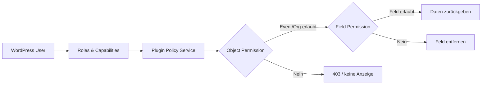
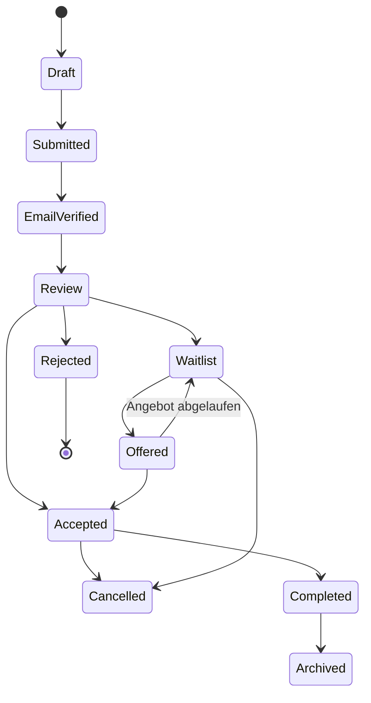
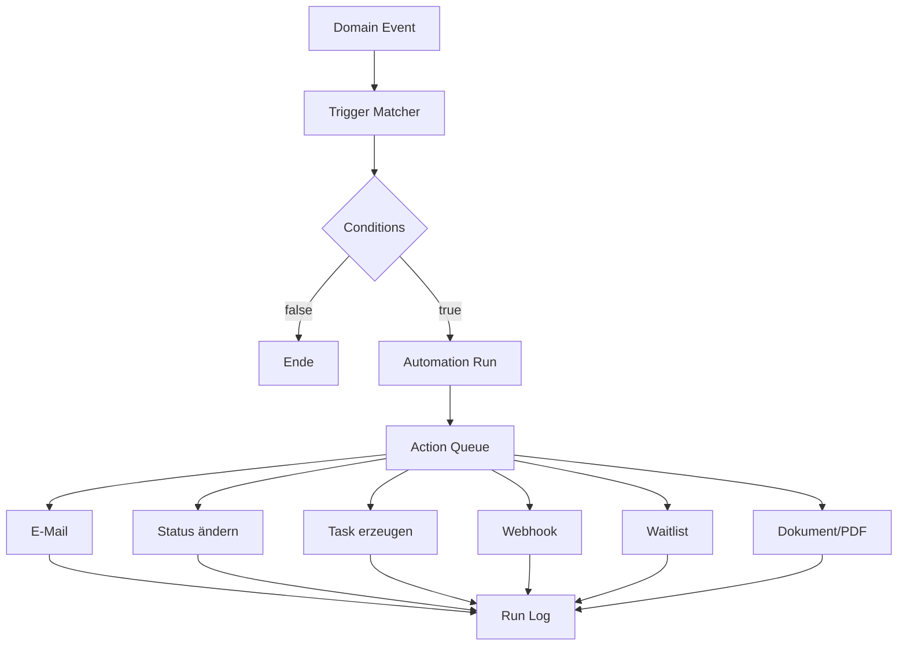
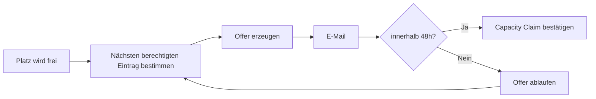
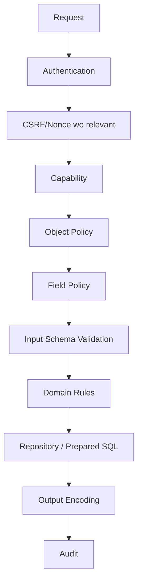
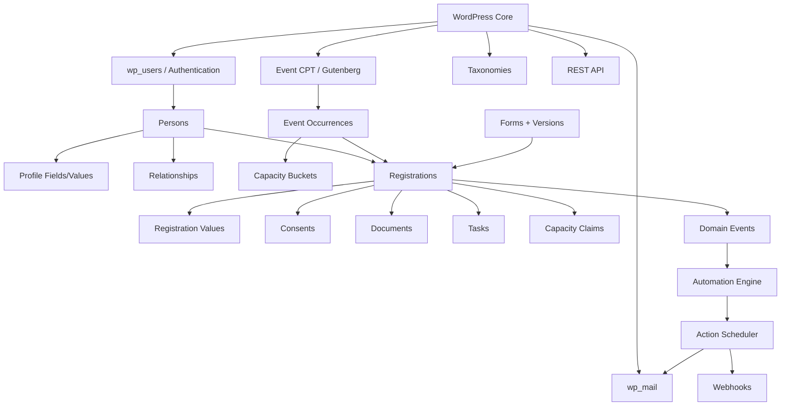
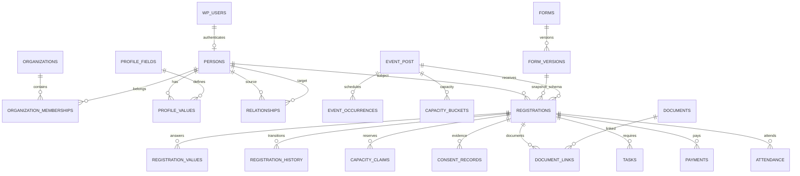
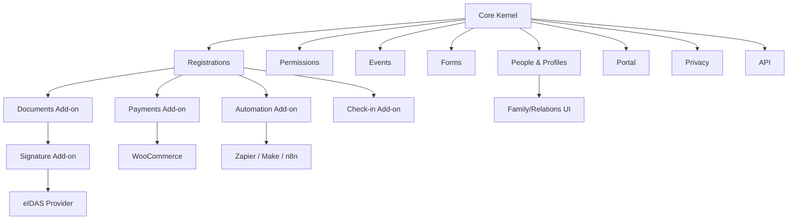
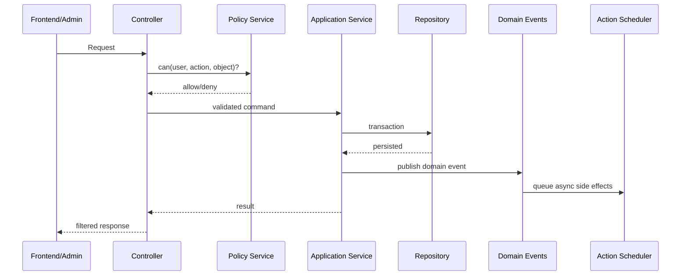

# Abschlussbericht: Produkt-, Technik- und Entwicklungsstrategie für ein universelles WordPress-Organisations- und Teilnehmermanagement-Plugin

**Recherche-Stand: 20. September 2026.** Zum Zeitpunkt der Recherche ist WordPress 7.1 die aktuelle Hauptversion; WordPress 7.1.1 wurde am 17. September 2026 als Maintenance- und Security-Release veröffentlicht. Die WordPress-Entwicklerdokumentation führt entsprechend bereits die 7.1-APIs. citeturn2search0turn0search0

Dieser Bericht behandelt die Idee ausdrücklich **nicht als kundenspezifisches Vereinsplugin**, sondern als potenzielles horizontal einsetzbares WordPress-Produkt für Personen-, Teilnehmer-, Mitglieder- und Veranstaltungsprozesse. Rechtliche Ausführungen sind dabei technische Produktanforderungen und keine individuelle Rechtsberatung; gerade bei Aufbewahrungsfristen, Minderjährigen, Gesundheitsdaten, Rechnungen und Signaturerfordernissen muss die konkrete Organisation ihre Rechtsgrundlage und nationalen Anforderungen bestimmen.

## Executive Summary, Markt und Produktpositionierung

**Gesamturteil.** Das Vorhaben ist technisch realistisch und kann eine echte Marktlücke adressieren – aber **nicht**, wenn Version 1 versucht, Membership, CRM, Eventbrite, Gravity Forms, DocuSign, WooCommerce, Zapier und ein Vereins-ERP gleichzeitig nachzubauen. Die sinnvolle Produktdefinition lautet vielmehr:

> **Eine WordPress-native Operations-Plattform für den vollständigen Lebenszyklus einer Person bzw. Teilnahme: Person → Profil → Angebot/Event → dynamische Bewerbung/Anmeldung → Prüfung → Kapazität/Warteliste → Aufgaben/Dokumente/Zahlung → Kommunikation → Teilnahme → Datenschutz-Lifecycle.**

Diese Abgrenzung ist entscheidend. Der WordPress-Markt ist in fast jedem Einzelbereich bereits stark besetzt. Ultimate Member konzentriert sich auf Registrierung, Login, Profile, Mitgliederverzeichnisse und Rollen; MemberPress auf kommerzielle Memberships und Content-Zugänge; BuddyPress auf soziale Community-Funktionen; Gravity Forms, Fluent Forms, WPForms und Formidable auf Formulare; The Events Calendar, Eventin, Amelia und WP Event Manager auf unterschiedliche Varianten von Events, Buchung und Ticketing. citeturn4view0turn17search0turn19search7turn17search2turn8view1turn7view0turn8view2turn8view3turn19search0turn19search5turn9view0

Die Chance liegt deshalb **nicht in einer besseren generischen Featureliste**, sondern in einem gemeinsamen Daten- und Berechtigungsmodell zwischen diesen Bereichen.

**Wie besetzt ist der Markt?**

| Marktsegment | Besetzung | Konsequenz |
|---|---:|---|
| Kontakt-/Formular-Builder | sehr hoch | Kein Produkt nur als „noch ein Formularplugin“ positionieren |
| Membership/Paywall | sehr hoch | MemberPress/PMPro nicht frontal kopieren |
| Frontend-Registrierung/Profile | hoch | Differenzierung über Relations-/Workflow-/Privacy-Modell |
| Eventkalender | sehr hoch | Kalenderansicht ist Commodity |
| Termine/Appointment Booking | sehr hoch | Amelia nicht imitieren |
| Ticketverkauf/QR | hoch | Eventin/WP Event Manager bereits stark |
| Community/Social Network | hoch | BuddyPress/BuddyBoss integrieren statt nachbauen |
| Teilnehmer-Bewerbungsprozesse | mittel | interessantes Feld |
| Eltern/Kind/Betreuer-Beziehungen | fragmentiert | starke Chance |
| Feldgenaue Zugriffsrechte für sensible Daten | schwach bis fragmentiert | sehr starke Chance |
| Eventbezogene Datenschutz-Löschregeln | schwach | starke Chance |
| Integrierter Teilnehmer-Lifecycle | fragmentiert | zentrale Produktchance |
| Konfigurierbare organisationale Workflows | fragmentiert | zentrale Produktchance |

Das ist eine **Marktinferenz aus den untersuchten Mainstream-Produkten**, keine Behauptung, dass weltweit kein Nischenprodukt alle Elemente anbietet. Unter den untersuchten verbreiteten Lösungen fand sich jedoch kein System, dessen primäres, kohärentes Domänenmodell nativ die komplette Kette **Person → individuelles Veranstaltungsformular → Prüfung → objekt- und feldgenaue Berechtigung → Kontingent/Warteliste → Dokument → Zahlung → Aufgaben → Teilnahme → konfigurierbare Löschung** abbildet. Gravity Forms plus Gravity Flow kommt der Workflow-Seite nahe; Eventin und WP Event Manager decken große Teile der Event-/Ticket-Kette ab; Membership-Produkte lösen wiederum Identität, Zugriff und Zahlung. Das Zusammensetzen mehrerer spezialisierter Systeme bleibt typisch. citeturn17search2turn17search6turn19search0turn9view0turn19search2turn4view0

**Marktanalyse der geforderten Lösungen.**

| Produkt | Stärkstes Problem, das es löst | Architektonischer Schwerpunkt | Lücke relativ zum geplanten Produkt |
|---|---|---|---|
| **User Registration & Membership** | Frontend-Registrierung, Login, Profile, Memberships, Zahlungen | WordPress-Benutzer + Formular-/Membership-zentrierte UX | kein umfassendes Teilnehmer-Fallmanagement als Kern |
| **Ultimate Member** | Frontend-Profile, Registrierung, Login, Rollen, Directories | benutzer-/profilzentriert, Erweiterungsökosystem | Events/Teilnahmeprozesse nicht Kern |
| **MemberPress** | Bezahlte Memberships, Zugriff auf Inhalte, Kurse | Subscription-/Access-Control-zentriert | Bewerbungs- und Eventoperations nicht Schwerpunkt |
| **Paid Memberships Pro** | Membership-Level, Paywall, Abonnements | Membership-/Commerce-zentriert | Teilnehmer-Workflow nicht Primärdomäne |
| **BuddyPress** | Profile, Gruppen, Activity Streams, Nachrichten, Notifications | komponentenbasierte Community auf WordPress-Identitäten | Operations-/Registration-Workflow fehlt als Kern |
| **BuddyBoss** | kommerziell ausgebaute Community/Membership-Erfahrung | Community-/Portal-Schwerpunkt | nicht primär Fall-/Event-Prozessmanagement |
| **Gravity Forms** | komplexe Datenerfassung, Conditional Logic, Uploads, Payments | Form/Entry-zentriert | Person/Event/Registration müssen meist modelliert oder angebunden werden |
| **Gravity Flow** | mehrstufige Freigabe- und Formularworkflows | Schritte um Form-Entries | sehr relevant als Benchmark, aber kein universelles Personen-/Eventdomänenmodell |
| **Fluent Forms** | umfangreicher Formularbau, Logik, Payments, Integrationen | Form/Submission-zentriert | ähnliche Abgrenzung |
| **WPForms** | zugängliche Allround-Formulare | Form-zentriert | kein tiefer Teilnehmer-Lifecycle |
| **Formidable Forms** | datenintensive Formulare/Views/Anwendungen | Form-/Entry-zentriert | Domänenmodell muss konfiguriert werden |
| **The Events Calendar** | Eventpublikation/Kalender | Event-/Content-zentriert | komplexe Bewerberprozesse kein Kern |
| **Amelia** | Termine, Dienstleistungen, Eventbuchungen | Booking-/Availability-zentriert | Prüfung, sensible Profile, Fallworkflow nicht Kern |
| **Eventin** | Event, Ticket, Teilnehmer, QR, WooCommerce | Ticketing-/Attendee-zentriert | allgemeinere Membership-/Case-Workflows begrenzt |
| **WP Event Manager** | Listings, Registrierungen, Tickets und Erweiterungen | modularer Event-Stack | breite Funktion oft über Add-ons |
| **Members** | WordPress-Rollen und Capabilities komfortabel verwalten | Core-Rollenmodell | keine eigenen Prozessobjekte |
| **UsersWP** | leichtgewichtige Registrierungs-/Profilseiten | WordPress-User-zentriert | kein Event-Workflow-Kern |

User Registration & Membership bewirbt inzwischen Registrierung, Membership-Pläne, Content Restriction und Payments als integriertes Produkt; Ultimate Member bietet Profile, Registrierung/Login, Custom Fields, Rollen, Directories und zahlreiche Erweiterungen. citeturn19search2turn19search6turn19search18turn4view0 MemberPress positioniert sich klar als Membership-, Monetarisierungs- und Content-Access-System. citeturn17search0 BuddyPress bietet dagegen Komponenten wie Profile, Gruppen, Activity Streams, Messaging und Notifications. citeturn19search7

Bei Formularen ist die funktionale Reife besonders hoch: Gravity Forms unterstützt unter anderem Drag-and-Drop, Conditional Logic, Multi-Page-Szenarien, Uploads, Payments und Accessibility-Funktionen; Fluent Forms, WPForms und Formidable Forms decken ebenfalls sehr breite Form-Szenarien ab. Fluent Forms meldete bei der Recherche 700.000+ aktive Installationen, Formidable 300.000+; ihre umfangreichen Changelogs zeigen zugleich, wie groß die Security- und Wartungsoberfläche solcher Builder wird. citeturn17search2turn8view0turn8view1turn7view0turn8view2

Im Eventmarkt ist das Bild ähnlich: The Events Calendar meldete 600.000+ aktive Installationen; Amelia bietet Events, Terminbuchung, wiederkehrende Angebote, Preis-/Ticketmodelle und WooCommerce-Anbindung; Eventin kombiniert Events, Ticketing, Teilnehmer, QR-Check-in sowie WooCommerce/Stripe/PayPal; WP Event Manager baut zahlreiche spezialisierte Add-ons rund um Listings, Registrierungen, Tickets und Check-in. citeturn8view3turn19search5turn19search37turn19search0turn19search8turn9view0

**Ein wichtiger Marktbefund aus den Änderungsprotokollen:** Komplexe User-, Formular- und Eventplugins müssen kontinuierlich Berechtigungs-, XSS-, REST-, Input-Validation- und Kompatibilitätsprobleme beheben. Ultimate Member, Fluent Forms, The Events Calendar und WP Event Manager enthalten auch in jüngeren Changelogs Security-Hardening bzw. sicherheitsbezogene Korrekturen. Das ist kein Qualitätsurteil über diese Produkte, sondern ein realistischer Hinweis darauf, wie groß die Angriffsfläche eines ähnlich mächtigen Systems ist. citeturn4view0turn8view1turn8view3turn9view0

Auch Rezensionen zeigen typische reale Reibungspunkte: komplexe Konfiguration, Theme-/Plugin-Konflikte, Upgrade-Regressions, Supportprobleme oder Funktionen, die erst über mehrere Erweiterungen zusammenkommen. Solche Rezensionen sind anekdotische Evidenz und dürfen nicht mit statistisch repräsentativen Nutzerstudien verwechselt werden. citeturn4view0turn9view0turn7view0

**Zielgruppenpriorisierung.**

Die höchste Product-Market-Fit-Chance sehe ich bei Organisationen, bei denen eine Anmeldung **kein einfacher Ticketkauf**, sondern ein Prozess ist:

| Zielgruppe | Fit | Warum |
|---|---:|---|
| Ferienfreizeiten/Camps/Jugendarbeit | sehr hoch | Eltern/Kind, medizinische Daten, Dokumente, Prüfung, Zahlung, Check-in |
| Sportvereine/Mannschaften | sehr hoch | Beziehungen, Gruppen, Rollen, Events, Anwesenheit |
| Bildungsanbieter/Seminare | sehr hoch | Bewerbungen, Kurse, Aufgaben, Dokumente |
| Musik-/Kunst-/Theaterschulen | hoch | Teilnehmerprofile, Gruppen, wiederkehrende Angebote |
| gemeinnützige Organisationen | hoch | Mitglieder + Veranstaltungen + Workflows |
| Verbände | hoch | Organisationsebenen, Delegierte, Veranstaltungen |
| Konferenzen | mittel bis hoch | starke Konkurrenz bei Ticketing; Workflow kann differenzieren |
| reine Membership-Websites | mittel | Markt bereits stark besetzt |
| klassische Terminbuchung | niedrig bis mittel | Amelia und ähnliche Systeme sind spezialisiert |
| E-Commerce | niedrig | WooCommerce ist die bessere Primärplattform |

**Produktprinzipien.**

Das System sollte von Anfang an fünf Prinzipien verfolgen:

1. **WordPress-native Identität, eigenes operatives Domänenmodell.**
2. **Privacy und Berechtigungen als Fundament, nicht als spätes Add-on.**
3. **Konfiguration statt organisationsspezifischer Hardcodes.**
4. **Core deckt einen vollständigen einfachen Prozess ab; Spezialkomplexität lebt in Modulen.**
5. **Integrate rather than reinvent** für Payment-Gateways, SMTP, QES, SMS, WhatsApp, Malware-Scanning und externe Kalender.

Damit wäre das Plugin eher ein **„Participant Operations Framework for WordPress“** als ein universelles „Alles-Plugin“.

## Fachliches Produktmodell und Feature-Katalog

**Die wichtigste Domänenentscheidung:** Ein **Account** und eine **Person** dürfen nicht dasselbe Objekt sein.

Für authentifizierte Nutzer sollte zwingend das native WordPress-Usersystem verwendet werden. WordPress bringt Rollen, Capabilities und etablierte Benutzer-/Authentifizierungsmechanismen mit; die offizielle Dokumentation sieht Custom Roles und Custom Capabilities ausdrücklich vor. citeturn10view0turn10view3

Trotzdem reicht `wp_users` fachlich nicht aus. Ein Elternteil kann beispielsweise drei Kinder anmelden, von denen keines einen eigenen Login benötigt. Deshalb empfehle ich:

```text
WordPress User Account 0..1 ───── 1 Person
                                  │
                                  ├── Profile
                                  ├── Relationships
                                  ├── Registrations
                                  ├── Documents
                                  ├── Consents
                                  └── Tasks
```

Ein `Person`-Datensatz kann also `wp_user_id = NULL` haben. Der eingeloggte Elternteil ist dann der **Actor**, das Kind der **Subject**. Diese Trennung löst gleichzeitig Gastanmeldungen, Minderjährige, Mitarbeiter, Mannschaftsmitglieder und Delegierte.

**Native WordPress Users: Entscheidung.**

| Alternative | Vorteil | Problem | Empfehlung |
|---|---|---|---|
| Eigenes Account-/Passwortsystem | völlige Kontrolle | doppelte Authentifizierung, Sicherheitsrisiko, schlechter Plugin-Fit | **Nein** |
| Nur `wp_users` | maximal WordPress-nativ | Kinder/Gäste/Vertretung schwer modellierbar | zu eingeschränkt |
| `wp_users` + Person-Abstraktion | WordPress-Auth + fachliche Flexibilität | zusätzliches Mapping | **klar empfohlen** |

Login, Logout, Passwort vergessen und Passwortspeicherung bleiben damit WordPress-Aufgabe. E-Mail-Verifikation, Freischaltung, Sperrung und Archivierung werden als zusätzliche Account-/Person-Statuslogik umgesetzt; das Plugin darf dabei niemals Passwörter separat speichern.

**Rollen- und Berechtigungsmodell.**

Nur WordPress-Rollen reichen für sensible Teilnehmerdaten nicht. Benötigt werden vier Ebenen:



WordPress-Capabilities sollten grobe Aktionen steuern, beispielsweise `uop_view_people`, `uop_edit_people`, `uop_manage_events`, `uop_export_data` und `uop_view_sensitive_data`. WordPress empfiehlt bei REST-Endpunkten ausdrücklich Capability-basierte Autorisierung über `permission_callback` statt lediglich zu prüfen, ob jemand eingeloggt ist. citeturn10view0turn16search8turn16search18

Darüber kommt ein eigener **Policy Service**:

```text
can(user, action, object, field?)
```

Beispiel:

```text
Trainer
    uop_view_people = ja
    Event #123 zugewiesen = ja
    Feld "Mobilnummer" = ja
    Feldklasse "medical" = nein
```

Dadurch reicht der Besitz der Rolle „Trainer“ nicht, um alle Teilnehmerdaten aller Veranstaltungen zu sehen.

Empfohlene Sensitivitätsklassen für Felder:

```text
public
internal
personal
confidential
sensitive
medical
financial
```

Jedes Feld erhält optional `view_capabilities`, `edit_capabilities` und Objektbedingungen. Besonders wichtig: **API, CSV-Export, Admin-Tabelle und Frontend müssen denselben Policy Service verwenden.** Andernfalls entsteht typischerweise ein Datenleck über einen „Nebenweg“.

**Flexible Profile und Field Builder.**

Die Felddefinition darf keine Felder wie „Konfirmationsgruppe“, „Zeltwunsch“ oder „Mannschaft“ fest verdrahten. Der Core sollte stattdessen folgende Typen bereitstellen:

`text`, `textarea`, `email`, `phone`, `number`, `date`, `time`, `select`, `multiselect`, `checkbox`, `radio`, `file`, `image`, `consent`, `url`, `address`, `hidden`.

`signature` würde ich technisch registrierbar machen, aber zunächst einem Signaturmodul zuordnen.

Eine Felddefinition benötigt mindestens:

```text
key
label
description
data_type
required
default
validation
visibility
editable_by
viewable_by
sensitivity
privacy_purpose
retention_class
options
conditional_logic
```

Conditional Logic sollte **nicht als JavaScript-Ausdruck gespeichert** werden, sondern als deklarativer Ausdrucksbaum:

```json
{
  "all": [
    {
      "field": "date_of_birth",
      "operator": "age_lt_on_event_start",
      "value": 18
    }
  ]
}
```

Dann kann derselbe Ausdruck serverseitig ausgewertet werden. Clientseitige Logik dient nur der UX. Entscheidungen wie „unter 18“ dürfen niemals ausschließlich im Browser getroffen werden.

Feldgruppen ermöglichen Bereiche wie „Kontaktdaten“, „Gesundheit“, „Erziehungsberechtigte“ oder „Notfallinformationen“. Ein Feld kann für Nutzer sichtbar, aber nicht editierbar sein; ein anderes nur für Administratoren.

**Beziehungsmodell.**

Hier sollte keine hart codierte `parent_id`-Spalte entstehen. Empfohlen wird ein gerichteter Graph:

```text
Person A --relationship_type--> Person B
```

Typen können sein:

```text
parent_of
guardian_of
child_of
coach_of
member_of_team
employee_of
supervisor_of
delegate_for
emergency_contact_for
```

Ein universelles Relationsmodell deckt 1:1, 1:n und n:m mit derselben Struktur ab. Beziehungen können zusätzlich `valid_from`, `valid_to`, `status` und Metadaten haben.

Dadurch lassen sich beispielsweise darstellen:

```text
Mutter ─guardian_of→ Kind A
Mutter ─guardian_of→ Kind B

Trainer ─coach_of→ Team Rot
Person A ─member_of→ Team Rot

Mitarbeiter ─employee_of→ Organisation X
```

Für sicherheitsrelevante Vertretungen ist zusätzlich eine Berechtigungsebene nötig: Eine Beziehung `guardian_of` darf beispielsweise das Einreichen einer Anmeldung für das Kind erlauben, aber nicht automatisch sämtliche Daten aus anderen Veranstaltungen sichtbar machen.

**Eventmodell.**

Ein Event sollte fachlich aus mindestens drei Ebenen bestehen:

```text
Event / Angebot
    ↓
Schedule / Serie
    ↓
konkrete Occurrence / Termin
```

Beispiele:

```text
"Gitarrenkurs Herbst"
   ├─ 01.10.
   ├─ 08.10.
   └─ 15.10.

"Sommercamp"
   └─ 12.07. 14:00 → 19.07. 11:00
```

Öffentliche Inhalte – Titel, Beschreibung, Bild, Kategorien, Tags – eignen sich gut für einen WordPress Custom Post Type, weil Gutenberg, Permalinks, Taxonomien und Theme-Integration dadurch kostenlos mitkommen. Operative Daten wie Occurrences, Kapazitäten, Wartelisten und Anmeldungen gehören dagegen in eigene Tabellen.

Ein Event benötigt konfigurierbar:

```text
Titel / Beschreibung / Bild
Kategorie / Tags
Zeitzone
Start / Ende
Registration Window
Ort
Kontakt
Sichtbarkeit
Status
Formular
Preis-Hinweis
Kapazitätsmodell
Zielgruppe / Eligibility
```

**Kapazitäten und Kontingente.**

Eine einfache `max_participants = 100`-Spalte reicht nicht. Stattdessen:

```text
Event
 ├─ Bucket Teilnehmer: 70
 ├─ Bucket Betreuer: 20
 └─ Bucket Reserve: 10
```

oder:

```text
12–14 Jahre: 25
15–16 Jahre: 30
17–18 Jahre: 20
```

Jeder Capacity Bucket erhält:

```text
capacity
eligibility_rule
priority
applicable_occurrence
status
```

Anmeldungen bekommen **Capacity Claims**. Damit kann ein Platz vorübergehend reserviert oder endgültig bestätigt werden.

Das ist wichtig, um Race Conditions zu vermeiden: Zwei parallele Requests dürfen den letzten Platz nicht gleichzeitig erhalten. Die Vergabe muss atomar bzw. transaktional erfolgen, nicht als unsicheres „COUNT → wenn kleiner 100 → INSERT“.

**Registration-System.**

Die Statuswerte sollten administratorfreundlich konfigurierbar sein, intern aber semantische Grundzustände behalten:



Der Administrator könnte „Review“ beispielsweise als „Prüfung durch Geschäftsstelle“ anzeigen. Intern sollte es dennoch einer bekannten Zustandsklasse entsprechen. Vollständig beliebige Zustände ohne semantische Zuordnung machen Kapazitäts-, Zahlungs- und Automationsregeln langfristig unbeherrschbar.

Eine Registration speichert immer:

```text
Person/Subject
Actor
Event
Occurrence optional
Form-Version
Status
Quelle
Zeitpunkte
Capacity Claim
```

Unterstützt werden sollten perspektivisch:

- eigener Account → eigene Person;
- Elternaccount → Kind;
- Mitarbeiter → andere berechtigte Person;
- Gast ohne Account;
- Gruppenanmeldung.

Gastanmeldung sollte möglich sein, aber Event-weise deaktivierbar. Für sensible Anwendungen kann Account + E-Mail-Verifikation verlangt werden.

**Duplikate** dürfen nicht nur anhand der E-Mail erkannt werden. Die Regel muss konfigurierbar sein, etwa:

```text
eine aktive Registration pro Person + Event
```

oder

```text
eine pro Person + Occurrence
```

**Formularsystem.**

Langfristig empfehle ich **einen eigenen schema-basierten Formular-Builder**, allerdings nicht sofort einen riesigen Page-Builder.

Warum überhaupt selbst bauen? Weil Formulare hier keine isolierten Kontaktformulare sind. Sie bestimmen:

```text
Personenfelder
Registration-Snapshot
Eligibility
Consent
Aufgaben
Berechtigungen
Workflows
Retention
```

Eine ausschließlich auf Gravity Forms oder Fluent Forms basierende Architektur würde das Kernmodell des eigenen Produkts von einem Fremdplugin abhängig machen.

Umgekehrt wäre es unwirtschaftlich, in Version 1 Gravity Forms funktional nachzubauen. Deshalb:

> **Native Basic Forms zuerst; Adapter zu etablierten Formplugins später.**

Der native Builder sollte von Anfang an versioniert sein:

```text
Form
   ├─ Version 1 [immutable]
   ├─ Version 2 [immutable]
   └─ Version 3 [current]
```

Eine abgeschickte Registration verweist auf die konkrete Formularversion. Nachträgliches Ändern eines Feldes darf historische Anmeldungen nicht rückwirkend verändern.

Native Form-V1-Funktionen:

| Funktion | V1 |
|---|---:|
| Feld hinzufügen/entfernen | ja |
| Drag-/Reorder | ja |
| Pflichtfelder | ja |
| serverseitige Validierung | ja |
| Conditional Logic | ja |
| Prefill aus Profil | ja |
| mehrere Seiten | später oder spätes V1 |
| Autosave/Draft | sinnvoll |
| Upload | Dokumentmodul |
| Berechnungsfelder | später |
| Signature | Signaturmodul |
| Conversational Forms | nein |
| komplexer Layout Builder | nein |

**Workflow-Engine.**

Hier sollte strikt zwischen **fachlicher State Machine** und **Automation Engine** getrennt werden.

Registration hat ihren Status unabhängig davon, ob Automationen aktiviert sind.

Die Automation Engine verarbeitet:

```text
Trigger → Conditions → Actions
```



Für Hintergrundverarbeitung ist Action Scheduler eine sehr passende Grundlage. Das Projekt beschreibt sich als skalierbare, nachvollziehbare Job Queue für WordPress; Jobs werden in Batches verarbeitet und mit Status-/Fehlerinformationen protokolliert. Das ist deutlich geeigneter als eigene Cron-Tabellen und eignet sich für E-Mails, Webhooks, Datenlöschung, PDF-Erstellung und Batch-Importe. citeturn24search0

Unbedingt nötig sind:

```text
Idempotency Key
Retries
max attempts
backoff
execution log
failure reason
correlation ID
```

Beispiel:

```text
registration.accepted
  IF event = "Sommercamp"
  AND payment_required = true
  THEN create_payment_task
  THEN send_email("payment_request")
```

Ein Retry darf nicht drei Rechnungen oder drei identische Aufgaben erzeugen.

**Frontend-Portal.**

Der Portal Builder sollte **kein Elementor-Konkurrent** werden. Sinnvoll ist ein Registry-System:

```text
dashboard
profile
events
registrations
relations
documents
payments
tasks
notifications
settings
```

Der Administrator kann für jeden Bereich festlegen:

```text
enabled
label
icon
order
capability/policy
```

Andere Entwickler können per API weitere Tabs registrieren.

**Dokumente.**

Das Dokumentenmodul ist fachlich sehr wertvoll, aber sicherheitskritisch. Metadaten:

```text
Owner
Registration/Event
Kategorie
Version
MIME
Größe
Checksum
Storage Driver
Storage Key
Ablaufdatum
Status
```

Sensible Dateien dürfen **nicht einfach in öffentlich erreichbaren Media-Library-URLs liegen**. OWASP empfiehlt für Uploads unter anderem Allowlisting von Erweiterungen, echte Typ-/Signaturprüfung, generierte Dateinamen, Limits, Autorisierung und – wenn möglich – Speicherung außerhalb des Webroots; öffentliche Downloads sollten über einen Application Handler vermittelt werden. citeturn24search1

Empfohlene Storage-Driver:

```text
PrivateLocalStorage
S3CompatiblePrivateStorage
CustomStorageAdapter
```

Download:

```text
GET /documents/{opaque-id}/download
   → authenticate
   → policy check
   → audit
   → stream
```

Für S3-kompatible Systeme können kurzlebige signierte URLs verwendet werden.

**Einwilligungen und Signaturen.**

Eine Checkbox-Einwilligung sollte mindestens enthalten:

```text
consent_definition
consent_version
subject
actor
accepted/rejected
timestamp
authentication_context
text/document hash
registration/event context
```

IP-Adresse und User Agent können zusätzliche Evidenz bieten, sind aber selbst personenbezogene Daten und sollten deshalb **nicht automatisch überall gespeichert werden**. Sie sollten konfigurierbar sein und eine dokumentierte Zweck-/Aufbewahrungsgrundlage haben.

Der Hash beweist außerdem nicht, **wer** unterschrieben hat. Er kann lediglich helfen nachzuweisen, dass sich der referenzierte Inhalt nicht verändert hat.

Für elektronische Signaturen muss klar zwischen den eIDAS-Stufen unterschieden werden. Die eIDAS-Verordnung 910/2014, inzwischen einschließlich der Änderungen des europäischen Digital-Identity-Rahmens konsolidiert, unterscheidet elektronische, fortgeschrittene und qualifizierte elektronische Signaturen. citeturn14search0turn23search8

| Stufe | Plugin allein realistisch? | Bewertung |
|---|---:|---|
| **SES / einfache elektronische Signatur** | ja | Checkbox, Name, Zeichnung, Audit Trail möglich |
| **AES/FES / fortgeschritten** | nicht durch bloße UI-Funktion garantierbar | Identifikation, Kontrolle und Manipulationserkennung müssen das gesamte Verfahren erfüllen |
| **QES / qualifiziert** | **nein** | qualifiziertes Zertifikat, qualifizierte Vertrauensinfrastruktur/QSCD erforderlich |

Eine QES sollte deshalb ausschließlich durch Integration eines geeigneten qualifizierten Vertrauensdiensteanbieters implementiert werden. Ein WordPress-Plugin kann Dokumente vorbereiten, Hashes bilden, den Signaturprozess initiieren und Resultate/Audit-Trails speichern; es kann sich nicht selbst durch eine gezeichnete Canvas-Unterschrift zu einem qualifizierten Vertrauensdienst machen. Die EU-Kommission behandelt qualifizierte Signaturen entsprechend als Teil des regulierten eIDAS-Vertrauensdiensterahmens. citeturn14search2turn14search0

**Payments.**

Empfehlung:

```text
Plugin Payment Domain
       │
       ├── Manual / Bank Transfer
       ├── WooCommerce Adapter  ← primär
       └── direkte Provider später
```

Das Plugin braucht einen kleinen eigenen Zahlungsstatus:

```text
not_required
pending
partially_paid
paid
refunded
failed
cancelled
```

Es sollte aber zunächst **kein eigenes Payment Gateway Framework, Kreditkartenhandling, Steuer- und Rechnungsökosystem** entwickeln.

WooCommerce ist eine etablierte Open-Source-Commerce-Plattform mit frei wählbaren Payment-Erweiterungen und einem großen Ökosystem. citeturn25search30 Deshalb ist WooCommerce für Stripe, PayPal, SEPA, Refunds und komplexe Orders der sinnvollste erste Adapter.

Eine Organisation, die nur Überweisungen erfasst, sollte WooCommerce dagegen nicht installieren müssen. Deshalb bleibt ein einfacher manueller Payment Record möglich.

**Check-in.**

V1 des Moduls:

```text
Teilnehmerliste
QR-Code
mobile Scan UI
Check-in/out
manuell
Status
Zeitpunkt
Operator
Export
```

Der QR-Code sollte möglichst **keine Klardaten enthalten**, sondern einen zufälligen oder signierten Identifier.

Offline-Modus ist erheblich komplexer: Teilnehmerdaten werden auf ein Smartphone repliziert, müssen geschützt, später synchronisiert und Konflikte behandelt werden. Das sollte ausdrücklich **nicht** erste Check-in-Version sein.

**Tasks/Fortschritt.**

Aufgaben sollten überwiegend **abgeleitet**, nicht manuell synchronisiert sein:

```text
profile_complete()       → erledigt
email_verified()         → erledigt
consent(photo_v3)        → offen
document("medical")      → offen
payment_status == paid   → offen
```

Der Fortschritt kann daraus errechnet werden:

```text
3 von 5 Pflichtaufgaben = 60 %
```

Die Aufgabe ist damit keine zweite Wahrheit, die versehentlich vom eigentlichen Payment-/Documentstatus abweicht.

**E-Mail und Kommunikation.**

E-Mail gehört in den Core:

```text
Template
Subject
HTML/Text body
variables
preview
event/context
manual send
automatic send
delivery state
```

Beispielvariablen:

```text
{{person.first_name}}
{{event.name}}
{{event.start_date}}
{{registration.status}}
{{payment.status}}
```

Versand sollte über WordPress `wp_mail()` erfolgen, sodass etablierte SMTP-/Transactional-Mail-Plugins weiterhin funktionieren. Einen eigenen SMTP-Server im Plugin zu bauen hätte keinen strategischen Vorteil.

Massenmails werden über die Job Queue verschickt, nicht während eines normalen Seitenrequests. Bounce-/Delivery-Webhooks sind spätere Provider-Integrationen.

SMS, WhatsApp, Browser Push und Mobile Push sollten **separate Provider-Module** sein. Sie verursachen zusätzliche Kosten, Einwilligungsfragen, externe Datenübermittlung und API-Abhängigkeiten.

**Warteliste.**

Eine robuste Warteliste benötigt:

```text
queue position
capacity bucket
priority score
created_at
manual override
offer status
offer_expires_at
```

Ablauf:



Die „48 Stunden“ sind natürlich Eventkonfiguration, kein Hardcode.

**Kalender.**

Core:

```text
interne Kalenderansicht
ICS Download
ICS Subscription Feed
```

Ein stabiler iCalendar-UID pro Occurrence ermöglicht Kalenderupdates. Direkte Google-/Microsoft-OAuth-Synchronisation sollte später als Integrationsmodul folgen, insbesondere wenn bidirektional synchronisiert werden soll.

**Dashboard und Reporting.**

Admin-Startseite:

```text
kommende Events
neue Registrations
Registrations in Review
Wartelisten
Kapazitätswarnungen
offene Pflichtaufgaben
fehlende Dokumente
überfällige Zahlungen
fehlgeschlagene Automationen
System-/Security-Hinweise
```

Reports:

```text
Auslastung
Registration Funnel
Statusverteilung
No-show / Attendance
Alters-/Gruppenverteilung
Capacity Buckets
Payments
Waitlist Conversion
```

Sensible Auswertungen brauchen dieselben Field-Level Permissions wie Einzelansichten. Ein Benutzer, der medizinische Daten nicht lesen darf, darf auch keinen Export oder Bericht dazu bekommen.

**Gesamter Feature-Katalog nach Produktstufe.**

| Bereich | Zweck / typischer Use Case | Schwierigkeit | Abhängigkeit | Security/Privacy | Stufe |
|---|---|---:|---|---|---|
| WP Account Integration | Login/Authentifizierung | M | WordPress | hoch | Core |
| Person-Abstraktion | Kinder/Gäste/Vertretung | H | Accounts | hoch | Core |
| Profile/Custom Fields | flexible Teilnehmerdaten | H | Person | sehr hoch | Core |
| Custom Roles/Caps | grobe Autorisierung | M | WP Roles | sehr hoch | Core |
| Object Policies | Event-/Org-spezifischer Zugriff | H | Permissions | sehr hoch | Core |
| Field Policies | medizinische/finanzielle Daten | VH | Profile | kritisch | Core |
| Events | Angebot/Veranstaltung | H | Forms | mittel | Core |
| Occurrences | Termine/Seriengrundlage | H | Events | mittel | Core |
| Registrations | Bewerbungs-/Teilnahmeobjekt | VH | Person/Event/Form | hoch | Core |
| Status Engine | Lifecycle | H | Registration | hoch | Core |
| Capacity | Teilnehmerlimits | H | Registration | mittel | Core |
| einfache Warteliste | Überbuchung | H | Capacity | mittel | Core |
| Form Builder | Datenerfassung | VH | Fields | hoch | Core, bewusst begrenzt |
| Basic Email | Statuskommunikation | M | Registration | mittel | Core |
| Portal | Self Service | H | Policies | hoch | Core |
| Privacy Export/Erase | Betroffenenrechte | H | alle Domains | kritisch | Core |
| Retention | automatische Löschung | VH | Jobs/Audit | kritisch | Core |
| Audit Log | Nachvollziehbarkeit | H | alle Domains | hoch | Core |
| REST API | Integrationen | H | Permissions | kritisch | Core |
| CSV Import/Export | Migration | H | Jobs | hoch | Core, begrenzt |
| Relationships | Eltern/Kind etc. | H | Person | hoch | Core-Datenmodell; Advanced UI Add-on |
| Advanced Automation | frei konfigurierbare TCA-Regeln | VH | Domain Events | hoch | Pro |
| Documents | sensible Dateien | VH | Storage/Policies | kritisch | Add-on |
| Payments | Geldfluss | VH | Registration | kritisch | Add-on |
| WooCommerce | Gateways/Orders | H | Payments | hoch | Add-on |
| Check-in | Anwesenheit | H | Registration | hoch | Add-on |
| Offline Check-in | Netzunabhängig | VH | Sync | kritisch | später Pro |
| elektronische Signatur | Vertrags-/Zustimmungsprozess | VH | Documents/Consent | kritisch | Add-on |
| QES | qualifizierte Signatur | VH | externer QTSP | kritisch | Integration |
| SMS/WhatsApp | Benachrichtigungen | H | Provider | hoch | Add-on |
| Advanced Reports | BI | H | Data Warehouse/Queries | hoch | Pro |
| Multi-Organisation | Verbände | VH | Scope/Policies | kritisch | Business |
| Full Multisite Management | Dachverbände | VH | WP Multisite | kritisch | Business |
| externe CRM/LMS | Datenaustausch | H | API | hoch | Integrationen |

## Datenschutz, Einwilligungen, Audit und Security

**Datenschutz muss Datenarchitektur sein, nicht Checkbox.** Die DSGVO verlangt unter anderem Zweckbindung, Datenminimierung und Speicherbegrenzung sowie angemessene Integrität und Vertraulichkeit. Gesundheitsdaten gehören grundsätzlich zu den besonderen Kategorien personenbezogener Daten nach Art. 9; bei Minderjährigen entstehen zusätzliche rechtliche und organisatorische Fragen. citeturn20search14turn20search22

Daraus folgt eine technische Anforderung: Jedes dynamische Datenfeld sollte mindestens optional klassifizieren können:

```text
purpose
lawful_basis_note
sensitivity
retention_policy
exportability
erasability
visibility
```

Das Plugin darf **keine universellen gesetzlichen Fristen behaupten**. Die WordPress.org-Richtlinien verbieten Plugins sogar ausdrücklich, den Eindruck zu erwecken, sie könnten rechtliche Compliance garantieren. citeturn26view0

Empfehlung für die Retention Engine:

```text
Retention Rule:
    data_class = medical
    trigger = event.end
    delay = 30 days
    action = erase

Retention Rule:
    data_class = general_registration
    trigger = event.end
    delay = administrator configured
    action = anonymize
```

Optional:

```text
legal_hold = true
```

blockiert automatische Löschung, bis der zuständige Administrator ihn entfernt.

Vor produktiver Ausführung braucht jede automatische Löschregel:

```text
Dry Run
Preview affected records
Audit entry
Batch execution
Failure handling
```

**WordPress Privacy Tools.** WordPress stellt Personal-Data-Exporter und Eraser bereit; Pluginentwickler können eigene Exporter und Eraser registrieren. Die Export-API arbeitet bewusst in Batches, um große Datenmengen ohne Request-Timeout zu verarbeiten. Der Eraser kann Daten löschen oder anonymisieren und kann begründen, warum bestimmte Daten beibehalten wurden. Wichtig: Das WordPress-Erase-Personal-Data-Werkzeug löscht nicht automatisch den WordPress-Useraccount selbst. citeturn11view0turn11view1

Daher muss das Plugin integrieren:

```text
Export Personal Data
Erase Personal Data
Privacy Policy Guide
```

und zusätzlich einen eigenen Account-/Person-Archivierungsprozess bereitstellen. WordPress empfiehlt Plugins darüber hinaus, Datenflüsse transparent zu dokumentieren und minimale Aufbewahrung sowie regelmäßige Löschung nicht mehr benötigter Daten zu berücksichtigen. citeturn16search5

**Einwilligungen.** Eine Zustimmung muss als historisches Ereignis gespeichert werden, nicht einfach als aktuelles `yes/no` im Profil:

```text
Photo Consent v3
accepted_at = ...
subject = Child #18
actor = Parent #4
document_hash = ...
auth_context = logged-in
```

Wenn sich der Einwilligungstext ändert, entsteht Version 4. Bestehende Nachweise verweisen weiterhin auf Version 3.

Die EDPB-Leitlinien zu Einwilligungen betonen die Anforderungen der DSGVO an wirksame Einwilligung; technisch sollte deshalb auch Widerruf als eigenes Ereignis mit Zeitstempel abbildbar sein. citeturn20search2

**Minderjährige.** Das Produkt darf nicht einfach „unter 16 = Elternunterschrift“ fest codieren. Art. 8 DSGVO betrifft speziell die Einwilligung eines Kindes bei Diensten der Informationsgesellschaft und enthält nationalen Spielraum; daneben können andere Rechtsgrundlagen und nationale Vorschriften relevant sein. citeturn20search14 Deshalb:

```text
guardian requirement = configurable
age threshold = configurable
jurisdictional policy = administrator responsibility
```

**Audit Log.**

Loggen sollte man insbesondere:

```text
Login-relevante Plugin-Ereignisse
Berechtigungsänderungen
Personen-/Profildatenänderungen
Ansicht besonders sensibler Daten, falls aktiviert
Registration-Statuswechsel
Dokumentdownload/-upload
Consent
Paymentstatus
Exports
Retention/Löschung
Workflow-Ausführungen
API/Webhook-Verwaltung
Admin-Konfigurationsänderungen
```

Beispiel:

```text
2026-09-20T17:04:12Z
Actor: user_id 57
Action: registration.status_changed
Object: registration 381
Old: waitlist
New: accepted
Correlation: ...
```

Für ein Dokument:

```text
Actor 57
document.downloaded
document_id 892
subject_person 132
```

Nicht in Audit Logs gehören vollständige medizinische Inhalte, Passwörter, API-Secrets, Session Cookies oder vollständige Dokumente.

OWASP empfiehlt bei geschäftskritischen Aktionen unter anderem Akteur, Ziel, Aktion, Ergebnis und geeigneten Request-/Business-Kontext zu protokollieren und Logs gegen Manipulation zu schützen. citeturn15search31

Eine praktikable Manipulationserschwerung ist:

```text
row_hash = HMAC(previous_hash + normalized_event_data)
```

Das ist kein vollständig manipulationssicheres externes Ledger, macht nachträgliche Änderungen aber erkennbarer. Für höhere Assurance kann regelmäßig ein Root-Hash extern archiviert werden.

Audit-Aufbewahrung muss selbst konfigurierbar sein, weil Audit Logs personenbezogene Daten enthalten können.

**Security-Modell.**

Das Plugin ist besonders gefährdet, weil es gleichzeitig Accounts, personenbezogene Daten, Uploads, Zahlungen und Privilegien verarbeitet. Security muss deshalb in mehreren Schichten erfolgen:



**Nonces.** WordPress-Nonces gehören zu State-Changing Admin-/Frontend-Aktionen, sind aber **kein Ersatz für Autorisierung**. Eine gültige Nonce bedeutet nicht, dass ein Benutzer auf Person X oder Dokument Y zugreifen darf. Deshalb immer Capability/Policy zusätzlich prüfen. WordPress dokumentiert Nonces und Capability-Prüfungen getrennt; OWASP beschreibt CSRF als Angriff, bei dem der Browser eines eingeloggten Opfers unerwünschte Aktionen ausführt. citeturn10view2turn10view3turn24search4

**XSS.**

Regel:

```text
validate/sanitize on input
store canonical value
escape for output context
```

HTML darf nur bei explizit dafür vorgesehenen Feldern und mit kontrolliertem Allowlist-Sanitizing gespeichert werden.

**SQL Injection.** Direkte Queries ausschließlich über `$wpdb` mit `$wpdb->prepare()` bzw. sicher zusammengesetzten Query-Komponenten. Die WordPress-Dokumentation nennt `prepare()` ausdrücklich für eigene Tabellenabfragen. citeturn10view1

**REST API.** Jede Route erhält:

```text
permission_callback
argument schema
validation
sanitization
object policy
response field filtering
```

WordPress verlangt bei `register_rest_route()` inzwischen explizit eine `permission_callback`; die Entwicklerdokumentation empfiehlt `current_user_can()` statt bloßer Login-Prüfung. citeturn16search18turn16search8

**IDOR/BOLA.** Ein Request wie

```text
/documents/123
```

darf niemals allein deshalb funktionieren, weil 123 existiert. Nach dem Laden folgt zwingend:

```text
policy.can(current_user, "download", document)
```

**Uploads.** OWASP empfiehlt Defense in Depth: Erweiterungs-Allowlist, nicht auf den vom Browser gelieferten MIME-Type vertrauen, File-Signature-Prüfung, generierte Dateinamen, Größenlimits, autorisierte Uploads, Speicherung außerhalb des Webroots und – wenn möglich – Malware-Scanning/Sandboxing. citeturn24search1

Deshalb:

```text
.pdf erlaubt
.php verboten
extension check
MIME sniff
magic bytes
size
random storage key
scanner hook
private storage
```

**Brute Force und Authentifizierung.** Kein eigenes Passwortsystem bauen. Registrierung, Login und Recovery an WordPress anbinden. Bei eigenen öffentlichen Verifikations-, Invite- und Portalendpunkten Rate Limits ergänzen. OWASP empfiehlt unter anderem sichere Recovery-Prozesse und Schutz gegen automatisierte Authentifizierungsangriffe; MFA bietet bei höherem Schutzbedarf zusätzlichen Nutzen. citeturn24search7

**Session Security.** Keine sensiblen Profile oder Dokumentinhalte dauerhaft in `localStorage` legen; OWASP weist darauf hin, dass `localStorage` sitzungsübergreifend bestehen kann und nicht automatisch verschlüsselt gespeichert wird. citeturn24search12

**Webhooks.**

Outbound:

```text
timestamp
event_id
body
signature = HMAC(secret, timestamp + "." + body)
```

Empfänger kann Replay-Fenster prüfen.

Inbound:

```text
authenticate
timestamp/replay protection
schema validate
idempotency
least privilege
audit
```

Secrets werden verschlüsselt oder außerhalb öffentlich zugänglichen Codes verwaltet und niemals ins Audit geschrieben.

**API-Tokens.** Für externe WordPress-REST-Zugriffe sollte vorrangig auf etablierte WordPress-Authentifizierungswege wie Application Passwords gesetzt werden, statt in V1 eine weitere Token-Authentifizierung zu erfinden. WordPress dokumentiert Application Passwords als REST-Authentifizierungsoption. citeturn16search4turn16search2

**Verschlüsselung.**

Unterscheiden:

```text
TLS in transit
storage encryption of host/database
application-level field encryption
```

Bei besonders sensiblen optionalen Feldern kann Application-Level Encryption sinnvoll sein. Der Schlüssel sollte nicht in derselben Datenbank wie der Ciphertext liegen. Gleichzeitig erschwert Verschlüsselung Suchen, Filtern und Reporting erheblich. Deshalb nicht blind „alles verschlüsseln“, sondern nach Datenklasse.

**Dependency Security.**

Pflicht:

```text
composer.lock
package-lock/pnpm lock
regelmäßige Dependency Updates
SBOM im Releaseprozess
SCA/Dependency Scan
kein unnötiger Vendor-Code
```

Die WordPress.org-Richtlinien verlangen außerdem, dass im Directory enthaltene Abhängigkeiten lizenzkonform sind und Plugins WordPress-eigene Bibliotheken nutzen sollen, wenn WordPress sie bereits mitliefert. citeturn26view1turn26view0

**WordPress.org und Datenschutz.**

Für die kostenlose Directory-Version sind aktuell besonders relevant:

- sämtlicher Directory-Code und enthaltene Assets müssen GPL-kompatibel sein; GPLv2-or-later wird ausdrücklich empfohlen; citeturn26view1
- der Code muss weitgehend menschenlesbar sein und Source/Build-Informationen für gebaute Assets zugänglich bleiben; citeturn26view1
- Trialware bzw. lokal enthaltene Funktionen, die nur per Zahlung entsperrt werden, sind nicht zulässig; WordPress empfiehlt für Premium-Code separate Add-on-Plugins; citeturn26view1
- substanzielle externe SaaS-Dienste sind erlaubt, müssen aber dokumentiert werden; citeturn16search0turn26view0
- Tracking oder externe Telemetrie ohne ausdrückliche Zustimmung ist nicht zulässig; citeturn26view0turn26view2
- nicht servicebezogener Remote-Code und Remote-JavaScript/-CSS sind problematisch bzw. unzulässig; citeturn26view0
- das Plugin darf keine garantierte rechtliche Compliance versprechen. citeturn26view0

Daraus folgt als Produktpolitik:

```text
Telemetry default: OFF
No account required for free core
No forced cloud
No "GDPR compliant guaranteed" marketing claim
Premium code: separate extensions
External services: explicit setup + disclosure
```

## Datenmodell, Datenbankarchitektur und Skalierung

WordPress empfiehlt grundsätzlich, vorhandene Metadatenmechanismen zu nutzen, wenn sie für den Zweck sinnvoll sind; bei wachsenden, strukturierten Plugin-Daten können jedoch eigene Tabellen angelegt werden. Für deren Installation/Upgrade stellt WordPress unter anderem `$wpdb->prefix` und `dbDelta()` bereit und empfiehlt eine separate Schema-Version. citeturn10view1

Für dieses Produkt wäre **„alles in postmeta/usermeta“ ein Architekturfehler**.

`wp_usermeta` ist sinnvoll für wenige accountbezogene Einstellungen:

```text
portal preference
last seen
kleine UI settings
```

Es ist nicht der richtige Hauptspeicher für Millionen dynamischer Registration-Antworten, Datumsfilter, Kapazitätsberechnungen, Audit Logs oder Paymentstatus.

**Empfohlenes Storage-Modell.**

| Datentyp | Speicher |
|---|---|
| Accounts | `wp_users` |
| accountnahe kleine Einstellungen | `wp_usermeta` |
| öffentliche Event-Inhalte | Custom Post Type `uop_event` |
| Event-Kategorien/Tags | WordPress Taxonomies |
| E-Mail-Templates | CPT oder eigene kleine Tabelle; CPT bevorzugt |
| Plugin-Konfiguration | Options API |
| kurzfristige Cachewerte | Object Cache/Transients |
| Personen | eigene Tabelle |
| flexible Profilwerte | eigene Tabellen |
| Occurrences | eigene Tabelle |
| Registrations | eigene Tabelle |
| Antworten | eigene Tabelle |
| Kapazität/Warteliste | eigene Tabellen |
| Consents | eigene Tabellen |
| Dokumentmetadaten | eigene Tabellen |
| Audit | eigene Tabelle |
| Automation | eigene Tabellen |
| Queue | Action Scheduler |

**Übergreifendes Systemmodell.**



**Organisationsfähigkeit früh einplanen.** Eine der wichtigsten Ergänzungen zu Ihrer ursprünglichen Liste ist ein Organisations-/Scope-Konzept. Auch wenn der erste Kunde nur eine Organisation betreibt, wird es sonst später schwer, einen Dachverband, mehrere Abteilungen oder Mandanten sauber einzuführen.

Ich würde deshalb intern jedes Event einer `organization_id` zuordnen und einen Default-Datensatz anlegen. Multi-Organisation-UI kann später kommen.

**Konkretes erstes Datenbankschema.**

Der Platzhalter `{prefix}` bedeutet `$wpdb->prefix . 'uop_'`. Alle Zeitwerte werden intern konsistent in UTC gespeichert; Darstellung erfolgt in Site-/Event-Zeitzone. Primärschlüssel sind `BIGINT UNSIGNED`, sofern nicht anders angegeben. WordPress-Plugin-Tabellen sollten nicht darauf angewiesen sein, dass physische Foreign-Key-Constraints überall problemlos verwaltet werden; logische Beziehungen werden deshalb in Repository-/Migrationstests abgesichert.

| Tabelle | Kernspalten | PK / logische Relationen | Hauptindizes | Zweck |
|---|---|---|---|---|
| `{prefix}organizations` | `id BIGINT`, `parent_id BIGINT NULL`, `name VARCHAR(191)`, `slug VARCHAR(191)`, `status VARCHAR(32)`, timestamps | PK `id`; self-parent | UNIQUE slug; parent/status | Organisation/Abteilung |
| `{prefix}persons` | `id`, `wp_user_id BIGINT NULL`, `display_name VARCHAR(191)`, `primary_email VARCHAR(191) NULL`, `status VARCHAR(32)`, `created_at`, `updated_at`, `archived_at` | PK; optional `wp_users.ID` | UNIQUE `wp_user_id`; email; status | fachliche Person |
| `{prefix}organization_memberships` | `id`, `organization_id`, `person_id`, `membership_type`, `status`, valid dates | PK; org/person | UNIQUE `(organization_id,person_id,membership_type)` | Person↔Organisation |
| `{prefix}profile_fields` | `id`, `organization_id NULL`, `field_key VARCHAR(100)`, `type VARCHAR(32)`, `sensitivity VARCHAR(32)`, `settings_json LONGTEXT`, `status` | PK | UNIQUE `(organization_id,field_key)` | dynamische Felddefinition |
| `{prefix}profile_values` | `id`, `person_id`, `field_id`, `ordinal SMALLINT`, typed value columns | PK | `(person_id,field_id)`, `(field_id,value_string)`, `(field_id,value_date)` | skalierbare Profilwerte |
| `{prefix}relationships` | `id`, `from_person_id`, `to_person_id`, `type_key VARCHAR(64)`, `status`, `valid_from`, `valid_to`, `metadata_json` | PK | `(from_person_id,type_key)`, `(to_person_id,type_key)`, unique edge optional | Eltern/Kinder/Trainer etc. |
| `{prefix}forms` | `id`, `organization_id`, `form_key`, `title`, `context`, `status`, `current_version_id` | PK | org/status; unique key | logisches Formular |
| `{prefix}form_versions` | `id`, `form_id`, `version INT`, `schema_json LONGTEXT`, `checksum BINARY(32)`, `created_by`, `published_at` | PK | UNIQUE `(form_id,version)` | immutable Formdefinition |
| `{prefix}event_settings` | `event_post_id BIGINT`, `organization_id`, `status`, `visibility`, `registration_open_at`, `registration_close_at`, `default_form_id`, `settings_json` | PK `event_post_id`; CPT post | org/status; registration dates | operative Eventkonfiguration |
| `{prefix}event_occurrences` | `id`, `event_post_id`, `start_at`, `end_at`, `timezone VARCHAR(64)`, `status`, `location_json` | PK | `(event_post_id,start_at)`, `(status,start_at)` | konkrete Termine |
| `{prefix}capacity_buckets` | `id`, `event_post_id`, `occurrence_id NULL`, `bucket_key`, `label`, `capacity INT`, `eligibility_json`, `priority SMALLINT`, `status` | PK | event/occurrence/status | Kontingente |
| `{prefix}registrations` | `id`, `public_id BINARY(16)`, `organization_id`, `person_id`, `actor_person_id NULL`, `event_post_id`, `occurrence_id NULL`, `form_version_id`, `status`, `semantic_state`, `source`, timestamps | PK | UNIQUE public id; `(event_post_id,status)`, `(person_id,event_post_id)`, occurrence/status | zentrale Anmeldung |
| `{prefix}registration_values` | `id`, `registration_id`, `field_key`, typed values, `ordinal`, `sensitivity` | PK | `(registration_id,field_key)`, typed search indexes | immutable/submitted answers |
| `{prefix}registration_history` | `id`, `registration_id`, `from_status`, `to_status`, `actor_user_id`, `reason`, `created_at` | PK | `(registration_id,created_at)` | Statushistorie |
| `{prefix}capacity_claims` | `id`, `bucket_id`, `registration_id`, `status`, `expires_at`, timestamps | PK | bucket/status/expiry; UNIQUE active logically | Reservierung/Platz |
| `{prefix}waitlist_offers` | `id`, `registration_id`, `bucket_id`, `token_hash BINARY(32)`, `offered_at`, `expires_at`, `status` | PK | `(bucket_id,status)`, expiry, token | Nachrückangebote |
| `{prefix}consent_definitions` | `id`, `organization_id`, `consent_key`, `title`, `status`, `current_version_id` | PK | org/key | Zustimmungstyp |
| `{prefix}consent_versions` | `id`, `definition_id`, `version`, `content LONGTEXT`, `document_hash BINARY(32)`, `published_at` | PK | UNIQUE definition/version | unveränderbare Textversion |
| `{prefix}consent_records` | `id`, `definition_version_id`, `subject_person_id`, `actor_person_id`, `registration_id NULL`, `decision`, `decided_at`, `auth_context`, `evidence_json` | PK | subject/definition; registration | Consentnachweis |
| `{prefix}documents` | `id`, `public_id BINARY(16)`, `storage_driver`, `storage_key`, `original_name`, `mime_type`, `size BIGINT`, `sha256 BINARY(32)`, `status`, `expires_at`, `created_by` | PK | unique public id; expiry/status | private Datei-Metadaten |
| `{prefix}document_links` | `id`, `document_id`, `entity_type`, `entity_id`, `relation_type` | PK | `(entity_type,entity_id)`, document | Dokumentzuordnung |
| `{prefix}tasks` | `id`, `person_id`, `registration_id NULL`, `task_key`, `status`, `due_at`, `definition_json`, timestamps | PK | registration/status; person/status | explizite/abgeleitete Tasks |
| `{prefix}automations` | `id`, `organization_id`, `name`, `trigger_key`, `definition_json`, `version`, `status` | PK | trigger/status | Workflowdefinition |
| `{prefix}automation_runs` | `id`, `automation_id`, `event_uuid BINARY(16)`, `status`, `started_at`, `finished_at`, `error_code`, `context_json` | PK | UNIQUE automation/event; status/time | Idempotenz/Debug |
| `{prefix}attendance` | `id`, `registration_id`, `occurrence_id`, `checkin_at`, `checkout_at`, `status`, `operator_user_id` | PK | `(occurrence_id,status)`, UNIQUE registration/occurrence | Check-in |
| `{prefix}payments` | `id`, `registration_id`, `provider`, `external_id`, `amount DECIMAL(18,2)`, `currency CHAR(3)`, `status`, `paid_at`, `metadata_json` | PK | external provider ID; reg/status | optionale Payment-Abstraktion |
| `{prefix}audit_log` | `id BIGINT`, `occurred_at`, `actor_user_id`, `action VARCHAR(100)`, `object_type`, `object_id`, `subject_person_id NULL`, `result`, `correlation_id BINARY(16)`, `data_json`, `prev_hash`, `row_hash` | PK | `(occurred_at)`, `(object_type,object_id)`, actor/time, subject/time | Audit |

**Typed Values statt blindem EAV.**

Flexible Felder benötigen zwangsläufig eine EAV-ähnliche Struktur, aber eine einzige Spalte `meta_value LONGTEXT` wäre schlecht indexierbar. Deshalb sollte `profile_values` bzw. `registration_values` typisierte Slots besitzen:

```sql
value_string   VARCHAR(191) NULL
value_text     LONGTEXT NULL
value_integer  BIGINT NULL
value_decimal  DECIMAL(20,6) NULL
value_date     DATE NULL
value_datetime DATETIME NULL
value_boolean  TINYINT(1) NULL
value_reference BIGINT NULL
```

Ein Datum kann so beispielsweise mit

```text
(field_id, value_date)
```

indexiert werden.

Multi-Select-Werte können mehrere Rows mit `ordinal` verwenden.

**Warum kein reines JSON für Antworten?**

Ein JSON-Snapshot ist gut für Revisionssicherheit:

```text
submission_snapshot_json
```

aber schlecht als alleinige Grundlage für:

```text
alle 14- bis 17-Jährigen finden
alle Teilnehmer mit Status X
alle Werte für Feld Y exportieren
```

Deshalb empfehle ich **typed rows + optionalen vollständigen immutable Snapshot**.

**Profil und Registration müssen getrennt bleiben.**

Beispiel:

```text
Person.address = aktuelle Adresse

Registration 2024.address_snapshot = damalige Adresse
Registration 2026.address_snapshot = heutige Adresse
```

Historische Bewerbungen dürfen nicht plötzlich anders aussehen, nur weil ein Nutzer sein Profil geändert hat.

**Datenmodelldiagramm.**



**Skalierung.**

Für 100 Nutzer würde fast jede WordPress-Datenstruktur funktionieren. Die Architektur muss deshalb an 100.000 Personen und Millionen Werte gedacht werden.

Essentiell:

```text
keine unpaginierten Listen
keyset pagination bei sehr großen Tabellen
keine SELECT *
keine N+1-Queries
Composite Indices nach echten Query Patterns
Batch processing
gezieltes Caching
asynchrone Exporte
```

Object Cache/Redis darf genutzt werden für:

```text
field definitions
event configuration
permission configuration
form schemas
aggregate counts
```

aber **nicht als Source of Truth** für Kapazitätsreservierungen oder Zahlungen.

Transients sind geeignet für kurzlebige Ableitungen, nicht für langlebige Jobs.

**Niemals synchron im normalen Seitenrequest:**

```text
10.000 E-Mails
CSV mit 100.000 Registrations erzeugen
Massenimport
Retention-Löschung
PDF-Batch
Webhook-Retry-Sturm
komplette Report-Neuberechnung
große Event-Serie expandieren
Malware-Scan großer Dateien
```

Action Scheduler ist genau für solche Hintergrundqueues ausgelegt und dokumentiert Batchverarbeitung sowie Logging fehlgeschlagener Jobs. citeturn24search0

**Datenbankmigrationen.**

Eigene Schema-Version:

```text
uop_db_version = 17
```

Migrationen:

```text
17 -> 18 add index
18 -> 19 backfill normalized status
19 -> 20 add organization scope
```

Nicht nur `dbDelta()` bei Aktivierung verwenden; Updates müssen auch bei normalem Plugin-Upgrade erkannt werden, weil Activation Hooks beim Aktualisieren nicht zwangsläufig der einzige Migrationsweg sein dürfen. WordPress empfiehlt für Plugin-Tabellen explizit eine gespeicherte Schema-Version und Upgrade-Routinen. citeturn10view1

Große Datenmigrationen werden resumierbar in Batches ausgeführt.

**Deinstallation.**

Standard:

```text
Plugin deaktivieren → Daten bleiben
Plugin löschen → Daten bleiben standardmäßig
```

Optional in Einstellungen:

```text
"Alle Plugin-Daten bei Deinstallation endgültig löschen"
```

mit klarer Warnung und zusätzlicher Bestätigung.

Ein professionelles Produkt sollte vor großen Schema-Upgrades außerdem Site-Administratoren auf ein vorhandenes Backup hinweisen; WordPress dokumentiert Backups ausdrücklich als grundlegende Betriebsmaßnahme. citeturn16search17

## WordPress-Architektur, APIs, UX, Accessibility und Engineering

**PHP-/Code-Architektur.**

Empfohlen ist ein bewusst leichtgewichtiges Domain-Design:

```text
plugin/
├── plugin.php
├── src/
│   ├── Core/
│   ├── Domain/
│   │   ├── People/
│   │   ├── Profiles/
│   │   ├── Events/
│   │   ├── Registrations/
│   │   ├── Forms/
│   │   ├── Permissions/
│   │   └── Privacy/
│   ├── Application/
│   │   ├── Commands/
│   │   ├── Queries/
│   │   └── Services/
│   ├── Infrastructure/
│   │   ├── Database/
│   │   ├── WordPress/
│   │   ├── Mail/
│   │   ├── Queue/
│   │   └── Storage/
│   ├── Admin/
│   ├── Frontend/
│   ├── REST/
│   ├── CLI/
│   └── Integrations/
├── modules/
├── blocks/
├── templates/
├── assets/
├── languages/
├── tests/
└── vendor/
```

Namespaces und Composer/PSR-4 sind für ein solches Projekt angemessen; selbst die WordPress-Developer-Ressourcen demonstrieren für größere Plugins Namespaces, Composer-Autoloading und Linting als skalierbaren Ansatz. citeturn16search7

Kein Framework-Overengineering:

```text
Controller
 → Application Service
 → Domain
 → Repository Interface
 → wpdb Repository
```

Ein kleiner Dependency Registry/Container kann Konstruktion zentralisieren. Ein komplexer Auto-Wiring-Enterprise-Container ist unnötig.

**Repository Pattern** ist hier sinnvoll, weil direkte SQL-Abfragen sonst durch Admin, REST, CLI und Frontend verteilt werden.

Beispiel:

```php
interface RegistrationRepository {
    public function find(RegistrationId $id): ?Registration;
    public function save(Registration $registration): void;
}
```

Dadurch kann Fachlogik unabhängig von `$wpdb` getestet werden.

**Domain Events.**

Beispiele:

```text
PersonRegistered
RegistrationSubmitted
RegistrationStatusChanged
PaymentReceived
DocumentUploaded
CapacityReleased
ConsentWithdrawn
```

Diese Events sind die Basis für Audit, Automation und Integrationen.

**Modulstruktur.**



Module registrieren Services über ein klar definiertes Extension Interface und werden nur geladen, wenn Abhängigkeiten erfüllt sind.

**WordPress Hooks/API für Entwickler.**

Actions:

```php
do_action( 'uop_person_created', $person );
do_action( 'uop_registration_submitted', $registration );
do_action( 'uop_registration_status_changed', $registration, $old, $new );
do_action( 'uop_document_uploaded', $document );
```

Filters:

```php
apply_filters( 'uop_registration_allowed', $allowed, $context );
apply_filters( 'uop_profile_field_types', $types );
apply_filters( 'uop_portal_sections', $sections );
apply_filters( 'uop_email_variables', $variables, $context );
apply_filters( 'uop_document_storage_driver', $driver );
```

Bei sensiblen Dingen sollten Filters **nicht** den zentralen Authorization Guard unbemerkt umgehen können.

**Gutenberg und Theme-Integration.**

Blocks:

```text
Event List
Event Details
Registration Form
Login/Register
Portal
Profile
My Registrations
Calendar
```

Shortcodes bleiben als Fallback sinnvoll:

```text
[uop_event_list]
[uop_registration event="123"]
[uop_portal]
```

Widgets sind angesichts moderner WordPress-/Block-Strukturen weniger strategisch wichtig.

WordPress entwickelt die Block- und Interactivity-Infrastruktur aktiv weiter; die Developer-Updates für 2026 dokumentieren unter anderem weitere Änderungen der Interactivity API. citeturn16search13

**Frontend-Technologieentscheidung.**

Empfehlung:

```text
Frontend:
PHP server rendering
+ progressive enhancement
+ WordPress Interactivity API
+ Vanilla JS dort, wo klein

Admin Builder:
React / @wordpress/components
```

Kein komplettes React-SPA-Frontend.

Warum?

- servergerendertes HTML funktioniert ohne JS besser;
- Theme-Integration ist leichter;
- Accessibility bleibt kontrollierbarer;
- weniger Bundle-Overhead;
- progressive Interaktivität reicht für Portal, Form Steps und Filters.

React lohnt sich dagegen im Admin für:

```text
Form Builder
Conditional Logic Builder
Automation Builder
Data tables
Field Builder
```

**CSS-Kompatibilität.**

Root-Scope:

```html
<div class="uop-root">
```

CSS:

```text
low specificity
CSS custom properties
kein globales input {}
kein globales table {}
kein !important-Wald
```

Beispiel:

```css
.uop-root {
    --uop-spacing: 1rem;
    --uop-radius: .25rem;
}
```

Standardmäßig werden Theme-Schriften, Grundfarben und Buttons möglichst geerbt.

Template Overrides:

```text
theme/uop/event.php
theme/uop/portal/profile.php
```

müssen Versionsheader haben, damit veraltete Overrides erkannt werden.

Elementor, Bricks und Divi sollten zunächst **über Blocks/Shortcodes** funktionieren. Native Widgets für jeden Builder erst später, wenn echte Nachfrage besteht. Damit vermeidet man drei zusätzliche UI-APIs als V1-Abhängigkeit.

**Admin-Informationsarchitektur.**

Empfehlung:

```text
Plugin
├── Dashboard
├── People
├── Events
├── Registrations
├── Forms
├── Tasks
├── Communications
├── Reports
├── Automation          [wenn Modul]
├── Documents           [wenn Modul]
├── Payments            [wenn Modul]
├── Audit Log
└── Settings
    ├── General
    ├── Profiles
    ├── Permissions
    ├── Privacy
    ├── Email
    ├── Integrations
    └── System
```

Nicht jedes technische Objekt gehört als Top-Level-Menüpunkt in WordPress. „Consents“ beispielsweise lässt sich eher in People/Registration und Privacy unterbringen als als permanent separater Menübereich.

**REST-Strategie.**

Namespace:

```text
/wp-json/uop/v1/
```

Beispiele:

```text
GET    /events
GET    /events/{id}
POST   /registrations
GET    /registrations/{id}
PATCH  /registrations/{id}
GET    /people/{id}
POST   /webhook-endpoints
```

Alle Ressourcen erhalten JSON-Schemas und serverseitige Argumentvalidierung. Die WordPress-REST-Dokumentation trennt bewusst Request-Verarbeitung und `permission_callback`; diese Struktur sollte konsequent verwendet werden. citeturn16search6turn16search10

Für neuere WordPress-Versionen kann später zusätzlich ein Adapter für die inzwischen dokumentierte **Abilities API** interessant sein. WordPress beschreibt dort explizit kontrollierte REST-Exposition und per Ability definierte `permission_callback()`-Regeln. Das sollte jedoch eine Integrationsschicht sein, nicht die fundamentale Domain-API des Plugins. citeturn16search2

**Webhooks.**

Konfigurierbare Events:

```text
person.created
registration.created
registration.status_changed
payment.paid
document.uploaded
attendance.checked_in
```

Delivery Log:

```text
endpoint
event
attempt
status code
duration
next retry
```

Die Payload sollte nicht pauschal sämtliche Personendaten enthalten. Admin muss Felder bzw. Datenklasse auswählen können.

**WP-CLI.**

Sehr sinnvoll:

```text
wp uop migrate
wp uop import people file.csv
wp uop export registrations
wp uop retention run --dry-run
wp uop queue status
wp uop audit verify
wp uop repair-capacity
```

Das hilft gerade bei großen Installationen erheblich.

**Zapier, Make, n8n und Supabase.**

Nicht jeweils eine völlig eigenständige Kernarchitektur bauen. Primär:

```text
REST
Webhooks
API Schema
```

Dann spezifische Adapter/Webhook-Templates.

Supabase sollte über API/Webhook synchronisiert werden, nicht indem ein WordPress-Plugin direkt irgendwelche Tabellen beider Systeme gemeinsam behandelt.

**Kalenderintegrationen.**

Core:

```text
ICS
```

Provider Add-ons:

```text
Google Calendar OAuth
Microsoft Calendar OAuth
```

Bidirektionale Sync braucht Mapping, Tokenverwaltung, Conflict Rules und Retry-Queues und sollte deshalb keine V1-Voraussetzung sein.

**Mehrsprachigkeit.**

Alle statischen Strings:

```php
__( 'Registration', 'plugin-textdomain' )
```

Keine englischen UI-Strings hart codieren.

Dynamische Inhalte wie Formularlabels sollten eine Übersetzungsstrategie besitzen. WPML/Polylang können später Adapter erhalten; interne Keys bleiben sprachneutral.

**Multisite.**

WordPress Multisite sollte in V1 **nicht als vollständige Dachverbandsplattform versprochen**, aber technisch nicht blockiert werden.

Wichtige Besonderheit: Benutzer können in einem Multisite-Netzwerk netzwerkweit geteilt werden, während Rollen sitebezogen sein können; WordPress bietet dafür auch Site-spezifische Capability-Prüfung. citeturn10view0

Empfehlung:

```text
V1:
per-site tables via $wpdb->prefix
multisite activation tested
no central cross-site operations UI

später:
network organization management
shared people mapping
cross-site reports
```

Multi-Organisation innerhalb einer Site ist fachlich sogar sauberer als Multisite als Mandantenmodell zu missbrauchen.

**Import/Migration.**

V1:

```text
CSV Persons
CSV Events basic
CSV Registrations
CSV Export
mapping UI
validation preview
dry run
```

Excel-native `.xlsx` kann später kommen; CSV genügt zunächst als zuverlässiges Austauschformat.

Große Imports:

```text
upload → parse headers → mapping → validate batch → import jobs
```

Nicht 50.000 Zeilen in einem HTTP-Request.

Plugin-spezifische Migrationen aus Ultimate Member, The Events Calendar, Gravity Forms usw. sind ein starkes späteres Acquisition-Feature, aber jedes Mapping muss separat gepflegt werden.

**Accessibility.**

WordPress verpflichtet seine eigenen Standards auf WCAG 2.2 Level A und AA; das ist ein geeigneter Zielmaßstab auch für das Plugin. citeturn24search2

Formularanforderungen:

```text
echte <label>
fieldset/legend
sichtbare focus states
Tastaturbedienung
semantische Buttons
Fehler textlich und programmatisch zugeordnet
Fehlerzusammenfassung
kein Farbcode als einzige Information
ARIA nur, wenn natives HTML nicht reicht
```

W3C-Techniken für WCAG 2.2 beschreiben unter anderem Mechanismen, mit denen Nutzer schnell zu Eingabefehlern springen können. citeturn25search31turn25search23

Drag-and-Drop-Builder brauchen eine Tastaturalternative, zum Beispiel „Nach oben/Nach unten“-Controls. Auch W3C behandelt alternative Bedienung bzw. abbrechbare Drag-and-Drop-Aktionen explizit. citeturn25search15

Tabellen im mobilen Admin sollten zu Cards oder horizontal kontrolliert scrollbaren Tabellen werden; Informationen dürfen nicht ausschließlich durch visuelle Spaltenposition verständlich sein.

**Mobile.**

Priorität besonders hoch für:

```text
Registration forms
Upload via phone camera
Portal
guardian/child switcher
check-in scanner
task list
consents
```

Signatur-Canvas, falls verwendet, braucht zusätzlich eine alternative Eingabeform.

**Technische Mindestanforderungen.**

WordPress empfiehlt aktuell Hosting mit PHP 8.3 oder höher sowie MariaDB 10.11+ oder MySQL 8.0+. citeturn24search3

Für ein neues Plugin würde ich dennoch nicht zwingend PHP 8.3 als Mindestversion setzen. Eine pragmatische Produktentscheidung wäre zunächst:

```text
Requires WordPress: etwa 6.8+
Requires PHP: 8.1+
Recommended PHP: 8.3+
```

Der konkrete Minimum-Release sollte vor Veröffentlichung anhand realer Installationsstatistiken und der verwendeten APIs entschieden werden. Zu viel Legacy-Support erhöht bei einem neuen großen Plugin die Entwicklungs- und Testlast erheblich.

**Entwicklungsworkflow.**

```text
Git + GitHub
short-lived feature branches
Pull Request
required CI
code review
main always releasable
tagged releases
reproducible build
WordPress.org SVN nur für Releases
```

Die WordPress.org-Richtlinien erklären ausdrücklich, dass SVN dort ein Release-, nicht das eigentliche Entwicklungsrepository sein soll und häufige Zwischen-Commits vermieden werden sollen. citeturn26view0

CI-Pipeline:

```text
Composer validate
PHPCS + WordPress Coding Standards
PHPStan
PHPUnit
WordPress integration tests
JavaScript lint
TypeScript check, falls genutzt
build blocks/assets
REST tests
migration tests
Playwright E2E
accessibility checks
security/dependency scan
```

**Testing-Strategie.**

| Ebene | Schwerpunkt |
|---|---|
| Unit | State Machines, Capacity, Conditions, Retention |
| Domain Tests | Registration transitions, permission decisions |
| Repository Integration | SQL, Migrationen, typed fields |
| WordPress Integration | Users, Caps, hooks, privacy APIs |
| REST | AuthN/AuthZ, schemas, IDOR |
| Permission Matrix | jede Capability × Objekt × Sensitivity |
| Security | XSS, CSRF, SQLi, upload, privilege escalation |
| E2E | Registration bis Portal |
| Browser | Chrome/Firefox/Safari/Edge unterstützte Versionen |
| Mobile | typische Smartphone-Breiten und Touch |
| Accessibility | automatisiert + Keyboard + Screenreader manuell |
| Load | Millionen Werte, 100k People, Eventspitzen |
| Migration | jede unterstützte DB-Version auf nächste |
| Failure | Mail/Webhook/Payment/Queue-Ausfall |
| Compatibility | Themes, Cache, SMTP, WooCommerce |

**Die kritischsten Test-Suites** sollten nicht Form-Design, sondern Autorisierung abdecken:

```text
Trainer A kann Kind X in Event A sehen
Trainer A kann Kind X medizinisch NICHT sehen
Trainer A kann Kind Y in Event B NICHT sehen
REST verhält sich identisch
CSV Export verhält sich identisch
Document Download verhält sich identisch
```

Genau dort entstehen bei einem solchen Produkt die gefährlichsten Fehler.

## MVP, Roadmap, Risiken, Geschäftsmodell und zusätzliche Chancen

**Der angefragte Gesamtumfang ist zu groß für Version 1.** Das ist die wichtigste kritische Aussage dieses Berichts.

Bereiche wie eigener Formbuilder, Event Engine, Relations, Dokumentstorage, Payments, Offline-Check-in, Workflow-Builder und Signaturen sind jeweils für sich bereits ernsthafte Plugin-Produkte. Werden alle gleichzeitig entwickelt, entsteht sehr wahrscheinlich:

```text
breite Feature-Abdeckung
+
unzureichende Tiefe
+
große Angriffsfläche
+
schlechte Testbarkeit
+
lange Stabilisierung
```

Deshalb braucht V1 eine klare vertikale „golden path“-Funktion:

> Eine Organisation kann ein Event erstellen, ein dazugehöriges Formular konfigurieren, Personen anmelden lassen, diese Registrations prüfen, Kapazität verwalten, kommunizieren und den Teilnehmern ein Portal anbieten – mit korrekten Berechtigungen und Privacy-Tools.

**Empfohlenes MVP.**

Enthalten:

| MVP | Begründung |
|---|---|
| WordPress User Integration | kein eigenes Auth-System |
| Person-Abstraktion | verhindert spätere Sackgasse |
| grundlegende Custom Profile Fields | Universalität |
| Rollen/Custom Capabilities | Sicherheitsfundament |
| Field-Level Policies | früh nötig; später teuer nachzurüsten |
| Event CPT | Kernobjekt |
| Single-/Multi-Day Occurrences | reale Events |
| Event Categories | Basisorganisation |
| einfache Kapazität/Buckets | essentiell |
| native Basic Forms | Kernprozess darf nicht Fremdplugin voraussetzen |
| Form Versioning | spätere Datenintegrität |
| Registrations | Produktzentrum |
| konfigurierbare Statusanzeige + stabile Systemzustände | Workflowbasis |
| Basic Waitlist | häufige Kernanforderung |
| E-Mail-Templates | Prozess muss kommunizieren |
| einfaches User Portal | Self-Service |
| Audit Log | Security/Support |
| WP Privacy Export/Erase | Privacy-Baseline |
| konfigurierbare Retention-Grundlage | Architekturentscheidung früh |
| REST API | Erweiterbarkeit |
| CSV Import/Export | Migration/Adoption |
| Domain Events/Extension Hooks | Add-on-Fähigkeit |

**Explizit nicht im ersten MVP:**

```text
WooCommerce Payments
direktes Stripe
Document Management
PDF Generator
Signature/QES
kompletter visueller Automation Builder
SMS/WhatsApp
offline Check-in
komplexe Recurrence Engine
Native Elementor/Bricks/Divi Widgets
Advanced BI
network-wide Multisite Management
CRM
LMS
Social Community
```

Das ist keine Schwäche. Es ist Produktdisziplin.

**MVP-Formbuilder bewusst klein halten.**

Nicht:

```text
40 Feldtypen
pixelgenaues Layout
Conversational Forms
Charts
calculations
PDF
AI form creation
```

Sondern:

```text
10–15 essenzielle Feldtypen
reorder
groups
required
validation
conditional visibility
prefill
versioning
```

Das fachliche Datenmodell ist wichtiger als Drag-and-Drop-Politur.

**Roadmap.**

| Phase | Ergebnis |
|---|---|
| **Foundation & Architecture** | Domainmodell, DB-Migrationen, Security Model, Coding Standards, CI |
| **Identity & Permissions** | Persons, WP Users, Profiles, Capabilities, Policy Engine |
| **Event & Form Core** | Event CPT, Occurrences, Field/Form Schema, Versioning |
| **Registration Core** | State Machine, Capacity Claims, einfache Warteliste |
| **Portal & Communication** | Portal Registry, E-Mails, Tasks |
| **Privacy & Platform Hardening** | Export/Erase, Retention, Audit, REST, CSV, Load/Security Tests |
| **Public Core Release** | Stabilisierung, WordPress.org, Dokumentation, Extension API |
| **Automation** | Trigger/Condition/Action, Builder, Action Scheduler |
| **Relations & Family UX** | Guardian/Child, Teams, Organisationen |
| **Documents & Check-in** | Private Storage, QR, mobile Check-in |
| **Commerce** | Payment abstraction, WooCommerce, manual/online payment |
| **Signatures** | SES evidence + provider integrations für höhere Stufen |
| **Ecosystem** | Google/Microsoft, Zapier/Make/n8n, CRM/LMS, page builders |
| **Business/Enterprise** | Multi-org, Multisite Federation, Advanced Reporting |

**Was sollte kostenlos sein?**

Der kostenlose Core muss einen echten vollständigen Prozess ermöglichen:

```text
People
Profiles
Permissions
Events
Basic Forms
Registrations
Basic Capacity/Waitlist
Basic Emails
Portal
Privacy
Audit
API
```

Ein kostenloses Plugin, bei dem man zwar ein Event erstellt, aber eine Registration nicht sinnvoll bearbeiten kann, würde sich wie künstlich amputierte Trialware anfühlen – und WordPress.org untersagt ohnehin lokal enthaltene Trialware-/Paywall-Mechanismen bestimmter Art. Separate Premium-Add-ons sind ausdrücklich ein saubereres Directory-Modell. citeturn26view1

**Premium/Business.**

Sinnvolle bezahlte Mehrwerte:

```text
Advanced Automation
Documents
Payments
Advanced Family Accounts
Check-in
Advanced Reporting
Provider Notifications
PDF Generation
Signature Integrations
CRM/LMS Integrations
Multi-Organization
Enterprise Audit/SSO
```

Monetarisierung sollte auf **zusätzlicher Komplexität und Betriebsvorteil** beruhen, nicht auf künstlichem Wegnehmen elementarer Funktionen.

**Was bewusst nicht selbst entwickelt werden sollte.**

| Bereich | Strategie |
|---|---|
| Passwort-Hashing/Auth-System | WordPress |
| SMTP | vorhandene SMTP-Plugins/Provider |
| Kreditkartenverarbeitung | Stripe/PayPal/WooCommerce |
| QES-Infrastruktur | qualifizierter Vertrauensdiensteanbieter |
| Malware Detection Engine | ClamAV/Scanner-Service-Adapter |
| vollständiges CRM | Integration |
| LMS | LearnDash/Tutor/etc. Integration |
| Community/Social Feed | BuddyPress/BuddyBoss Integration |
| Cloud Storage selbst | Storage Adapter |
| vollständige Rechnungs-/Steuerengine | WooCommerce oder spezialisierte Lösung |
| WhatsApp Transport | offizielle Provider/API |
| Page Builder | Blocks/Shortcodes + Adapter |

**Risk Register.**

| Risiko | Eintritt | Schaden | Gegenmaßnahme |
|---|---:|---:|---|
| Scope Creep | sehr hoch | sehr hoch | harte Core-/Module-Grenze, MVP Governance |
| Permission Leak | mittel | kritisch | zentraler Policy Service, Matrix-Tests |
| Sensitive Data Exposure | mittel | kritisch | Field Policies, private Storage, exports kontrollieren |
| Upload Exploit | mittel | kritisch | OWASP Defense in Depth, Scanner Hooks |
| REST IDOR | mittel | kritisch | objektbezogene `permission_callback`/Policies |
| Capacity Race | hoch ohne Design | hoch | atomare Claims/Transaktionen |
| Workflow Duplicate Actions | hoch | hoch | Idempotency |
| DB Performance | mittel | hoch | Custom Tables, typed indexes, Load Tests |
| Migration Data Loss | niedrig–mittel | kritisch | additive Migration, Backups, Batch, tests |
| Plugin/Theme Conflict | hoch | mittel | scoped CSS, WP APIs, compatibility suite |
| Payment Bugs | mittel | kritisch | Provider/Woo delegieren |
| Signature Misrepresentation | mittel | kritisch | keine falschen eIDAS-Versprechen |
| GDPR Misconfiguration | hoch | hoch | Admin-Konfiguration, Privacy Inventory, keine Legal Defaults |
| Queue Failure | mittel | mittel–hoch | retries, monitoring, dead-letter UI |
| Email Deliverability | hoch | mittel | SMTP/provider integration |
| Multisite Complexity | hoch | hoch | nicht als V1-Mandantenmodell |
| Dependency/Supply Chain | mittel | kritisch | locks, SCA, reviewed releases |
| Upgrade Regression | mittel | hoch | migration/E2E matrix, staged releases |
| Support Complexity | hoch | hoch | diagnostics, system report, workflow debugger |

WordPress selbst warnt allgemein davor, unnötige Plugins und problematische Plugin-Last als Performancefaktor zu ignorieren; für dieses Produkt ist deshalb ein integriertes modulares System grundsätzlich attraktiv, sofern die Module tatsächlich lazy geladen werden und nicht alle Funktionen permanent aktiv sind. citeturn16search15

**Zusätzliche Features und Chancen – sehr wichtig.**

**Organisations-Scopes.** Dachverband → Ortsverein → Mannschaft/Gruppe ist in Ihrer Liste indirekt enthalten, sollte aber explizit ins Grundmodell.

**Data Classification Builder.** Administrator kann Felder als `medical`, `financial`, `confidential` klassifizieren; Permission und Retention werden daraus abgeleitet. Das wäre ein starkes Differenzierungsmerkmal.

**Privacy Data Map.** Ansicht:

```text
Welche personenbezogenen Daten speichern wir?
Warum?
Wo?
Wer darf sie sehen?
Wie lange?
An welche Integrationen gehen sie?
```

Das ist produktstrategisch deutlich interessanter als eine weitere Kalenderansicht.

**Workflow Debugger.**

```text
Warum wurde diese E-Mail nicht geschickt?
Trigger matched: yes
Condition payment_status=pending: no
Action skipped
```

Workflow-Systeme werden ohne Erklärbarkeit schnell Support-Albträume.

**Capacity Simulator.**

```text
75 Plätze
63 accepted
5 temporary claims
12 waiting
7 freie tatsächlich verfügbare Plätze
```

und „Warum steht Person X auf Warteliste?“ mit Regelauflösung.

**Status Reason Codes.** Nicht nur `rejected`, sondern:

```text
rejected / age_requirement
rejected / missing_qualification
cancelled / participant_request
```

mit interner und optional externer Nachricht.

**Consent Renewal.**

Neue Version einer wichtigen Zustimmung:

```text
Version 3 published
→ betroffene aktive Teilnehmer erhalten Task
→ alte Zustimmung historisch erhalten
```

**System Health/Diagnostics.**

```text
Cron/Action Scheduler läuft?
private storage wirklich geschützt?
Mail funktioniert?
DB schema aktuell?
REST permalinks?
Object cache?
stale template overrides?
```

Für Support enorm wertvoll.

**Duplicate Merge.** Besonders bei Gastanmeldungen entstehen doppelte Personen. Ein sicherer Merge-Workflow mit Preview, Referential Integrity und Audit ist später sehr wertvoll.

**Sandbox/Test Mode.**

Automation testen mit fiktivem Event, ohne echte Mails/Zahlungen zu versenden.

**Additional Features – sinnvoll.**

```text
event templates/cloning
saved admin filters
bulk actions with preview
communication preferences
email delivery events
calendar subscriptions
webhook replay
saved reports
custom columns
registration notes
internal mentions
assignment/ownership
```

**Optional.**

```text
badges/certificates
seat maps
member directory
custom PDF badges
photo galleries
SMS
WhatsApp
```

**Langfristig interessant.**

```text
SSO/OIDC/SAML adapters
central multi-site federation
native mobile app API
advanced offline PWA
data warehouse connector
AI-assisted workflow/form creation
AI only with explicit provider/privacy controls
```

Gerade AI sollte kein frühes Verkaufsfeature sein. WordPress 7.x baut zwar inzwischen eigene AI-/Connector-Infrastruktur aus, aber der Produktkern hier ist verlässliche Organisationslogik. citeturn16search16

## Konkrete Architekturentscheidungen, Beispielablauf und Schlussbewertung

**Entscheidungsmatrix.**

| Frage | Entscheidung | Begründung |
|---|---|---|
| WordPress Users? | **Ja** | WordPress-Auth, Capabilities und Ökosystem nicht duplizieren |
| Eigene Person-Entität? | **Ja** | Kinder, Gäste, Vertretung, Mitarbeiter |
| `usermeta` als Hauptspeicher? | **Nein** | flexible High-Volume-Daten brauchen eigene Tabellen |
| Custom Tables? | **Ja** | Registrations, Values, Audit, Capacity etc. |
| Event als CPT? | **Ja, hybrid** | Gutenberg/Permalinks/Theme; operative Daten separat |
| Registrations als CPT? | **Nein** | Volumen, Queries, Status/Relations |
| Forms als CPT? | **Nein** | Versionierung/schemaorientiert |
| Eigener Form Builder? | **Ja, schrittweise** | Kernintegration; V1 bewusst klein |
| Gravity Forms Integration? | **später ja** | Migration/Interoperabilität |
| Eigene Event Engine? | **Ja, für operatives Modell** | Event↔Registration↔Capacity muss kohärent sein |
| komplette Kalenderengine selbst? | **Nein** | Standards/Provider integrieren |
| Workflow Engine? | **ja, aber nach MVP** | zentraler Differenziator |
| Action Scheduler? | **Ja** | etablierte WordPress-Jobqueue |
| REST API? | **Ja** | Integrationsvertrag |
| React? | **selektiv Admin** | Builder geeignet, Frontend nicht als SPA |
| Interactivity API? | **Ja, progressiv** | WordPress-native Frontendinteraktion |
| WooCommerce Payments? | **primärer Commerce-Adapter** | Gateways/Orders/Refunds auslagern |
| direkt Stripe? | **später optional** | reduziert Core-Risiko |
| SMTP selbst? | **Nein** | `wp_mail()` + bestehende Plugins |
| QES selbst? | **Nein** | externer Vertrauensdiensteanbieter |
| private Dokumente Media Library? | **Nein** | kontrollierter Private Storage |
| Multisite als Mandantenarchitektur? | **Nein** | Multi-Org fachlich separat modellieren |
| Organization Scope von Anfang an? | **Ja** | später schwer nachzurüsten |
| Field-Level Permissions? | **Ja ab V1** | sensible Daten sonst strukturell unsicher |
| Audit später hinzufügen? | **Nein** | relevante Domain Events von Anfang an erzeugen |
| Retention später? | **Policy-Fundament sofort** | Datenklassifikation später teuer nachzurüsten |

**Warum Action Scheduler statt nur WP-Cron?** Action Scheduler wurde speziell als verteilbare WordPress-Jobqueue für große Hintergrundqueues entwickelt, bietet Batchverarbeitung und nachvollziehbare Job-Logs und wird unter anderem im WooCommerce-Ökosystem für umfangreiche Hintergrundarbeit eingesetzt. citeturn24search0

**Warum Custom Tables trotz WordPress?** WordPress selbst dokumentiert eigene Tabellen als legitime Lösung, wenn Plugin-Daten über einfache Metadaten hinauswachsen, und stellt mit `$wpdb`, `$wpdb->prefix` und `dbDelta()` entsprechende Mechanismen bereit. citeturn10view1

**Warum Field-Level Security?** Eine Capability wie `view_users` beantwortet nicht die Frage, ob ein Trainer Telefonnummern sehen darf, aber keine Diagnoseinformationen. Das WordPress-Capability-System bildet die grobe Autorisierung; die feld- und objektgenaue Ebene muss die Anwendung ergänzen. WordPress unterstützt Custom Capabilities und objektbezogene Capability-Prüfungen als Basis. citeturn10view0

**Empfohlener Request Flow.**



**Realer Beispielablauf.**

Eine Jugendorganisation installiert das Core-Plugin.

```text
Installation
↓
Default Organization wird angelegt
↓
Administrator erstellt Rollen:
  Geschäftsstelle
  Freizeitleitung
  Betreuer
↓
Administrator erstellt Profilfelder:
  Geburtsdatum
  Mobilnummer
  Notfallkontakt
  Allergien [Sensitivity: medical]
↓
Für "Betreuer" gilt:
  Teilnehmer sehen = ja
  Kontakt sehen = ja
  medical sehen = nein
```

Danach erstellt die Organisation das Event „Sommercamp 2027“ als WordPress-Event-CPT. Inhalt, Bild und öffentliche Beschreibung werden mit Gutenberg gepflegt. Operativ werden Zeitraum, Anmeldung, Kapazität und Formular konfiguriert.

```text
Kapazität:
Teilnehmer 12–14: 25
Teilnehmer 15–17: 30
Betreuer: 10
```

Das Anmeldeformular enthält:

```text
Teilnehmerprofil
Geburtsdatum
Notfallkontakt

IF Alter < 18:
    Erziehungsberechtigten-Beziehung erforderlich

Teilnahmebedingungen
Fotoeinwilligung optional
```

Die veröffentlichte Formdefinition wird als Version 1 unveränderlich gespeichert.

Eine Mutter besitzt einen WordPress-Account und eine verknüpfte `Person`.

```text
Mutter
 ├ guardian_of → Anna
 └ guardian_of → Ben
```

Sie meldet Anna an.

```text
Actor = Mutter
Subject = Anna
Event = Sommercamp
Form Version = 1
Status = submitted
```

Das System prüft serverseitig:

```text
Berechtigung zur Anmeldung für Anna
Formvollständigkeit
Alter
Duplikat
Registration Window
Capacity Bucket
```

Die Registration wechselt zu:

```text
submitted → email_verified → review
```

Ein Mitarbeiter prüft sie. Er sieht nur Felder, für die seine Policy gilt.

Nach Annahme:

```text
review → accepted
```

Ein Capacity Claim wird bestätigt.

Später installiert die Organisation das Documents-Modul. Eine Automation lautet:

```text
Trigger:
registration.accepted

Condition:
event requires medical certificate

Action:
create document task
send email
```

Danach das WooCommerce-Payment-Modul:

```text
accepted
→ Payment Order
→ Provider
→ payment.paid webhook
→ Registration Task "Zahlung" erledigt
```

Im Portal sieht die Mutter:

```text
Anna / Sommercamp

✓ Profil
✓ E-Mail
✓ Teilnahmebedingungen
✓ Zahlung
○ Dokument
```

Vor dem Event folgt optional das Check-in-Modul. Der Betreuer scannt Annas QR-Code; er sieht Registrations- und Check-in-Informationen, aber aufgrund der Policy keine medizinischen Felder.

Nach Eventende erzeugt die Retention Engine einen Dry Run:

```text
Medical data:
Rule triggers in 30 days

General registration:
configured archive policy

Consents:
separate configured retention
```

Erst die von der Organisation konfigurierten Regeln bestimmen, was wann gelöscht, anonymisiert oder behalten wird. DSGVO-Grundsätze wie Datenminimierung und Speicherbegrenzung sprechen genau für ein solches Lifecycle-Modell, schreiben aber nicht die universellen Fristen vor, die das Plugin voreinstellen müsste. citeturn20search14

**Antworten auf die geforderten Abschlussfragen.**

| Frage | Antwort |
|---|---|
| **Ist ein solches universelles WordPress-Plugin technisch sinnvoll umsetzbar?** | **Ja.** WordPress stellt Users, Roles/Capabilities, REST, Blocks, Privacy APIs, Plugin Hooks und eine reife Erweiterungsplattform bereit; eigene Tabellen ergänzen das operative Datenmodell. citeturn6search11turn10view0turn10view1turn11view0 |
| **Wo liegt die größte technische Schwierigkeit?** | Nicht im Eventkalender oder Form-Rendering, sondern in der **Konsistenz zwischen dynamischem Datenmodell, granularen Permissions, Registration-State-Machine, Capacity und asynchronen Workflows**. |
| **Wo liegt die größte Datenschutz-/Security-Herausforderung?** | Sicherzustellen, dass sensible Personendaten über **jeden** Zugangspfad – Admin, Portal, REST, Export, Dokumentdownload, Reports und Webhooks – nur den richtigen Personen zugänglich sind, und danach kontrolliert gelöscht werden. |
| **Was sollte unbedingt Teil des kostenlosen Core sein?** | WordPress-User-Integration, Persons, Profiles/Fields, Permissions, Events, Basic Forms, Registrations, Capacity/Basic Waitlist, Basic Email, Portal, Privacy Tools, Audit, REST und Extension Hooks. |
| **Welche Funktionen sollten Module sein?** | Documents, Payments/WooCommerce, Advanced Automation UI, Check-in, Signatures, SMS/WhatsApp, Advanced Reports, Provider-Integrationen, Multi-Organization Business UI und Offline. |
| **Welche Funktionen sollte man nicht selbst entwickeln?** | Passwortsystem, SMTP, Kreditkarten-/Bankinfrastruktur, QES-Vertrauensdienst, vollständiges CRM/LMS/Community-Netzwerk, Malware-Engine und komplexe Steuer-/Commerce-Infrastruktur. |
| **Welches Datenbankmodell empfiehlst du?** | **Hybrid:** `wp_users` für Accounts; Event-CPT für öffentliche Inhalte; eigene normalisierte Tabellen für Persons, Fields/Values, Occurrences, Registrations, Capacity, Consents, Documents, Automation und Audit. |
| **Welche WordPress-Technologien sollten verwendet werden?** | Roles/Capabilities, REST API, Gutenberg/dynamic Blocks, Shortcodes als Fallback, Privacy APIs, `wp_mail`, `$wpdb`, Options/Object Cache, Action Scheduler, WP-CLI; Interactivity API progressiv. |
| **Was sollte der MVP konkret enthalten?** | Identity/Person, Profiles, Permission Engine, Event Core, kleiner versionierter Formbuilder, Registration State Machine, Capacity/Waitlist, Emails, Portal, Privacy, Audit, REST und CSV. |
| **In welcher Reihenfolge sollte entwickelt werden?** | Daten-/Security-Fundament → Identity/Permissions → Event/Form → Registration/Capacity → Portal/Email → Privacy/Audit/API → Stabilisierung → Automation → Relations → Documents/Check-in → Commerce → Signatures/Integrations. |
| **Wie könnte sich das Plugin gegenüber bestehenden Produkten unterscheiden?** | Nicht über „mehr Felder“, sondern über **integrierten Teilnehmer-Lifecycle, Beziehungen/Vertretung, objekt- und feldgenaue Permissions, versionierte Daten, Capacity Rules, Privacy Lifecycle und erklärbare Workflows**. |
| **Welcher Funktionsumfang ist für Version 1 realistisch?** | Ein vollständiger **einfacher** Registration-Lifecycle ohne eigenen Payment-Stack, Dokumentensystem, QES, Offline-Sync oder riesigen Automation-Builder. |
| **Welche Funktionen könnten später ein echtes Alleinstellungsmerkmal werden?** | Privacy Data Map, Policy-/Data-Classification Engine, Guardian/Delegation-Modell, Workflow Debugger, retention-by-event, erklärbare Capacity/Wartelisten, Multi-Organization Operations und Audit-Evidence. |
| **Welche Architekturentscheidungen müssen von Anfang an richtig sein?** | Account ≠ Person; immutable Form-Versionen; Registration ≠ Profil; Hybrid-CPT/Custom-Tables; Organisation-Scope; zentrale Policy Engine; Domain Events; idempotente Jobs; private Storage-Abstraktion; typed flexible Values; schema-versionierte Migrationen; Extension Contracts. |

**Endgültige Produktempfehlung.**

Das Vorhaben sollte **nicht** unter dem Versprechen „ein Plugin für alles“ gestartet werden. Der Markt beweist gerade das Gegenteil: Spezialisten wie Ultimate Member, Gravity Forms, Amelia, Eventin, The Events Calendar, MemberPress und BuddyPress besitzen bereits sehr breite, reife Funktionsräume. citeturn4view0turn17search2turn19search5turn19search0turn8view3turn17search0turn19search7

Die überzeugendere Strategie lautet:

> **Ein stabiles Core-Framework für Menschen und ihre organisatorischen Prozesse rund um Anmeldungen und Veranstaltungen – mit einem gemeinsamen Berechtigungs-, Daten-, Audit- und Privacy-Modell.**

Der Core sollte bewusst langweilige, robuste Grundlagen hervorragend lösen: Identität, Personen, Felder, Berechtigungen, Formversionen, Events, Registrations, Status, Kapazität, Portal und Datenschutz. Commerce, Dokumente, Signaturen, Check-in und externe Kommunikation werden darauf als Module gesetzt.

Das ist auch technisch der Weg mit dem geringsten langfristigen Risiko: WordPress übernimmt Authentifizierung und Content-Integration; die eigene Software besitzt nur die Domänen, in denen tatsächlich Differenzierung entsteht. WordPress erlaubt dafür ausdrücklich Custom Capabilities, eigene Tabellen, REST-Erweiterungen, Privacy-Hooks und moderne Blockintegration. citeturn10view0turn10view1turn16search8turn11view0turn16search19

Die **größte strategische Fehlentscheidung** wäre dagegen, zuerst einen optisch eindrucksvollen Form Builder, Kalender und Dashboard zu bauen und Permissions, Datenmodell, Versionierung, Organisation-Scope und Privacy erst später nachzurüsten. Gerade diese unsichtbaren Grundlagen bestimmen, ob das Produkt nach einigen hundert Nutzern weiterhin funktioniert oder nach den ersten großen Installationen neu geschrieben werden muss.

Die **stärkste langfristige Positionierung** wäre daher nicht „Alternative zu Gravity Forms“ oder „Alternative zu The Events Calendar“, sondern:

> **WordPress-native Participant Operations: eine konfigurierbare Plattform, die Personen, Beziehungen, Veranstaltungen, Anmeldungen, sensible Daten, organisatorische Freigaben und den gesamten Datenlebenszyklus in einem konsistenten System verbindet.**

Genau dort ist die Idee technisch sinnvoll, ausreichend differenzierbar und als modular wachsendes WordPress-Produkt realistisch.
