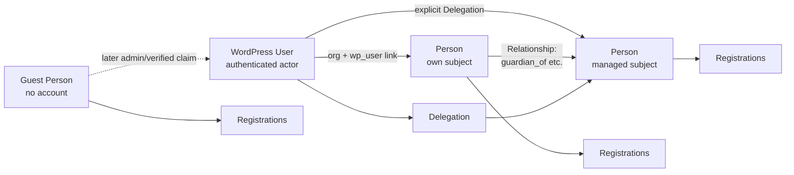
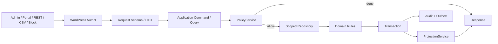
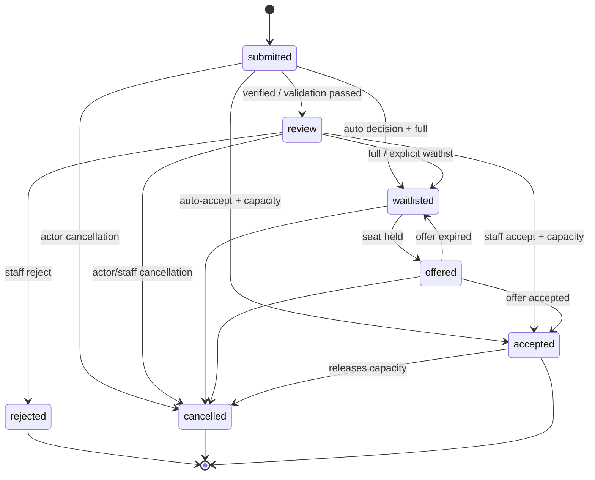
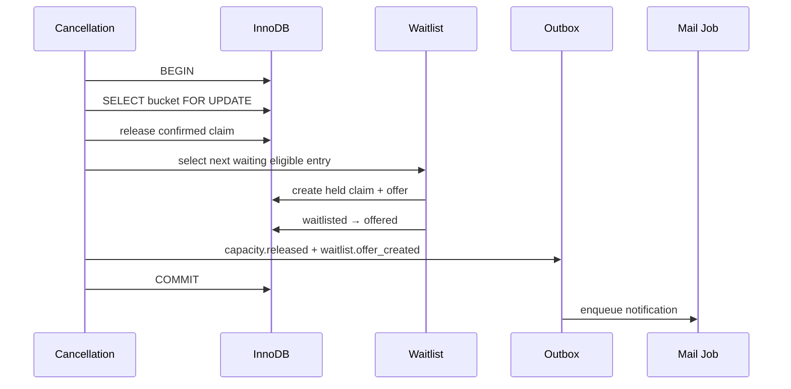
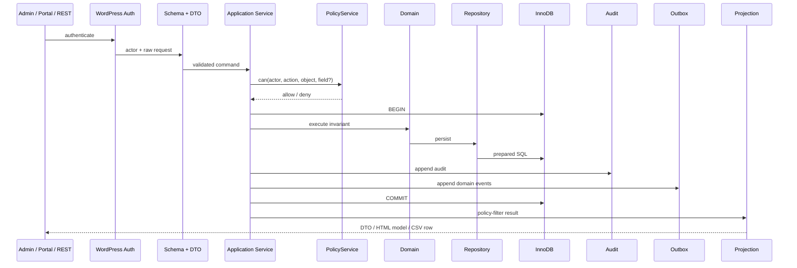
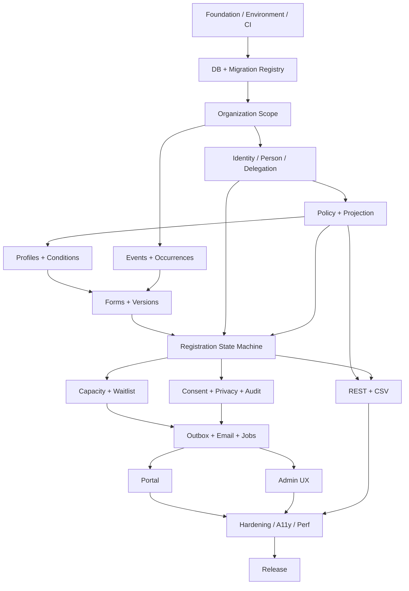

# Phase 2: Implementierungsreife V1-Spezifikation für das WordPress-Organisations- und Teilnehmermanagement

## Ergebnis und verbindlicher V1-Scope

Der Phase-1-Bericht trifft die wesentlichen Architekturentscheidungen bereits in der richtigen Reihenfolge: WordPress-Account und fachliche Person sind getrennte Objekte; operative Massendaten gehören in eigene Tabellen; Events werden hybrid aus WordPress-CPT und operativen Tabellen modelliert; Berechtigungen müssen objekt- und feldbezogen über alle Kanäle identisch wirken; Formulare werden versioniert; und Payments, Dokumente, Signaturen, Offline-Funktionen sowie große Automation sollen den ersten Release nicht belasten. Diese Grundrichtung bleibt bestehen. fileciteturn0file0

Phase 2 verschärft den Scope jedoch an mehreren Stellen. **V1 ist kein „kleines CRM mit Events“, sondern ein sicherer Registration-Kern mit Personenmodell.** Alles, was nicht für diesen vertikalen Ablauf benötigt wird, wird aus dem Release-Gate entfernt:

> Organisation konfigurieren → Event veröffentlichen → versioniertes Formular veröffentlichen → eigene oder delegierte Person anmelden → Registration validieren/prüfen → Platz atomar vergeben oder Warteliste bilden → Status kommunizieren → Portal anzeigen → Daten exportieren/löschen/anonymisieren, ohne Berechtigungsgrenzen zu verletzen.

### Verbindliche Plattform-Baseline

Zum Recherchestand 21. September 2026 ist WordPress **7.1.1** die aktuelle Version; das Maintenance-/Security-Release erschien am 17. September 2026. WordPress.org empfiehlt derzeit PHP 8.3+, MariaDB 10.11+ beziehungsweise MySQL 8.0+ und weist selbst darauf hin, dass ältere Legacy-Baselines zwar technisch noch funktionieren können, aber über ihrem regulären Lebenszyklus liegen. citeturn15search1turn15search0 PHP 8.1 ist seit Ende 2025 EOL; PHP 8.2 erhält nur noch bis Ende 2026 Security-Support, PHP 8.3 bis Ende 2027. citeturn10search0turn10search5

Daraus folgt für V1:

| Vertrag | V1-Entscheidung | Begründung |
|---|---|---|
| `Requires at least` | **WordPress 6.9** | Die verwendete Interactivity API wäre schon seit 6.5 verfügbar; ein noch älterer Floor bringt für ein 2026 neu erscheinendes Plugin unverhältnismäßige Testlast. Der aktuelle Action-Scheduler-Ansatz verfolgt zudem eine „latest minus two“-Dependency-Policy. Die Wahl 6.9 ist damit eine Support-, nicht eine API-Notwendigkeitsentscheidung. citeturn16search0turn17search6 |
| `Tested up to` | **WordPress 7.1.1** beim Release | Aktueller stabiler Stand am Recherchetag. citeturn15search1 |
| PHP Minimum | **PHP 8.3** | Phase 1 wird hier geändert: 8.1 ist EOL, 8.2 steht unmittelbar vor Ende des Security-Supports. citeturn10search0turn10search5 |
| PHP CI | **8.3, 8.4, 8.5** | Alle drei Zweige sind am Recherchetag noch im offiziellen PHP-Supportfenster. citeturn10search0 |
| Datenbank Support | **MySQL 8.0+ oder MariaDB 10.11+, InnoDB, utf8mb4** | Entspricht der aktuellen WordPress-Empfehlung und vermeidet, einen neuen transaktionskritischen Kern auf Legacy-Datenbanken zu optimieren. citeturn15search0 |
| Browser | **WordPress-Browserslist-Policy** | Letzte zwei Desktop-Versionen von Chrome, Firefox, Safari, Edge und Opera, letzte relevante mobile Versionen sowie Browser >1 % Nutzung; das Projekt verwendet `@wordpress/browserslist-config` statt einer eigenen Browserliste. citeturn15search2 |

**Wichtig:** MySQL/MariaDB-Versionen werden bei Aktivierung beziehungsweise im System-Health geprüft. Da der WordPress-Plugin-Header keine geeignete Datenbank-Minimumsdeklaration bereitstellt, muss das Plugin bei einer nicht unterstützten Datenbank **vor dem Anlegen operativer Tabellen** mit einer administrativen Fehlermeldung abbrechen.

### Phase-1-Entscheidungen nach Review

| Phase-1-Annahme | Status | Phase-2-Entscheidung |
|---|---|---|
| `WordPress User ≠ Person` | **Bestätigt** | Bleibt fundamentale Identitätsgrenze. |
| WordPress übernimmt Passwörter/Login | **Bestätigt** | Kein eigenes Credential-System. WordPress-Users und Capabilities bleiben AuthN-/grobe AuthZ-Basis. citeturn13search2 |
| Operative Daten in Custom Tables | **Bestätigt** | Persons, Values, Forms, Registrations, Capacity, Consent, Audit usw. bleiben außerhalb von `postmeta`/`usermeta`. |
| Event als CPT + operative Tabelle | **Bestätigt** | Öffentlicher Content im CPT, Registration-/Capacity-Daten in Tabellen. |
| Person global + Organization Memberships | **Geändert** | **V1-Personen sind organization-owned.** Jede Person gehört exakt einer Organisation. Cross-Org-Personen-Sharing ist ein späteres Modul. |
| Organization Scope früh | **Präzisiert** | V1 erzeugt eine Default-Organisation; `organization_id` ist dennoch vom ersten Schema an eine echte Security Boundary. |
| generischer Relationship Graph | **Präzisiert** | Tabelle bleibt generisch, UI unterstützt V1 aber nur die für Delegation nötige Guardian-/Representative-Beziehung. |
| Relationship kann Vertretung implizieren | **Geändert/geschärft** | Fachliche Relationship und sicherheitswirksame Delegation sind **zwei getrennte Objekte**. |
| großer Feldtyp-Katalog | **Geändert** | V1 erhält nur elf Feldtypen. File/Image/Address/Hidden/Time/URL sind nicht Teil des Builders. |
| Form-Versionen immutable | **Bestätigt** | Veröffentlichung erzeugt unveränderliche Version. Der bearbeitbare Draft liegt am Form-Root. |
| Registration-Status aus Phase 1 | **Geändert** | `email_verified`, `completed` und `archived` werden aus der State Machine entfernt und als orthogonale Attribute/Lifecycle behandelt. |
| Typed Registration Values + Snapshot | **Präzisiert** | Immutable Snapshot ist kanonische historische Repräsentation; typed rows sind daraus reproduzierbare Query-Projektion. |
| Capacity Claims | **Bestätigt** | Eine Registration besitzt V1 höchstens einen Seat Claim. |
| einfache Waitlist | **Präzisiert** | Eigene Waitlist Entry + Offer-Objekte; Offer reserviert einen Platz mit einem expiring `held` Claim. |
| Audit-HMAC-Kette | **Geändert** | Kein Hash-Chain-System in V1. Audit ist application-append-only; externe/verankerte Integritätsnachweise sind Enterprise/Future. |
| Action Scheduler | **Bestätigt** | Queue-Layer, ergänzt durch Transactional Outbox und fachliche Idempotenz. Action Scheduler selbst stellt Queueing, Logging und Admin-Diagnostik bereit. citeturn17search0turn17search2 |
| Tasks als Core | **Geändert** | Entfallen vollständig aus V1. Kein zweiter Statuskanal neben Registration/Consent/Capacity. |
| allgemeiner CSV-Import | **Geändert** | Nicht Release-blockierend; aus Core V1 entfernt. |
| CSV-Export | **Präzisiert** | Bleibt, da operativ nützlich und wichtiger Projection-/Permission-Kanal. Große Exporte laufen asynchron. |
| breite öffentliche REST-Schreib-API | **Präzisiert** | Nur Endpunkte, die V1 selbst benötigt. Intern und extern dieselben Application Services. |
| Documents/Payments/Signatures | **Übernommen** | Future Modules, keine V1-Tabellen. |
| Automation Builder | **Übernommen** | Future Module; Core liefert lediglich Domain Events/Outbox. |
| Theme PHP Template Overrides | **Geändert** | V1 verzichtet auf kopierbare PHP-Template-Overrides. Anpassung über Blocks, Block Supports, CSS und dokumentierte Hooks reduziert Stale-Template-Risiken. |
| Interactivity API | **Bestätigt mit Einschränkung** | Für progressive Enhancement geeignet; keine Frontend-SPA und keine experimentelle Full-Page-Navigation. Die API ist seit WordPress 6.5 Core, hat aber 2026 weiterhin API-Änderungen erfahren. citeturn16search0turn16search1turn16search3 |

Diese Änderungen reduzieren die Zahl konkurrierender Wahrheiten und vermeiden genau die Scope-Gefahr, vor der Phase 1 bereits gewarnt hat. fileciteturn0file0

### MUST, SHOULD und Out of Scope

| Stufe | Bestandteil | Release-Bedeutung |
|---|---|---|
| **MUST / P0** | Installer, Environment Check, Migration Registry, Default Organization, Public IDs, Transaction Manager, Policy Engine, Projection Engine, Audit-Grundlage, Domain-Event-Outbox | Ohne diese Grundlage beginnt keine Feature-Implementierung. |
| **MUST / P1** | Person ↔ WP User, Profile Fields/Values, minimale Relationships + Delegations, Actor Assignments, Events, manuelle Occurrences, Conditions, Forms/Drafts/immutable Versions | Grunddomäne. |
| **MUST / P1** | Registration, serverseitige Formvalidierung, Review, Capacity, Waitlist + Offers, Consent, E-Mail, Portal, Admin-Operations | Golden Path. |
| **MUST / P1** | WP Privacy Exporter/Eraser, Retention Rules, Audit UI, notwendige REST-Routen, CSV Export | Security/Privacy und Betrieb. WordPress stellt dafür explizite Exporter-/Eraser-Hooks und Privacy-Policy-Integration bereit. citeturn11search0turn11search1turn11search2 |
| **MUST / P1** | Permission-Matrix-Cross-Channel-Tests, Capacity-Concurrency-Test, Accessibility Baseline, Upgrade-/Migrationstests | Release Gate. |
| **SHOULD / P2** | Person Merge UI, gespeicherte Adminfilter, bessere Bulk Actions, Dashboard-KPIs, allgemeiner CSV-Import | Darf Release verschieben, aber nicht Architektur verändern. |
| **SHOULD / P2** | Self-Service-Claim eines früheren Gastprofils | V1 kann zunächst sicheren admin-assistierten Account-Link anbieten. |
| **Architecture Only / P2–P3** | Notification-Channel-Registry, Module Registry, Requirement Provider, External Integration Contracts | Interfaces/Hooks vorhanden, aber keine UI oder Fachtabellen. |
| **OUT OF SCOPE** | Files/Documents, Payment Records/WooCommerce, Signatures, Check-in, Offline/PWA, SMS/WhatsApp, Automation Builder, Advanced Reporting, CRM/LMS, Network-wide Multisite | Keine V1-Tabellen, keine versteckten halbfertigen Features. |
| **OUT OF SCOPE** | Recurrence Rule Engine, Group Registration, Seat Maps, Rechnungen, PDF, Webhook Builder | Später. |

Der Form Builder enthält exakt folgende V1-Feldtypen:

```text
text
textarea
email
phone
number
date
select
radio
checkbox
multiselect
consent
```

`group` ist ein Layout-/Semantikcontainer, kein Feldtyp. `file`, `image`, `signature`, `address`, `calculation`, `HTML`, `hidden` und freie ausführbare Expressions sind ausdrücklich nicht V1.

## Domänenmodell, Datenbank und Migrationen

Die wichtigste Präzisierung gegenüber Phase 1 lautet: **Organization Scope wird nicht lediglich als zukünftige Multi-Org-Vorbereitung gespeichert, sondern ist schon in V1 eine echte Autorisierungsgrenze.** Gleichzeitig wird V1 nicht zu einer Multi-Tenant-Plattform ausgebaut.

### Finales fachliches Modell

| Entity | Owner / Scope | Mutable? | Historisch relevant? | Lösch-/Archivregel |
|---|---|---|---|---|
| Organization | WordPress Site | ja | begrenzt | archive |
| WP User | WordPress | WordPress | ja | WordPress-Lifecycle |
| Person | Organization | ja | ja | archive/anonymize/merge |
| Relationship | Organization | ja | ja | status/validity |
| Delegation | Organization + Actor + Subject | ja | **sehr** | revoke, nicht still löschen |
| Actor Assignment | Organization/Event | ja | **sehr** | revoke |
| Profile Field | Organization | eingeschränkt | ja | archive |
| Profile Value | Person | ja | aktuelle Wahrheit | erase/anonymize nach Policy |
| Form | Organization | Draft ja | ja | archive |
| Form Version | Form | **nein nach Publish** | **ja** | referenced versions nicht löschen |
| Event CPT | Organization | ja | ja | WP archive/trash plus Domain Guard |
| Occurrence | Event | ja bis Nutzung | ja | archive |
| Capacity Bucket | Event/Occurrence | ja kontrolliert | ja | archive |
| Registration | Person + Event | State Machine | **ja** | archive/anonymize |
| Registration Snapshot | Registration | **fachlich immutable** | **ja** | nur Privacy-Redaction darf Inhalte entfernen |
| Registration Value | Snapshot | **immutable** | ja | derived; Privacy-Redaction möglich |
| Capacity Claim | Registration | State Machine | ja | released/expired, nicht hart löschen |
| Waitlist Entry | Registration/Bucket | State Machine | ja | terminal status |
| Waitlist Offer | Entry | State Machine | ja | expire/accept |
| Consent Definition/Version | Organization | Version immutable | **ja** | referenced version erhalten |
| Consent Record | Subject | **append-only** | **ja** | nach konfigurierter Retention |
| Audit Entry | Organization | **append-only auf App-Ebene** | ja | dedizierte Retention |
| Domain Event | Aggregate | **append-only** | vorübergehend | payload-minimiert, purge nach Verarbeitung |
| Email Message | Organization | Status mutable | operativ | kurze konfigurierbare Retention |
| Retention Rule | Organization | ja | Konfiguration | archive/disable |

Die Entscheidung, Person und Account zu trennen, bleibt damit vollständig erhalten. Phase 1 hatte zu Recht hervorgehoben, dass Minderjährige, Gäste und Vertretungen mit einem reinen `wp_users`-Modell nicht sauber abbildbar wären. fileciteturn0file0 WordPress selbst definiert User als Access Account mit Rollen und Capabilities; Custom Roles/Capabilities sind ausdrücklich vorgesehen. citeturn13search2



Die fünf geforderten Fälle werden verbindlich wie folgt gelöst:

| Fall | Regel |
|---|---|
| A Account → eigene Person | Pro Organisation höchstens eine `Person` mit `wp_user_id = user.ID`. Self-Policy entsteht implizit, nicht durch Delegation-Row. |
| B Elternaccount → Kind ohne Account | Parent besitzt eigene Person; `guardian_of` ist fachliche Beziehung; zusätzlich existiert eine aktive `Delegation(permission_set=registration_manage)` für das Kind. |
| C Account → mehrere Personen | Beliebig viele Delegations pro Actor, immer subject- und scope-spezifisch. |
| D Person ohne Account → späterer Account | Kein Match nur nach E-Mail. V1: Admin-vermitteltes Linking oder verifizierter Claim-Flow mit Einmal-Token; Transaktion prüft `wp_user_id IS NULL`. |
| E Gast → Person + Registration | Gast-Self-Registration erzeugt `Person(wp_user_id=NULL)` plus Registration. Delegierte Gastregistrierung für fremde Personen ist **nicht** V1. |

**Relationship ist niemals eine Autorisierung.** `guardian_of` allein gibt keinen Zugriff. Nur eine aktive Delegation kann Self-Service-Handlungen für die andere Person erlauben. Dadurch kann die fachliche Beziehung erhalten bleiben, während die Handlungsberechtigung widerrufen wird.

### Duplicate-, Merge- und Account-Deletion-Regeln

Eine E-Mail-Adresse ist kein eindeutiger Personenschlüssel. Kinder können dieselbe Kontaktadresse wie Eltern oder Geschwister nutzen; daher existiert **kein Unique Constraint auf `primary_email`**. Die V1-Duplikaterkennung ist advisory und arbeitet mit Kandidaten, niemals mit automatischem Merge.

Ein Merge ist fachlich destruktiv und erfolgt ausschließlich über einen `MergePersonCommand` mit Preview. Registrations werden auf den Survivor umgehängt; Profile-Wertkonflikte müssen explizit entschieden werden; Relationships und Delegations werden dedupliziert; der verlorene Datensatz erhält `status=merged` und `merged_into_person_id`; ein Audit-Event wird geschrieben. Die UI hierfür ist P2, der Datenvertrag steht aber bereits.

Das Löschen eines WordPress-Users löscht **keine Person**. `wp_user_id` wird atomar auf `NULL` gesetzt, aktive Actor-Delegations werden widerrufen, historische `actor_user_id`-Referenzen in Audit/History bleiben als ID bestehen und werden in der UI als gelöschter WordPress-Actor dargestellt. Das entspricht auch der Trennung der WordPress-Privacy-Werkzeuge vom User-Account: der Core-Eraser löscht den WordPress-User nicht automatisch. citeturn3search2turn11search0

### ER-Modell

```mermaid
erDiagram
    WP_USERS ||--o{ PERSONS : "linked account per org"
    ORGANIZATIONS ||--o{ PERSONS : owns
    ORGANIZATIONS ||--o{ ACTOR_ASSIGNMENTS : scopes
    WP_USERS ||--o{ ACTOR_ASSIGNMENTS : receives

    PERSONS ||--o{ RELATIONSHIPS : from
    PERSONS ||--o{ RELATIONSHIPS : to
    WP_USERS ||--o{ DELEGATIONS : actor
    PERSONS ||--o{ DELEGATIONS : subject

    ORGANIZATIONS ||--o{ PROFILE_FIELDS : defines
    PERSONS ||--o{ PROFILE_VALUES : has
    PROFILE_FIELDS ||--o{ PROFILE_VALUES : typed_value

    ORGANIZATIONS ||--o{ FORMS : owns
    FORMS ||--o{ FORM_VERSIONS : publishes

    ORGANIZATIONS ||--o{ EVENT_SETTINGS : owns
    EVENT_POST ||--|| EVENT_SETTINGS : operational_data
    EVENT_POST ||--o{ EVENT_OCCURRENCES : schedules
    EVENT_POST ||--o{ CAPACITY_BUCKETS : capacity

    PERSONS ||--o{ REGISTRATIONS : subject
    FORM_VERSIONS ||--o{ REGISTRATIONS : schema
    EVENT_POST ||--o{ REGISTRATIONS : receives
    REGISTRATIONS ||--o{ REGISTRATION_SNAPSHOTS : revisions
    REGISTRATION_SNAPSHOTS ||--o{ REGISTRATION_VALUES : materializes
    REGISTRATIONS ||--o{ REGISTRATION_HISTORY : transitions

    REGISTRATIONS ||--o| CAPACITY_CLAIMS : occupies
    REGISTRATIONS ||--o| WAITLIST_ENTRIES : queues
    WAITLIST_ENTRIES ||--o{ WAITLIST_OFFERS : offers

    CONSENT_DEFINITIONS ||--o{ CONSENT_VERSIONS : versions
    CONSENT_VERSIONS ||--o{ CONSENT_RECORDS : evidence
    PERSONS ||--o{ CONSENT_RECORDS : subject

    ORGANIZATIONS ||--o{ DOMAIN_EVENTS : outbox
    ORGANIZATIONS ||--o{ AUDIT_LOG : audits
    ORGANIZATIONS ||--o{ EMAIL_MESSAGES : sends
    ORGANIZATIONS ||--o{ RETENTION_RULES : configures
```

### Profile, Form und Registration als getrennte Wahrheiten

Der Phase-1-Grundsatz wird bestätigt und weiter verschärft. fileciteturn0file0

```text
Profile Value
    = aktueller fachlicher Stand einer Person

Form Draft
    = aktuell bearbeitbares Schema

Form Version
    = unveränderliches veröffentlichtes Schema

Registration Snapshot
    = kanonischer Wertestand einer konkreten Submission/Amendment

Registration Values
    = typisierte, reproduzierbare Materialisierung dieses Snapshots

Registration History
    = Status- und Business-Transition-Historie
```

Eine Registration referenziert eine veröffentlichte Form-Version. Eine spätere Änderung des Profils oder des Form-Drafts verändert historische Registrations nicht.

`registration_snapshots.payload_json` ist die **kanonische historische Datenrepräsentation**. Die typed rows sind Query-Indizes auf denselben Inhalt. Sie dürfen deshalb notfalls aus dem Snapshot neu aufgebaut werden. Diese Festlegung beseitigt die Phase-1-Offenheit, ob JSON oder typed values Source of Truth sind.

Ein Amendment erzeugt eine **neue Snapshot-Revision**, anstatt die alte zu überschreiben:

```text
Registration 4711
current_snapshot_id → Revision 3

Revision 1  initial submission      immutable
Revision 2  participant correction immutable
Revision 3  staff correction       immutable/current
```

Die einzige Ausnahme von fachlicher Immutability ist ein ausdrücklich autorisierter Privacy-/Retention-Redaction-Prozess. Er darf personenbezogene Werte aus historischen Snapshots entfernen oder anonymisieren, muss dies aber separat auditieren. „Immutable“ darf nicht bedeuten, dass unnötige personenbezogene Daten technisch für immer unauslöschbar werden.

### Public IDs, Zeit und Fremdschlüssel

Interne Primärschlüssel sind `BIGINT UNSIGNED AUTO_INCREMENT`. Extern adressierbare Domain-Objekte erhalten zusätzlich einen zufälligen UUID-v4-ähnlichen `BINARY(16)` Public ID, der in REST als kanonischer UUID-String serialisiert wird. Opaque IDs erschweren Enumeration, ersetzen aber niemals Object Authorization; OWASP weist ausdrücklich darauf hin, dass auch UUIDs ohne objektbezogene Zugriffskontrolle IDOR/BOLA nicht verhindern. citeturn12search13turn12search16

Alle Domain-Zeitpunkte werden als UTC gespeichert. Event-/Occurrence-Zeitzonen werden separat als IANA-Zeitzonen gespeichert und erst für Darstellung beziehungsweise fachliche Zeitberechnung angewandt.

V1 verwendet **keine physischen Foreign-Key-Constraints**. Unique Constraints, Primary Keys und Indizes werden dagegen datenbankseitig erzwungen. Die Beziehungen zu `wp_users`/`wp_posts` und zwischen Domain-Tabellen sind logische FKs, deren Integrität Repository-, Migration- und Repair-Tests prüfen. Diese Entscheidung hält WordPress-Migrationen und Install/Uninstall-Vorgänge überschaubar; sie bedeutet aber ausdrücklich, dass Referential-Integrity-Tests Release-Gates sind.

### Migrationen

`dbDelta()` bleibt ausschließlich für Initialschema und einfache additive Schemaabgleiche zulässig. Die offizielle WordPress-Dokumentation weist sowohl auf die strikten Syntaxanforderungen von `dbDelta()` als auch darauf hin, dass Activation Hooks beim normalen Plugin-Update nicht erneut ausgeführt werden; WordPress empfiehlt deshalb eine gespeicherte Schema-Version und eine Upgrade-Prüfung außerhalb des Aktivierungswegs. citeturn15search3

Der V1-Vertrag lautet:

```php
interface Migration {
    public function version(): int;
    public function up(MigrationContext $context): void;
}

final class MigrationRegistry {
    /** @return list<Migration> */
    public function pending(int $installedVersion): array;
}
```

```text
uop_db_version      = strukturelle Version
uop_data_version    = vollständig migrierter Datenstand

Migration:
expand schema
→ deploy compatibility reads/writes
→ resumable backfill
→ verify counts/invariants
→ switch canonical read
→ erst in späterem Release altes Feld entfernen
```

Große Backfills laufen resumierbar über Action Scheduler statt während des Upgrade-Requests. Action Scheduler ist explizit für große, nachvollziehbare WordPress-Hintergrundqueues ausgelegt; die Standard-Queue arbeitet konservativ in begrenzten Batches und stellt Logs sowie eine Admin-Ansicht für fehlgeschlagene Aktionen bereit. citeturn17search0turn17search5

## Autorisierung, Security, Privacy und Audit

Die wichtigste Phase-2-Entscheidung ist, dass Berechtigungen **nicht in Controllern leben**.

REST, Admin, Portal, CSV, Blocks und Background Jobs dürfen fachliche Repositories nicht direkt verwenden. Jede fachliche Query und jeder Command läuft durch eine Application-Schicht, die den zentralen Policy Service aufruft. RESTs `permission_callback` führt denselben Service als frühes Preflight aus, die Application-Schicht prüft aber erneut authoritative.

OWASP empfiehlt für komplexe Autorisierung „deny by default“ und die Prüfung auf jedem Request beziehungsweise jedem Zugriffspfad; genau deshalb wird keine UI-spezifische Berechtigungslogik akzeptiert. citeturn12search0turn12search9



### Capability-Katalog

WordPress-Rollen werden ausschließlich als Bündel grober Capabilities verwendet. WordPress selbst empfiehlt Capability-Prüfungen und unterstützt Custom Roles/Capabilities; `current_user_can()` kann darüber hinaus Meta-/Object-Capabilities auflösen. Rollenname-Vergleiche werden nicht als Autorisierung verwendet. citeturn13search2turn4search0

V1 registriert:

```text
uop_manage_settings
uop_manage_organization

uop_view_people
uop_edit_people
uop_manage_delegations

uop_manage_events
uop_manage_forms

uop_view_registrations
uop_review_registrations
uop_manage_capacity

uop_send_communications
uop_export_data

uop_view_sensitive_data
uop_edit_sensitive_data

uop_manage_privacy
uop_view_audit
```

Die Capabilities sind **notwendig, aber niemals allein hinreichend**. Danach folgen Assignment/Object Policy und gegebenenfalls Field Policy.

### Rollenmatrix

`✓` bedeutet Default Capability; Objekt-Scope und Field Policy bleiben zusätzlich erforderlich.

| Capability | Site Admin | Org Manager | Event Manager | Staff | Viewer | Participant |
|---|---:|---:|---:|---:|---:|---:|
| manage settings | ✓ |  |  |  |  |  |
| manage organization | ✓ | ✓ |  |  |  |  |
| view people | ✓ | ✓ | ✓ | ✓ | ✓ | self/delegated policy |
| edit people | ✓ | ✓ | ✓ | ✓ |  | self/delegated fields |
| manage delegations | ✓ | ✓ |  |  |  | limited self/delegated flow |
| manage events | ✓ | ✓ | ✓ |  |  |  |
| manage forms | ✓ | ✓ | ✓ |  |  |  |
| view registrations | ✓ | ✓ | ✓ | ✓ | ✓ | self/delegated |
| review registrations | ✓ | ✓ | ✓ |  |  |  |
| manage capacity | ✓ | ✓ | ✓ |  |  |  |
| send communications | ✓ | ✓ | ✓ |  |  |  |
| export data | ✓ | ✓ | ✓ |  |  |  |
| view sensitive | ✓ | ✓ | optional explicit grant |  |  | field-specific self/delegate |
| edit sensitive | ✓ | ✓ | optional explicit grant |  |  | field-specific |
| manage privacy | ✓ | ✓ |  |  |  |  |
| view audit | ✓ | ✓ |  |  |  |  |

Ein Site Admin kann sämtliche Organisationen der Site verwalten. Alle anderen Business-Rollen benötigen `actor_assignments`, beispielsweise:

```text
User 42
role_key             = event_manager
scope_type           = event
scope_id             = 781
organization_id      = 1
sensitivity_ceiling  = personal
```

Dadurch bedeutet „Event Manager“ nicht „Event Manager aller Events“.

### `can(actor, action, object, field?)`

Der Policy-Vertrag wird endgültig:

```php
interface PolicyService
{
    public function can(
        Actor $actor,
        string $action,
        DomainObject $object,
        ?FieldDefinition $field = null
    ): Decision;
}
```

Ein `Decision` enthält nicht nur bool, sondern intern einen Reason Code:

```text
ALLOW_SELF
ALLOW_DELEGATION
ALLOW_ORG_ASSIGNMENT
ALLOW_EVENT_ASSIGNMENT

DENY_UNAUTHENTICATED
DENY_CAPABILITY
DENY_ORGANIZATION
DENY_OBJECT_SCOPE
DENY_DELEGATION
DENY_FIELD
DENY_ARCHIVED
```

Reason Codes werden für Tests und Admin-Diagnostik verwendet, aber extern nicht so detailliert ausgegeben, dass sie fremde Objekt-Existenz verraten.

Die Auswertung lautet:

```text
Actor auflösen
→ Action bekannt?
→ Default = deny
→ grobe WP Capability vorhanden oder ausdrücklich public/self action?
→ Organization Scope passend?
→ self / aktive Delegation / Actor Assignment passend?
→ object-specific constraint passend?
→ falls Field: Field Policy passend?
→ allow
```

### Field Policy und Projection Policy

V1 reduziert den ursprünglich sehr freien ACL-Ansatz auf eine implementierbare Struktur.

Sensitivitätsklassen:

```text
public
internal
personal
sensitive
medical
```

Jedes Feld besitzt zusätzlich:

```text
subject_view
subject_edit
delegate_view
delegate_edit
```

Staff-/Manager-Zugriff wird durch die Kombination aus Capability und `sensitivity_ceiling` des Actor Assignments begrenzt. `uop_view_sensitive_data` ist zusätzliche Defense in Depth für die beiden höchsten Klassen.

Beispiel:

```text
Allergien
sensitivity      = medical
subject_view     = true
subject_edit     = true
delegate_view    = true
delegate_edit    = true
```

Ein Guardian kann damit das Feld für sein Kind sehen, sofern die Delegation aktiv ist. Ein Event Manager mit `sensitivity_ceiling=personal` sieht es trotz Zugriff auf die Registration nicht.

Die Projection Policy ist verpflichtend:

```php
$view = $projector->person(
    actor: $actor,
    person: $person,
    context: ProjectionContext::REST
);
```

Nie:

```php
return rest_ensure_response($person->toArray()); // verboten
```

Der gleiche Projector wird für HTML View Models, REST DTOs und CSV benutzt.

### Security Threat Model

WordPress-Nonces schützen gegen CSRF, stellen aber ausdrücklich **keine** Autorisierung dar; die WordPress-Dokumentation verlangt zusätzliche Capability-Prüfungen. citeturn4search6 Bei REST-Cookie-Authentication verwendet WordPress einen REST-Nonce; externe Clients können Application Passwords über HTTPS nutzen. citeturn18search2

| Threat | Angriff | V1-Kontrolle | Verbindlicher Test |
|---|---|---|---|
| **Spoofing** | fremder Actor / gestohlener Verification Token | WordPress Auth; zufällige One-Time-Tokens nur gehasht gespeichert; expiry | token replay + invalid actor |
| **BOLA/IDOR** | `/people/{uuid}` eines anderen Subjekts | scoped lookup + Object Policy; UUID nur defense-in-depth | Multi-user replay über alle Kanäle |
| **Cross-org leak** | ID aus fremder Organization | `organization_id` in Repository Scope vor Objektfreigabe | Org A / Org B fixture |
| **Privilege escalation** | Staff ruft Manager-Command direkt auf | Capability + Assignment + App-Service-Policy | direkte REST-/Service-Tests |
| **Field leak** | medical field in Export/REST | ProjectionService | Cross-channel visible-field equality |
| **CSRF** | eingeloggter Nutzer wird zu POST verleitet | REST nonce/Admin nonce + AuthZ | missing/wrong nonce |
| **Mass Assignment** | Request setzt `status=accepted` oder `organization_id` | explizite DTO-Allowlist; status nur TransitionCommand | unbekannte/protected properties |
| **XSS** | Feldlabel/Antwort enthält Markup | Validierung + kontextbezogenes spätes Escaping | persistent/reflected payload fixtures |
| **SQLi** | Filter/Sort manipuliert Query | `$wpdb->prepare()` für Werte; safelisted Sort-/Spaltennamen | malicious query params |
| **Capacity Race** | zwei akzeptieren letzten Platz | InnoDB transaction + bucket row lock | parallele 50-worker tests |
| **Waitlist Race** | zwei Offers für einen Platz | selbe Bucket-Lock-Grenze | simultaneous release/accept |
| **Duplicate Job** | Queue sendet E-Mail mehrfach | fachlicher Idempotency Key | callback twice |
| **CSV Formula Injection** | Name beginnt `=`, `+`, `-`, `@` | Spreadsheet-safe cell escaping | malicious export fixture |
| **Repudiation** | Statusänderung ohne Spur | Registration History + Audit + Correlation ID | mutation always creates both |
| **DoS** | riesige Filter, page size, Mail-Loop | max page sizes, Query Allowlist, async batching, public rate-limit hook | fuzz/load suite |

OWASP beschreibt Mass Assignment als Risiko, wenn Requestfelder automatisch an Domainobjekte gebunden werden; DTO-Allowlisting ist deshalb verbindlich. citeturn11search11 Prepared/parameterisierte Queries sind sowohl nach WordPress- als auch OWASP-Empfehlung die primäre SQL-Injection-Kontrolle; `$wpdb->prepare()` unterstützt dafür Wert- und seit WordPress 6.2 auch Identifier-Platzhalter. citeturn13search0turn12search5 Für Output gilt WordPress’ „escape late“-Prinzip mit dem jeweiligen Ausgabekontext. citeturn14search0turn14search5 CSV-Formula-Injection ist ein eigener Export-Angriffsweg und wird entsprechend behandelt. citeturn11search12

### Privacy, Retention und Consent

WordPress empfiehlt Plugins, die personenbezogene Daten speichern oder übertragen, ausdrücklich Privacy Policy Content, Exporter, Eraser sowie die Prüfung von Frontend-, REST- und Löschpfaden. citeturn11search0turn11search2 Der Core-Exporter ist paginiert und arbeitet über registrierte Plugin-Callbacks. citeturn11search1turn11search4

Jede Profile-Field-Definition enthält:

```text
privacy_purpose
lawful_basis_note
sensitivity
retention_class
subject_view/edit
delegate_view/edit
```

Das Plugin liefert **keine angeblich gesetzlich richtigen Standardfristen**. Bei Kindern variiert beispielsweise selbst der für bestimmte Einwilligungskonstellationen relevante Schwellenwert innerhalb der EU; EDPB/EU-Leitlinien betonen zudem, dass Alters-/Elternprüfung verhältnismäßig sein muss. citeturn9search0turn9search12 Consent muss freiwillig, spezifisch, informiert und widerrufbar modellierbar sein; die EDPB-Guidelines behandeln diese Anforderungen ausführlich. citeturn9search1

Retention Rule:

```json
{
  "data_class": "medical",
  "trigger": "event.end",
  "delay_days": 30,
  "action": "erase",
  "enabled": true
}
```

V1-Aktionen:

```text
erase
anonymize
archive
```

Jeder produktive Retention Run unterstützt:

```text
dry run
affected record count
sample of IDs, niemals sensible Werte
legal/retention hold
batch cursor
failure state
audit entry
```

Eine `retention_hold_until`-Sperre auf Person/Registration verhindert automatische Verarbeitung.

Bei WordPress-Privacy-Requests entsteht ein wichtiges Edge Case: Der Core-Exporter identifiziert Requests über eine E-Mail-Adresse. citeturn11search1 Da das Produkt geteilte Familienadressen zulässt, darf „gleiche E-Mail“ nicht automatisch „gleicher Data Subject“ bedeuten. V1 exportiert automatisch nur eindeutig account-verknüpfte beziehungsweise eindeutig auflösbare Personen. Mehrdeutige Shared-Email-Fälle werden im Admin als **manual subject resolution required** ausgewiesen; niemals werden auf Verdacht mehrere Kinderprofile zusammen exportiert.

### Audit

Audit und Business History sind getrennt.

`registration_history` beantwortet fachlich:

```text
welcher Status → welcher Status
wann
durch wen
warum
mit welchem Command
```

`audit_log` beantwortet sicherheits-/betriebsbezogen:

```text
wer
welche Aktion
welches Objekt
welches Subject
Ergebnis
Correlation ID
wann
optionale nicht-sensitive Metadaten
```

In `audit_log.data_json` sind untersagt:

```text
medical values
vollständige Profilwerte
Passwörter
Tokens
Application Passwords
Cookies
Mail bodies
Consent full text
```

Phase 1 schlug eine HMAC-Kette vor. Diese wird für V1 **nicht** übernommen. Eine globale Hash-Kette erzeugt Lock-/Serialisierungsprobleme und ist bei kompromittierter Anwendung samt Schlüssel kein externes, manipulationssicheres Ledger. V1 garantiert stattdessen „no update path“ auf Anwendungsebene, restriktiven Admin-Zugriff und dedizierte Audit-Retention. Extern verankerte Hash-Wurzeln bleiben Enterprise-Option.

## Kernprozesse, REST und WordPress-Architektur

### Registration State Machine

Phase 1 enthielt `draft`, `email_verified`, `completed` und `archived` als Zustände. fileciteturn0file0 Phase 2 reduziert das Modell:



`email_verified_at` ist orthogonal. Ein `submitted` Record kann also „awaiting email verification“ sein, ohne einen eigenen Business-State zu erzeugen.

`completed` entfällt: Eine akzeptierte Registration bleibt historisch `accepted`, auch nachdem das Event stattgefunden hat. `archived` ist `archived_at` und kein fachlicher Status. `draft` entfällt aus V1, womit Autosave-/Partial-Submission-Komplexität ebenfalls wegfällt.

### Transition Matrix

| From | To | Actor | Preconditions | Capacity | Audit/Event |
|---|---|---|---|---|---|
| create | submitted | participant/delegate/guest | event open, form valid, eligibility valid, duplicate rule pass | none | submitted |
| submitted | review | system | verification satisfied | none | status changed |
| submitted | accepted | system | auto mode + seat available | confirmed claim | accepted |
| submitted | waitlisted | system | auto mode + no seat | waitlist entry | waitlisted |
| review | accepted | reviewer | permission + eligibility + seat | confirmed claim | accepted |
| review | waitlisted | reviewer/system | no seat or manual choice | waitlist entry | waitlisted |
| review | rejected | reviewer | reason code | none | rejected |
| waitlisted | offered | system | head of queue + available seat | `held` claim | offer created |
| offered | accepted | subject/delegate | valid token, not expired | held→confirmed | offer accepted |
| offered | waitlisted | system | expired | held→expired | offer expired |
| accepted | cancelled | subject/staff | cancellation permitted | confirmed→released; next offer | cancelled + capacity released |
| any nonterminal | cancelled | authorized actor | policy | release if any | cancelled |

Statusänderungen können nicht durch `PATCH {"status":"accepted"}` erfolgen. Sie laufen ausschließlich durch einen Command wie:

```php
new TransitionRegistration(
    registrationId: $id,
    targetState: RegistrationState::Accepted,
    reasonCode: 'review_approved',
    commandId: $uuid,
);
```

`command_id` macht Wiederholungen idempotent.

### Capacity und Waitlist

Der entscheidende DB-Vertrag lautet: **der Capacity-Bucket ist die Serialisierungszeile**.

InnoDB-Locking Reads mit `SELECT ... FOR UPDATE` sperren relevante Datensätze bis Commit/Rollback; solche Sperren müssen innerhalb einer Transaktion verwendet werden. MySQL weist außerdem darauf hin, dass geeignete Indizes die Menge gesperrter Records/Ranges wesentlich beeinflussen. citeturn6search2turn6search4 MariaDB dokumentiert `FOR UPDATE` entsprechend für InnoDB innerhalb einer echten Transaktion. citeturn6search5

```sql
START TRANSACTION;

SELECT id, capacity, status
FROM wp_uop_capacity_buckets
WHERE id = ?
FOR UPDATE;

UPDATE wp_uop_capacity_claims
SET status = 'expired',
    released_at = UTC_TIMESTAMP()
WHERE bucket_id = ?
  AND status = 'held'
  AND expires_at <= UTC_TIMESTAMP();

SELECT COUNT(*)
FROM wp_uop_capacity_claims
WHERE bucket_id = ?
  AND status IN ('held', 'confirmed');

-- wenn count < capacity:
INSERT / UPDATE claim ...

-- transition + history + audit + outbox in derselben TX

COMMIT;
```

Die Anzahl belegter Plätze wird **nicht** als separat veränderbarer Counter gespeichert. `capacity_claims` ist die Wahrheit. Dadurch entstehen nicht zwei Werte, die nach einem Crash repariert werden müssten.

Ein `held` Claim für ein Waitlist Offer zählt sofort gegen Capacity. Dadurch kann ein Platz, der Person A angeboten wurde, nicht gleichzeitig Person B akzeptiert werden.



**Der nächste Offer wird innerhalb derselben DB-Transaktion erzeugt, nicht erst in einem Background Job.** Sonst könnte zwischen Capacity Release und Queue Processing eine neue direkte Acceptance den freien Platz übernehmen.

Queue-Reihenfolge:

```text
priority DESC
joined_at ASC
id ASC
```

`queue_position` wird nicht dauerhaft gespeichert, sondern berechnet.

Ein Event Manager darf die Warteliste nicht still umgehen. Sobald aktive Waitlist-Einträge existieren, wird ein frei werdender Platz zuerst als Offer reserviert. V1 unterstützt kein „force overbook“. Soll ein weiterer Platz vergeben werden, muss Capacity explizit erhöht werden.

Für jede Capacity-Mutation gilt dieselbe Lock Order:

```text
capacity_bucket
→ betroffene registration rows in ascending id
→ capacity_claim
→ waitlist_entry
→ waitlist_offer
```

Trotz sauberer Lock-Reihenfolge können relationale Systeme Deadlocks nicht vollständig ausschließen; MySQL empfiehlt, eine komplette Transaktion nach Deadlock zu wiederholen. citeturn7search1turn7search3 Die Transaction-Schicht retried deshalb maximal dreimal mit kleinem Jitter; Business-Code selbst enthält keine Ad-hoc-Retry-Logik.

Der zentrale Release-Test lautet:

```text
capacity = 1
50 parallele Acceptance Commands
```

Erwartung:

```text
exactly one confirmed capacity claim
zero overbookings
all other commands deterministic conflict/waitlist outcomes
no duplicate domain events
```

### Conditions

Conditional Logic ist deklarativ und schema-versioniert:

```json
{
  "schema_version": 1,
  "all": [
    {
      "source": "profile",
      "field": "date_of_birth",
      "operator": "age_lt_at",
      "value": 18,
      "context": "event.start"
    },
    {
      "not": {
        "source": "registration",
        "field": "participant_type",
        "operator": "eq",
        "value": "staff"
      }
    }
  ]
}
```

V1-Nodes:

```text
all
any
not
predicate
```

V1-Operatoren:

```text
eq
neq
in
not_in
exists
empty
lt
lte
gt
gte
date_before
date_after
age_lt_at
age_gte_at
```

Freier PHP-/JavaScript-Code ist nicht zulässig.

Der `ConditionEvaluator` in PHP ist authoritative. JavaScript beziehungsweise Interactivity API repliziert lediglich Visibility-/UX-Auswertung. Bei einer manipulierten Browser-Submission wird die komplette Regel serverseitig erneut ausgewertet.

### WordPress-Schichten

```text
plugin.php
src/
  Core/
    Kernel.php
    Container.php
    PublicId.php
    Clock.php
    TransactionManager.php

  Domain/
    Organization/
    People/
    Profiles/
    Delegation/
    Events/
    Forms/
    Registration/
    Capacity/
    Consent/
    Privacy/
    Audit/

  Application/
    Command/
    Query/
    Policy/
    Projection/
    DTO/

  Infrastructure/
    Database/
    WordPress/
    Queue/
    Mail/

  REST/
  Admin/
  Frontend/
  Blocks/
  CLI/
  Extension/

assets/
blocks/
tests/
vendor/
```

Kein Symfony-/Laravel-Domain-Framework und kein Auto-Wiring-Container werden eingeführt. Konstruktion erfolgt über einen kleinen expliziten Service Container.

Repositories werden nur innerhalb von Application Services verwendet. Controller dürfen nicht selbst SQL schreiben.

### Request Chain



### Transactional Outbox

Ein wichtiger neuer V1-Baustein ist `domain_events`.

Ohne Outbox existiert ein Crashfenster:

```text
DB commit succeeds
→ PHP process dies
→ Action Scheduler job never scheduled
```

Deshalb wird jedes für asynchrone Side Effects relevante Domain Event **in derselben DB-Transaktion** wie die Business-Änderung in `uop_domain_events` geschrieben. Nach Commit versucht der Dispatcher, eine Action-Scheduler-Aktion anzulegen. Ein periodischer Sweep findet Events mit `published_at IS NULL`, falls der Request zwischen Commit und Enqueue abgestürzt ist.

Die Outbox enthält IDs und fachliche Metadaten, nicht komplette Personen-/Medizindaten.

### REST-Vertrag

WordPress verlangt für registrierte REST-Routen eine `permission_callback`; die offizielle Dokumentation empfiehlt, dort autorisierungsbezogene Capability-Prüfungen statt bloßer Login-Prüfung vorzunehmen. Routen können Argument-Schemas, Validation und Sanitization deklarieren. citeturn18search0turn18search1turn18search3

Namespace:

```text
/wp-json/uop/v1/
```

Alle Domain-Ressourcen werden über `public_id`, niemals über interne PKs adressiert.

| Methode | Route | Auth | Policy / Zweck | Idempotenz |
|---|---|---|---|---|
| GET | `/events` | public | nur public/published | n/a |
| GET | `/events/{event}` | public/policy | visibility | n/a |
| GET | `/events/{event}/form` | public/policy | nur veröffentlichte Form-Version | n/a |
| POST | `/registrations` | guest/auth | registration.create + delegation if foreign subject | `submission_key` |
| POST | `/registration-verifications` | token | hashed token + expiry | token single-use |
| GET | `/me/persons` | auth | own + active delegated | n/a |
| GET | `/people/{person}` | auth | person.view | n/a |
| PATCH | `/people/{person}` | auth | per-field `person.edit` | expected version |
| GET | `/registrations` | auth | scoped query | n/a |
| GET | `/registrations/{registration}` | auth | registration.view | n/a |
| POST | `/registrations/{registration}/cancel` | auth | transition policy | `command_id` |
| POST | `/registrations/{registration}/transitions` | staff | specific transition policy | `command_id` |
| GET | `/admin/people` | staff | people query + projection | n/a |
| POST | `/admin/people` | staff | person.create | `command_id` |
| GET | `/admin/registrations` | staff | scoped | n/a |
| GET | `/forms` | manager | form.view | n/a |
| POST | `/forms` | manager | form.create | `command_id` |
| PATCH | `/forms/{form}/draft` | manager | form.edit | draft revision |
| POST | `/forms/{form}/publish` | manager | form.publish | `command_id` |
| GET/PATCH | `/events/{event}/settings` | event manager | event.manage | version |
| GET/POST/PATCH | `/events/{event}/occurrences` | event manager | event.manage | command/version |
| GET/POST/PATCH | `/events/{event}/capacity-buckets` | manager | capacity.manage | command/version |
| GET | `/audit` | org manager | audit.view | n/a |
| POST | `/exports` | manager | export + field projection | `command_id` |
| GET | `/exports/{job}` | creator/policy | export.view | n/a |

API-Fehlervertrag:

```text
400 invalid schema / malformed request
401 authentication required
403 actor authenticated but action globally prohibited
404 resource absent OR intentionally hidden by scope
409 stale version / illegal transition / capacity conflict / reused command
422 semantically valid request but domain validation failed
429 public abuse/rate limit
500 unexpected internal error
503 migration/queue/system prerequisite unavailable
```

Bei Cookie-authentifizierten WordPress-Requests wird der Core-REST-Nonce verwendet; bei externen Integrationen ist Application Passwords der erste V1-Authentifizierungsweg. WordPress liefert Application Passwords als API-spezifische, widerrufbare Credentials und empfiehlt deren Verwendung über HTTPS. citeturn18search2turn18search5 Ein eigenes JWT-System wird nicht gebaut.

### Blocks und Interactivity API

Die Frontend-Bausteine sind dynamische, servergerenderte Blocks:

```text
uop/event-list
uop/event-details
uop/registration-form
uop/portal
uop/my-registrations
```

WordPress unterstützt Dynamic Blocks über `render_callback` beziehungsweise `render.php`; dadurch können Inhalte requestseitig mit aktuellen Domain-Daten erzeugt werden. citeturn10search1turn10search4 Die Interactivity API ist seit WordPress 6.5 in Core und explizit für progressive, blockbasierte Frontend-Interaktion ausgelegt. citeturn16search0turn16search5

V1 verwendet sie für:

```text
conditional form visibility
dependent field UI
accessible disclosure widgets
portal filters
guardian/subject switcher
inline capacity feedback
```

Nicht für:

```text
authoritative validation
authorization
capacity decisions
full SPA routing
experimental full-page client navigation
```

2026 wurden APIs wie `state.navigation` bereits wieder geändert/deprecated, während Full-Page-Navigation weiterhin als experimentell dokumentiert ist; deshalb liegt eine kleine `FrontendInteractionAdapter`-Grenze zwischen Domain UI und konkreter Interactivity-API-Nutzung. citeturn16search1turn16search3

## UI, Jobs, Performance und Accessibility

### Verbindliche Screen Inventory

**Admin**

| Screen | V1-Inhalt | Nicht enthalten |
|---|---|---|
| Overview | System-/Action-required-Hinweise, kleine Counts | kein BI-Dashboard |
| People | Filterbare Liste, Create | Charts |
| Person Detail | Profile, account link, relations/delegations, registrations | Dokumente/Payments |
| Events | natives CPT Listing | eigene Kalenderplattform |
| Event Editor | Gutenberg + operatives Settings Panel | Recurrence Builder |
| Registrations | filterbare Liste, bulk-safe actions | freie Workflow-Automation |
| Registration Detail | Snapshot, current values, history, status actions, capacity | Tasks |
| Forms | Liste + Draft/Published state | Marketplace |
| Form Builder | kleine Field Palette, Reorder, Conditions, Publish | Page Builder |
| Consent/Privacy | Consent Definitions + Retention Rules | Legal wizard |
| Communications | Templates, queue/failure log | SMS/WhatsApp |
| Audit | filterbare Audit-Tabelle | SIEM |
| Settings | General, Permissions, Privacy, Email, System | Commerce |
| System Health | schema, queue, mail test, environment | remote telemetry |

**Portal**

| Screen | V1 |
|---|---|
| Home | nächste relevante Registrations / offene Statushinweise |
| My Profile | aktuelle erlaubte Profilfelder |
| Managed Persons | Subject Switcher |
| Events | verfügbare Events |
| Registration Form | server-authoritative Form |
| My Registrations | eigene/delegierte Registrations |
| Registration Detail | Status, Snapshot-Daten nach Field Policy, Cancel falls erlaubt |
| Privacy | Link/Information zu Data Request Process |

Jeder Screen bekommt explizite Zustände für:

```text
loading
empty
permission denied
not found
validation error
conflict/stale data
background failure
mobile/reflow
```

Ein „403“-Screen darf nicht versehentlich über Tabellen, Breadcrumbs oder Seitentitel Informationen über das verbotene Objekt verraten.

### Background Jobs

Action Scheduler bleibt Queue Engine. Es bietet eine WordPress-spezifische, nachvollziehbare Hintergrundqueue, verarbeitet standardmäßig konservative Batches und bietet WP-CLI für größere Queues. citeturn17search0turn17search1turn17search3

| Job | Trigger | Idempotency | Retry | Failure UI |
|---|---|---|---|---|
| `uop_outbox_dispatch` | commit/sweep | event UUID | fortlaufend | System Health |
| `uop_send_email` | email message created | email idempotency hash | 1m, 5m, 30m, 2h, 8h | Communications |
| `uop_expire_waitlist_offers` | recurring | offer status guarded | next run | Registrations/System |
| `uop_retention_scan` | daily | rule + cutoff cursor | next schedule | Privacy |
| `uop_retention_batch` | scan | object/action key | exponential, max 5 | Privacy |
| `uop_generate_export` | user command | export command UUID | max 3 | Exports |
| `uop_migration_backfill` | DB upgrade | migration + cursor | max 5 / admin intervention | System Health |

Action Scheduler bietet zwar ein `$unique`-Flag für Scheduled Actions, fachliche Idempotenz wird trotzdem in den UOP-Tabellen erzwungen, weil Queue-Deduplizierung allein nicht garantiert, dass ein bereits teilweise ausgeführter Side Effect nicht noch einmal aufgerufen wird. Die aktuellen APIs stellen unter anderem `as_enqueue_async_action()`, `$unique`, Gruppen und Prioritäten bereit. citeturn17search2

### E-Mail

V1 sendet ausschließlich über `wp_mail()`. SMTP-/Transactional-Mail-Plugins können dadurch weiterhin die bestehende WordPress-Mailpipeline übernehmen.

Statusmodell:

```text
queued
sending
accepted
failed
```

**Nicht `delivered`.** Ein erfolgreicher Rückgabewert von `wp_mail()` bedeutet lediglich, dass WordPress die Nachricht zur Verarbeitung akzeptiert hat, nicht dass sie beim Empfänger zugestellt wurde. citeturn3search1 Delivery/Bounce-Status benötigt später einen Provider Adapter.

Jede Nachricht besitzt einen fachlichen Idempotency Key, zum Beispiel:

```text
sha256(
  "registration.accepted"
  + registration_id
  + transition_command_id
  + template_revision
)
```

Mails werden vor Queueing gerendert; Subject/Text/HTML werden in `email_messages` gespeichert, damit ein später geändertes Template keinen Retry-Inhalt verändert. Diese gespeicherten Inhalte sind selbst personenbezogene Daten und unterliegen einer kurzen konfigurierbaren Retention.

### Performance-Verträge

Die Budgets sind **Release-Ziele auf einer definierten Referenzumgebung**, keine Garantie für beliebige Shared-Hosting-Systeme.

Referenz:

```text
4 vCPU
8 GB RAM
PHP 8.3-FPM
MySQL 8.0 current patch oder MariaDB 10.11 current patch
kein verpflichtender Redis/Object Cache
HTTPS lokal/CI
Produktions-ähnliche OPcache-Konfiguration
```

Datensätze:

| Profil | Persons | Registrations | Dynamic Values | Audit Rows |
|---|---:|---:|---:|---:|
| Small | 100 | 500 | 10.000 | 10.000 |
| Medium | 10.000 | 50.000 | 750.000 | 500.000 |
| Large | 100.000 | 500.000 | 7.000.000+ | 3.000.000+ |

Release-Budgets:

```text
People/Registration list:
p95 server time <= 500 ms
page size default 50, max 100
no N+1 queries

Portal read:
p95 server time <= 500 ms

Registration submit:
p95 <= 1 s excluding async email

Normal capacity transition:
p95 <= 750 ms without heavy contention

No unpaginated custom-table collection.
No SELECT * in repositories.
No synchronous >5,000-row CSV generation.
No synchronous mass mail.
No synchronous retention batch.
```

Custom-table Collections verwenden Cursor/Keyset Pagination. Die zentralen Indexpfade sind:

```text
people:
organization_id, status, id

registrations:
organization_id, status, id
event_post_id, status, id
person_id, event_post_id, occurrence_id

profile values:
field_id + typed value

registration values:
field_key + typed value
current snapshot join

claims:
bucket_id, status, expires_at

waitlist:
bucket_id, status, priority, joined_at, id

audit:
organization_id, occurred_at, id
object_type, object_id, occurred_at
```

MySQL dokumentiert, dass `FOR UPDATE` je nach Index-/Suchbedingung Record- oder Range-/Gap-Locks betreffen kann; deshalb ist ein präziser Bucket-PK-Lookup für Capacity erheblich sicherer als eine breit gescannte Bedingung. citeturn6search0turn6search2

Cachebar:

```text
profile field definitions
form versions
event configuration
consent definitions
permission configuration
stable aggregate counts
```

Nicht cachebar als Source of Truth:

```text
capacity availability
capacity claims
current authorization result
waitlist offer validity
registration state
consent decision
```

V1 cached insbesondere **keine per-user Authorization Decisions**. Damit entfällt eine zusätzliche Cache-Invalidierungs-Sicherheitsgrenze.

### Accessibility

Das Ziel ist **WCAG 2.2 AA**, passend zum aktuellen WordPress-Accessibility-Ziel. citeturn19search4turn19search6 WCAG 2.2 ergänzt unter anderem AA-Anforderungen zu Focus Not Obscured, Dragging Movements, Target Size und Accessible Authentication. citeturn19search2

Daraus folgen konkrete UI-Verträge:

```text
jedes Input besitzt programmatisch verknüpftes Label
groups nutzen fieldset + legend
errors besitzen Text + programmatic association
error summary erhält Fokus nach fehlgeschlagenem Submit
focus state bleibt sichtbar
Statusinformation niemals nur über Farbe
native controls vor ARIA
alle Aktionen per Tastatur
```

Der Form Builder darf Drag-and-Drop anbieten, muss aber **zusätzlich** „Nach oben“, „Nach unten“, „an Position verschieben“ anbieten. WCAG 2.2 verlangt bei Drag-Funktionalität eine nicht-drag-basierte Alternative, wenn das Dragging nicht wesentlich ist. citeturn19search2turn19search9

Interaktive Targets werden im Produktstandard mindestens 32×32 CSS-Pixel gestaltet; damit liegt der interne Designstandard oberhalb des WCAG-2.2-AA-Minimums von grundsätzlich 24×24 Pixeln beziehungsweise den dort definierten Spacing-Ausnahmen. citeturn19search0

Frontend CSS:

```css
.uop-root { ... }
.uop-form { ... }
.uop-field { ... }
```

Verboten:

```css
input { ... }
table { ... }
button { ... }
* { ... }
```

Theme-Typografie und grundlegende Farbvariablen werden möglichst geerbt. Blocks verwenden WordPress Block Supports, wo sie semantisch passen. Es gibt in V1 keine PHP-Template-Kopier-Overrides, deren Version später mit Themes auseinanderlaufen könnte.

## Tests, Roadmap, Golden Paths und Release-Gates

### Testarchitektur

Die riskanteste Suite ist nicht der Form Builder, sondern Authorization × Object Scope × Field Scope × Channel. Diese Priorisierung entspricht bereits dem Phase-1-Risikobefund. fileciteturn0file0 OWASP empfiehlt ausdrücklich automatisierte Authorization-Regressionstests gegen horizontale und vertikale Eskalation sowie Tenant-/Object-Isolation. citeturn12search9

| Ebene | Testinhalt |
|---|---|
| Pure Unit | Conditions, State Machine, Field Rules, Retention selection, Public ID codec |
| Domain | Registration transitions, Delegation, eligibility, waitlist ordering |
| Repository Integration | SQL, indexes, typed values, scoped repositories |
| Transaction Integration | capacity locking, deadlock retry, outbox atomicity |
| WordPress Integration | users, roles/caps, user deletion, CPT, privacy hooks, `wp_mail` |
| REST | schemas, auth, CSRF, BOLA, mass assignment, error mapping |
| Projection Contract | Admin/Portal/REST/CSV gleiche erlaubte Felder |
| Migration | fresh install, every supported version → next, interrupted backfill |
| Queue | retry, duplicate execution, dead-letter/failure state |
| E2E | guest registration, guardian flow, review, waitlist, portal |
| Accessibility | axe-style automation + keyboard + screenreader manual |
| Performance | 100 / 10k / 100k Persons, multi-million Values |
| Concurrency | last-seat and offer races |
| Compatibility | WP minimum/latest, PHP matrix, MySQL/MariaDB, browsers |
| Security | XSS, SQLi, CSRF, IDOR, escalation, CSV formula, token replay |

Ein Cross-Channel-Test sieht beispielsweise so aus:

```text
Fixture:
Event A
Event B
Child X
Child Y
Staff Alice assigned Event A
Fields:
  name         personal
  phone        personal
  allergy      medical

Expected:
Admin query      = name, phone
Portal serializer= name, phone
REST             = name, phone
CSV              = name, phone

Never:
allergy

Event B / Child Y:
resource itself invisible
```

Wenn auch nur ein Serializer abweicht, schlägt der Build fehl.

### CI/CD

Blocking GitHub-Actions-Pipeline:

```text
composer validate
composer audit
PHPCS + WordPress Coding Standards
PHPStan

PHPUnit unit
PHPUnit domain
WordPress integration tests
Repository/database tests
REST tests
Migration tests
Concurrency tests

npm ci
JS lint
TypeScript check
production build

Playwright E2E
automated accessibility
permission cross-channel contract suite

release artifact build
artifact smoke install
```

Matrix:

```text
PHP:       8.3 / 8.4 / 8.5
WordPress: 6.9 latest patch / 7.1.1
Database:  MySQL 8.0 / MariaDB 10.11
```

WordPress trunk läuft zusätzlich non-blocking bis zur Release-Candidate-Phase der nächsten WordPress-Version.

Der WordPress.org-Release-Build enthält reproduzierbare Build-Anweisungen und keine versteckten/minifizierten-only Sources. Die aktuellen Directory Guidelines verlangen GPL-kompatible Inhalte, weitgehend menschenlesbaren Code beziehungsweise zugängliche Build-/Source-Informationen, untersagen ungefragtes Tracking und verbieten problematisches remote ausgeführtes Drittcode-Verhalten. citeturn14search8

### Epic-Abhängigkeiten



### Priorisierte Epics

| Epic | Prio | Definition |
|---|---|---|
| Foundation | P0 | environment checker, namespaces, container, CI, coding/security standards |
| Database | P0 | schema, migrations, public IDs, transaction service |
| Organization | P0 | default org, OrgScope |
| Identity | P0 | Person, account link, relationship/delegation, assignment |
| Policy | P0 | capability, object, field, projection |
| Profiles | P1 | fields, values, typed storage, condition evaluator |
| Events | P1 | CPT, settings, occurrences |
| Forms | P1 | draft builder, publish, immutable version |
| Registration | P1 | submit, snapshots, transition machine |
| Capacity | P1 | claims, waitlist, offer algorithm |
| Consent/Privacy/Audit | P1 | evidence, exporter/eraser, retention, audit |
| Jobs/Mail | P1 | outbox, Action Scheduler, email |
| Portal | P1 | self/delegated flows |
| Admin | P1 | operational screens |
| REST/Export | P1 | necessary API + CSV |
| Hardening | P0 Release | a11y, perf, security, migration, compatibility |
| Person Merge | P2 | safe previewed merge |
| CSV Import | P2 | async mapping/import |
| Dashboard/reporting | P2/P3 | after operational core stabilizes |

### Beispiel-Story

> Als Event Manager möchte ich eine Registration annehmen, damit der Person verbindlich ein freier Platz zugewiesen wird.

```gherkin
GIVEN a registration is in "review"
AND its immutable snapshot satisfies the selected bucket eligibility
AND the actor has uop_review_registrations
AND the actor assignment covers the event
AND the capacity bucket is active
AND one seat is available

WHEN the actor sends AcceptRegistration(command_id)

THEN the bucket row is locked in a database transaction
AND exactly one confirmed capacity claim exists for the registration
AND the registration state becomes "accepted"
AND registration_history contains the transition
AND an audit entry contains actor, object, result and correlation id
AND registration.accepted is written to the transactional outbox
AND the transaction commits atomically
AND the email is queued only after commit
AND retrying the same command_id creates no second transition, claim or email
AND another concurrent request cannot allocate the same last seat.
```

### Allgemeine Definition of Done

Eine Story ist erst fertig, wenn gleichzeitig definiert beziehungsweise umgesetzt sind:

```text
Domain invariant
Organization scope
Capability requirement
Object policy
Field policy / projection
Input schema
Mass-assignment allowlist
transaction boundary
idempotency behavior
domain event behavior
audit behavior
privacy classification
retention impact
REST behavior where applicable
error codes
migration impact
unit tests
integration tests
permission tests
failure-path tests
accessibility
responsive behavior
developer documentation
```

### Release Gates

**Kein Public V1**, solange eines der folgenden Gates rot ist:

| Gate | Muss erfüllt sein |
|---|---|
| Scope | Golden Path vollständig; kein Payment/Document/Automation-Code im Core versteckt |
| Schema | Fresh install + alle Upgrade Paths erfolgreich; kein orphan invariant failure |
| Authorization | vollständige Cross-Channel-Matrix grün |
| Security | keine offenen Critical/High Findings |
| Capacity | Stress-/Race-Tests ohne Overbooking |
| Privacy | Exporter, Eraser, retention dry-run und account deletion getestet |
| Queue | duplicate execution und outage recovery getestet |
| Accessibility | WCAG-2.2-AA-Baseline; Keyboard + Screenreader manueller Review |
| Performance | Large Fixture innerhalb definierter Budgets |
| Browser | WordPress Browserslist E2E smoke tests |
| WordPress | 6.9 minimum + 7.1.1 current |
| Database | MySQL 8.0 + MariaDB 10.11 |
| PHP | 8.3–8.5 |
| Artifact | reproducible clean install, keine Dev-Secrets/build-only missing sources |
| Documentation | API, hooks, schema, upgrade notes und privacy documentation aktuell |

### Golden Paths und Edge Cases

**Golden Path: Guardian registration.** Ein eingeloggter Parent besitzt eine eigene Person, `guardian_of` zum Kind und eine aktive Delegation. Er öffnet das Event, wählt das Kind, das servergerenderte Formular wird aus Form Version 4 erzeugt, Profile-Felder werden prefetched, der Submit erzeugt Person-/Registration-Snapshot und `submitted`. Nach Verifikation geht die Registration auf `review`. Ein Event Manager sieht nur die ihm erlaubten Felder, akzeptiert die Registration, Capacity wird atomar bestätigt, E-Mail wird nach Commit verschickt, und Parent sieht im Portal den Status des Kindes.

**Golden Path: letzter Platz + Warteliste.** Zwei Reviewer akzeptieren gleichzeitig bei Capacity 1. Der Bucket Lock serialisiert beide; genau einer erhält den Claim. Die zweite Registration wird nicht „fast accepted“, sondern erhält einen deterministischen Capacity Conflict beziehungsweise wird bewusst auf Waitlist gesetzt. Wenn die erste Person storniert, wird im selben Capacity-Transaction-Kontext der nächste Waiting Entry `offered` und ein `held` Claim angelegt. Ein verspäteter Klick auf ein abgelaufenes Offer liefert 409 und kann keinen Platz zurückholen.

**Golden Path: Privacy Lifecycle.** Nach Eventende trifft eine konfigurierte medizinische Retention Rule. Dry Run zeigt die betroffenen IDs/Counts, aber keine medizinischen Inhalte. Nach Ausführung werden relevante Profile-/Registrationwerte redigiert oder gelöscht, historische State-/Capacity-Metadaten bleiben gemäß konfigurierter Policy erhalten; Audit protokolliert die Retention-Aktion, ohne den gelöschten Inhalt in den Audit Log zu kopieren.

Verbindliche Edge-Case-Tests umfassen außerdem: gelöschten WP-Account bei bestehender Person; Delegation-Revoke während offener Portal-Session; Capability-Revoke während asynchronem Export; Person mit geteilter Familien-E-Mail; doppelte Gast-Person; Form-Version gelöscht/unpublish versucht, obwohl Registration referenziert; Profilfeldtyp nach existierenden Werten geändert; Event-Zeitzone und DST-Grenze; Occurrence-Verschiebung nach Submission; Offer-Accept exakt an Expiry-Grenze; Cancel vs Offer-Accept parallel; Queue für Stunden inaktiv; Mailfehler; Retention und Legal Hold gleichzeitig; Migration mitten im Backfill abgebrochen; stale Browser-PATCH nach paralleler Änderung; WordPress-User-ID nicht mehr vorhanden; und Event-/Registration-Public-ID aus fremder Organisation.

## Entwicklungsanhänge, SQL-Schema, Contracts und ADRs

**Appendix A — Complete Database Schema.** `{p}` steht im folgenden Schema für `$wpdb->prefix . 'uop_'`. Die Migration fügt `$wpdb->get_charset_collate()` hinzu. Die Definitionen sind bewusst ohne physische Foreign Keys gehalten.

```sql
CREATE TABLE {p}organizations (
    id                  BIGINT UNSIGNED NOT NULL AUTO_INCREMENT,
    public_id           BINARY(16) NOT NULL,
    parent_id           BIGINT UNSIGNED NULL,
    name                VARCHAR(191) NOT NULL,
    slug                VARCHAR(191) NOT NULL,
    status              VARCHAR(32) NOT NULL,
    settings_json       LONGTEXT NULL,
    created_at          DATETIME NOT NULL,
    updated_at          DATETIME NOT NULL,
    archived_at         DATETIME NULL,
    PRIMARY KEY (id),
    UNIQUE KEY uq_public_id (public_id),
    UNIQUE KEY uq_slug (slug),
    KEY ix_parent_status (parent_id, status)
);

CREATE TABLE {p}persons (
    id                  BIGINT UNSIGNED NOT NULL AUTO_INCREMENT,
    public_id           BINARY(16) NOT NULL,
    organization_id     BIGINT UNSIGNED NOT NULL,
    wp_user_id          BIGINT UNSIGNED NULL,
    display_name        VARCHAR(191) NOT NULL,
    primary_email       VARCHAR(254) NULL,
    status              VARCHAR(32) NOT NULL,
    version             INT UNSIGNED NOT NULL DEFAULT 1,
    merged_into_person_id BIGINT UNSIGNED NULL,
    retention_hold_until DATETIME NULL,
    retention_hold_reason VARCHAR(191) NULL,
    created_at          DATETIME NOT NULL,
    updated_at          DATETIME NOT NULL,
    archived_at         DATETIME NULL,
    PRIMARY KEY (id),
    UNIQUE KEY uq_public_id (public_id),
    UNIQUE KEY uq_org_wp_user (organization_id, wp_user_id),
    KEY ix_org_status_id (organization_id, status, id),
    KEY ix_primary_email (primary_email),
    KEY ix_merged_into (merged_into_person_id)
);

CREATE TABLE {p}relationships (
    id                  BIGINT UNSIGNED NOT NULL AUTO_INCREMENT,
    public_id           BINARY(16) NOT NULL,
    organization_id     BIGINT UNSIGNED NOT NULL,
    from_person_id      BIGINT UNSIGNED NOT NULL,
    to_person_id        BIGINT UNSIGNED NOT NULL,
    type_key            VARCHAR(64) NOT NULL,
    status              VARCHAR(32) NOT NULL,
    valid_from          DATETIME NULL,
    valid_to            DATETIME NULL,
    metadata_json       LONGTEXT NULL,
    created_at          DATETIME NOT NULL,
    updated_at          DATETIME NOT NULL,
    PRIMARY KEY (id),
    UNIQUE KEY uq_public_id (public_id),
    UNIQUE KEY uq_edge (
        organization_id,
        from_person_id,
        to_person_id,
        type_key
    ),
    KEY ix_from_type (from_person_id, type_key, status),
    KEY ix_to_type (to_person_id, type_key, status)
);

CREATE TABLE {p}delegations (
    id                  BIGINT UNSIGNED NOT NULL AUTO_INCREMENT,
    public_id           BINARY(16) NOT NULL,
    organization_id     BIGINT UNSIGNED NOT NULL,
    actor_user_id       BIGINT UNSIGNED NOT NULL,
    subject_person_id   BIGINT UNSIGNED NOT NULL,
    relationship_id     BIGINT UNSIGNED NULL,
    permission_set      VARCHAR(64) NOT NULL,
    scope_type          VARCHAR(32) NOT NULL,
    scope_id            BIGINT UNSIGNED NOT NULL DEFAULT 0,
    status              VARCHAR(32) NOT NULL,
    valid_from          DATETIME NULL,
    valid_to            DATETIME NULL,
    created_at          DATETIME NOT NULL,
    revoked_at          DATETIME NULL,
    PRIMARY KEY (id),
    UNIQUE KEY uq_public_id (public_id),
    UNIQUE KEY uq_grant (
        organization_id,
        actor_user_id,
        subject_person_id,
        permission_set,
        scope_type,
        scope_id
    ),
    KEY ix_actor_status (actor_user_id, status),
    KEY ix_subject_status (subject_person_id, status)
);

CREATE TABLE {p}actor_assignments (
    id                  BIGINT UNSIGNED NOT NULL AUTO_INCREMENT,
    organization_id     BIGINT UNSIGNED NOT NULL,
    user_id             BIGINT UNSIGNED NOT NULL,
    role_key            VARCHAR(64) NOT NULL,
    scope_type          VARCHAR(32) NOT NULL,
    scope_id            BIGINT UNSIGNED NOT NULL DEFAULT 0,
    sensitivity_ceiling VARCHAR(32) NOT NULL,
    status              VARCHAR(32) NOT NULL,
    valid_from          DATETIME NULL,
    valid_to            DATETIME NULL,
    created_at          DATETIME NOT NULL,
    updated_at          DATETIME NOT NULL,
    PRIMARY KEY (id),
    UNIQUE KEY uq_assignment (
        organization_id,
        user_id,
        role_key,
        scope_type,
        scope_id
    ),
    KEY ix_user_status (user_id, status),
    KEY ix_scope (organization_id, scope_type, scope_id, status)
);

CREATE TABLE {p}profile_fields (
    id                  BIGINT UNSIGNED NOT NULL AUTO_INCREMENT,
    public_id           BINARY(16) NOT NULL,
    organization_id     BIGINT UNSIGNED NOT NULL,
    field_key           VARCHAR(100) NOT NULL,
    data_type           VARCHAR(32) NOT NULL,
    label               VARCHAR(191) NOT NULL,
    description         TEXT NULL,
    sensitivity         VARCHAR(32) NOT NULL,
    subject_view        TINYINT(1) UNSIGNED NOT NULL DEFAULT 1,
    subject_edit        TINYINT(1) UNSIGNED NOT NULL DEFAULT 1,
    delegate_view       TINYINT(1) UNSIGNED NOT NULL DEFAULT 0,
    delegate_edit       TINYINT(1) UNSIGNED NOT NULL DEFAULT 0,
    privacy_purpose     VARCHAR(255) NULL,
    lawful_basis_note   TEXT NULL,
    retention_class     VARCHAR(64) NULL,
    settings_json       LONGTEXT NULL,
    status              VARCHAR(32) NOT NULL,
    created_at          DATETIME NOT NULL,
    updated_at          DATETIME NOT NULL,
    PRIMARY KEY (id),
    UNIQUE KEY uq_public_id (public_id),
    UNIQUE KEY uq_org_key (organization_id, field_key),
    KEY ix_org_status (organization_id, status),
    KEY ix_sensitivity (organization_id, sensitivity)
);

CREATE TABLE {p}profile_values (
    id                  BIGINT UNSIGNED NOT NULL AUTO_INCREMENT,
    person_id           BIGINT UNSIGNED NOT NULL,
    field_id            BIGINT UNSIGNED NOT NULL,
    ordinal             SMALLINT UNSIGNED NOT NULL DEFAULT 0,
    value_string        VARCHAR(191) NULL,
    value_text          LONGTEXT NULL,
    value_integer       BIGINT NULL,
    value_decimal       DECIMAL(20,6) NULL,
    value_date          DATE NULL,
    value_datetime      DATETIME NULL,
    value_boolean       TINYINT(1) NULL,
    value_reference     BIGINT UNSIGNED NULL,
    updated_at          DATETIME NOT NULL,
    PRIMARY KEY (id),
    UNIQUE KEY uq_person_field_ordinal (person_id, field_id, ordinal),
    KEY ix_field_string (field_id, value_string),
    KEY ix_field_integer (field_id, value_integer),
    KEY ix_field_decimal (field_id, value_decimal),
    KEY ix_field_date (field_id, value_date),
    KEY ix_field_datetime (field_id, value_datetime),
    KEY ix_field_reference (field_id, value_reference)
);

CREATE TABLE {p}forms (
    id                  BIGINT UNSIGNED NOT NULL AUTO_INCREMENT,
    public_id           BINARY(16) NOT NULL,
    organization_id     BIGINT UNSIGNED NOT NULL,
    form_key            VARCHAR(100) NOT NULL,
    title               VARCHAR(191) NOT NULL,
    context             VARCHAR(32) NOT NULL,
    status              VARCHAR(32) NOT NULL,
    current_version_id  BIGINT UNSIGNED NULL,
    draft_schema_json   LONGTEXT NOT NULL,
    draft_revision      INT UNSIGNED NOT NULL DEFAULT 1,
    created_by_user_id  BIGINT UNSIGNED NOT NULL,
    created_at          DATETIME NOT NULL,
    updated_at          DATETIME NOT NULL,
    archived_at         DATETIME NULL,
    PRIMARY KEY (id),
    UNIQUE KEY uq_public_id (public_id),
    UNIQUE KEY uq_org_key (organization_id, form_key),
    KEY ix_org_status (organization_id, status)
);

CREATE TABLE {p}form_versions (
    id                  BIGINT UNSIGNED NOT NULL AUTO_INCREMENT,
    public_id           BINARY(16) NOT NULL,
    form_id             BIGINT UNSIGNED NOT NULL,
    version             INT UNSIGNED NOT NULL,
    schema_json         LONGTEXT NOT NULL,
    checksum            BINARY(32) NOT NULL,
    created_by_user_id  BIGINT UNSIGNED NOT NULL,
    published_at        DATETIME NOT NULL,
    PRIMARY KEY (id),
    UNIQUE KEY uq_public_id (public_id),
    UNIQUE KEY uq_form_version (form_id, version),
    KEY ix_form_published (form_id, published_at)
);

CREATE TABLE {p}event_settings (
    event_post_id       BIGINT UNSIGNED NOT NULL,
    public_id           BINARY(16) NOT NULL,
    organization_id     BIGINT UNSIGNED NOT NULL,
    status              VARCHAR(32) NOT NULL,
    visibility          VARCHAR(32) NOT NULL,
    timezone            VARCHAR(64) NOT NULL,
    registration_open_at DATETIME NULL,
    registration_close_at DATETIME NULL,
    default_form_id     BIGINT UNSIGNED NULL,
    review_mode         VARCHAR(32) NOT NULL,
    require_email_verification TINYINT(1) UNSIGNED NOT NULL DEFAULT 0,
    eligibility_json    LONGTEXT NULL,
    settings_json       LONGTEXT NULL,
    version             INT UNSIGNED NOT NULL DEFAULT 1,
    created_at          DATETIME NOT NULL,
    updated_at          DATETIME NOT NULL,
    PRIMARY KEY (event_post_id),
    UNIQUE KEY uq_public_id (public_id),
    KEY ix_org_status (organization_id, status),
    KEY ix_registration_window (
        organization_id,
        registration_open_at,
        registration_close_at
    )
);

CREATE TABLE {p}event_occurrences (
    id                  BIGINT UNSIGNED NOT NULL AUTO_INCREMENT,
    public_id           BINARY(16) NOT NULL,
    organization_id     BIGINT UNSIGNED NOT NULL,
    event_post_id       BIGINT UNSIGNED NOT NULL,
    start_at            DATETIME NOT NULL,
    end_at              DATETIME NOT NULL,
    timezone            VARCHAR(64) NOT NULL,
    status              VARCHAR(32) NOT NULL,
    location_json       LONGTEXT NULL,
    created_at          DATETIME NOT NULL,
    updated_at          DATETIME NOT NULL,
    PRIMARY KEY (id),
    UNIQUE KEY uq_public_id (public_id),
    KEY ix_event_start (event_post_id, start_at, id),
    KEY ix_org_status_start (organization_id, status, start_at, id)
);

CREATE TABLE {p}capacity_buckets (
    id                  BIGINT UNSIGNED NOT NULL AUTO_INCREMENT,
    public_id           BINARY(16) NOT NULL,
    organization_id     BIGINT UNSIGNED NOT NULL,
    event_post_id       BIGINT UNSIGNED NOT NULL,
    occurrence_id       BIGINT UNSIGNED NOT NULL DEFAULT 0,
    bucket_key          VARCHAR(100) NOT NULL,
    label               VARCHAR(191) NOT NULL,
    capacity            INT UNSIGNED NOT NULL,
    eligibility_json    LONGTEXT NULL,
    priority            SMALLINT NOT NULL DEFAULT 0,
    status              VARCHAR(32) NOT NULL,
    created_at          DATETIME NOT NULL,
    updated_at          DATETIME NOT NULL,
    PRIMARY KEY (id),
    UNIQUE KEY uq_public_id (public_id),
    UNIQUE KEY uq_event_occurrence_key (
        event_post_id,
        occurrence_id,
        bucket_key
    ),
    KEY ix_event_status (event_post_id, status),
    KEY ix_occurrence_status (occurrence_id, status)
);

CREATE TABLE {p}registrations (
    id                  BIGINT UNSIGNED NOT NULL AUTO_INCREMENT,
    public_id           BINARY(16) NOT NULL,
    submission_key      BINARY(16) NOT NULL,
    organization_id     BIGINT UNSIGNED NOT NULL,
    person_id           BIGINT UNSIGNED NOT NULL,
    actor_user_id       BIGINT UNSIGNED NULL,
    actor_person_id     BIGINT UNSIGNED NULL,
    event_post_id       BIGINT UNSIGNED NOT NULL,
    occurrence_id       BIGINT UNSIGNED NOT NULL DEFAULT 0,
    form_version_id     BIGINT UNSIGNED NOT NULL,
    current_snapshot_id BIGINT UNSIGNED NULL,
    status              VARCHAR(32) NOT NULL,
    source              VARCHAR(32) NOT NULL,
    contact_email       VARCHAR(254) NULL,
    email_verification_token_hash BINARY(32) NULL,
    verification_expires_at DATETIME NULL,
    email_verified_at   DATETIME NULL,
    status_reason_code  VARCHAR(64) NULL,
    version             INT UNSIGNED NOT NULL DEFAULT 1,
    retention_hold_until DATETIME NULL,
    retention_hold_reason VARCHAR(191) NULL,
    submitted_at        DATETIME NOT NULL,
    waitlisted_at       DATETIME NULL,
    accepted_at         DATETIME NULL,
    cancelled_at        DATETIME NULL,
    archived_at         DATETIME NULL,
    created_at          DATETIME NOT NULL,
    updated_at          DATETIME NOT NULL,
    PRIMARY KEY (id),
    UNIQUE KEY uq_public_id (public_id),
    UNIQUE KEY uq_submission_key (submission_key),
    KEY ix_org_status_id (organization_id, status, id),
    KEY ix_event_status_id (event_post_id, status, id),
    KEY ix_person_event_occurrence (
        person_id,
        event_post_id,
        occurrence_id,
        id
    ),
    KEY ix_verification_expiry (
        email_verification_token_hash,
        verification_expires_at
    )
);

CREATE TABLE {p}registration_snapshots (
    id                  BIGINT UNSIGNED NOT NULL AUTO_INCREMENT,
    public_id           BINARY(16) NOT NULL,
    registration_id     BIGINT UNSIGNED NOT NULL,
    revision            INT UNSIGNED NOT NULL,
    form_version_id     BIGINT UNSIGNED NOT NULL,
    payload_json        LONGTEXT NULL,
    payload_hash        BINARY(32) NULL,
    created_by_user_id  BIGINT UNSIGNED NULL,
    reason              VARCHAR(191) NULL,
    created_at          DATETIME NOT NULL,
    redacted_at         DATETIME NULL,
    PRIMARY KEY (id),
    UNIQUE KEY uq_public_id (public_id),
    UNIQUE KEY uq_registration_revision (registration_id, revision),
    KEY ix_registration_created (registration_id, created_at)
);

CREATE TABLE {p}registration_values (
    id                  BIGINT UNSIGNED NOT NULL AUTO_INCREMENT,
    registration_id     BIGINT UNSIGNED NOT NULL,
    snapshot_id         BIGINT UNSIGNED NOT NULL,
    profile_field_id    BIGINT UNSIGNED NULL,
    field_key           VARCHAR(100) NOT NULL,
    data_type           VARCHAR(32) NOT NULL,
    sensitivity         VARCHAR(32) NOT NULL,
    ordinal             SMALLINT UNSIGNED NOT NULL DEFAULT 0,
    value_string        VARCHAR(191) NULL,
    value_text          LONGTEXT NULL,
    value_integer       BIGINT NULL,
    value_decimal       DECIMAL(20,6) NULL,
    value_date          DATE NULL,
    value_datetime      DATETIME NULL,
    value_boolean       TINYINT(1) NULL,
    value_reference     BIGINT UNSIGNED NULL,
    PRIMARY KEY (id),
    UNIQUE KEY uq_snapshot_field_ordinal (
        snapshot_id,
        field_key,
        ordinal
    ),
    KEY ix_registration_snapshot (registration_id, snapshot_id),
    KEY ix_key_string (field_key, value_string),
    KEY ix_key_integer (field_key, value_integer),
    KEY ix_key_date (field_key, value_date),
    KEY ix_profile_field (profile_field_id, snapshot_id)
);

CREATE TABLE {p}registration_history (
    id                  BIGINT UNSIGNED NOT NULL AUTO_INCREMENT,
    registration_id     BIGINT UNSIGNED NOT NULL,
    command_id          BINARY(16) NOT NULL,
    from_status         VARCHAR(32) NULL,
    to_status           VARCHAR(32) NOT NULL,
    reason_code         VARCHAR(64) NULL,
    actor_user_id       BIGINT UNSIGNED NULL,
    correlation_id      BINARY(16) NOT NULL,
    created_at          DATETIME NOT NULL,
    PRIMARY KEY (id),
    UNIQUE KEY uq_command_id (command_id),
    KEY ix_registration_time (registration_id, created_at, id)
);

CREATE TABLE {p}capacity_claims (
    id                  BIGINT UNSIGNED NOT NULL AUTO_INCREMENT,
    public_id           BINARY(16) NOT NULL,
    organization_id     BIGINT UNSIGNED NOT NULL,
    bucket_id           BIGINT UNSIGNED NOT NULL,
    registration_id     BIGINT UNSIGNED NOT NULL,
    status              VARCHAR(32) NOT NULL,
    expires_at          DATETIME NULL,
    created_at          DATETIME NOT NULL,
    updated_at          DATETIME NOT NULL,
    released_at         DATETIME NULL,
    PRIMARY KEY (id),
    UNIQUE KEY uq_public_id (public_id),
    UNIQUE KEY uq_registration (registration_id),
    KEY ix_bucket_status_expiry (bucket_id, status, expires_at)
);

CREATE TABLE {p}waitlist_entries (
    id                  BIGINT UNSIGNED NOT NULL AUTO_INCREMENT,
    public_id           BINARY(16) NOT NULL,
    organization_id     BIGINT UNSIGNED NOT NULL,
    bucket_id           BIGINT UNSIGNED NOT NULL,
    registration_id     BIGINT UNSIGNED NOT NULL,
    priority            SMALLINT NOT NULL DEFAULT 0,
    status              VARCHAR(32) NOT NULL,
    joined_at           DATETIME NOT NULL,
    updated_at          DATETIME NOT NULL,
    PRIMARY KEY (id),
    UNIQUE KEY uq_public_id (public_id),
    UNIQUE KEY uq_registration (registration_id),
    KEY ix_queue (
        bucket_id,
        status,
        priority,
        joined_at,
        id
    )
);

CREATE TABLE {p}waitlist_offers (
    id                  BIGINT UNSIGNED NOT NULL AUTO_INCREMENT,
    public_id           BINARY(16) NOT NULL,
    organization_id     BIGINT UNSIGNED NOT NULL,
    waitlist_entry_id   BIGINT UNSIGNED NOT NULL,
    registration_id     BIGINT UNSIGNED NOT NULL,
    bucket_id           BIGINT UNSIGNED NOT NULL,
    claim_id            BIGINT UNSIGNED NOT NULL,
    token_hash          BINARY(32) NOT NULL,
    status              VARCHAR(32) NOT NULL,
    offered_at          DATETIME NOT NULL,
    expires_at          DATETIME NOT NULL,
    accepted_at         DATETIME NULL,
    PRIMARY KEY (id),
    UNIQUE KEY uq_public_id (public_id),
    UNIQUE KEY uq_token_hash (token_hash),
    KEY ix_entry_status (waitlist_entry_id, status),
    KEY ix_bucket_status_expiry (bucket_id, status, expires_at)
);

CREATE TABLE {p}consent_definitions (
    id                  BIGINT UNSIGNED NOT NULL AUTO_INCREMENT,
    public_id           BINARY(16) NOT NULL,
    organization_id     BIGINT UNSIGNED NOT NULL,
    consent_key         VARCHAR(100) NOT NULL,
    title               VARCHAR(191) NOT NULL,
    status              VARCHAR(32) NOT NULL,
    current_version_id  BIGINT UNSIGNED NULL,
    created_at          DATETIME NOT NULL,
    updated_at          DATETIME NOT NULL,
    PRIMARY KEY (id),
    UNIQUE KEY uq_public_id (public_id),
    UNIQUE KEY uq_org_key (organization_id, consent_key)
);

CREATE TABLE {p}consent_versions (
    id                  BIGINT UNSIGNED NOT NULL AUTO_INCREMENT,
    public_id           BINARY(16) NOT NULL,
    definition_id       BIGINT UNSIGNED NOT NULL,
    version             INT UNSIGNED NOT NULL,
    content             LONGTEXT NOT NULL,
    document_hash       BINARY(32) NOT NULL,
    published_by_user_id BIGINT UNSIGNED NOT NULL,
    published_at        DATETIME NOT NULL,
    PRIMARY KEY (id),
    UNIQUE KEY uq_public_id (public_id),
    UNIQUE KEY uq_definition_version (definition_id, version)
);

CREATE TABLE {p}consent_records (
    id                  BIGINT UNSIGNED NOT NULL AUTO_INCREMENT,
    public_id           BINARY(16) NOT NULL,
    organization_id     BIGINT UNSIGNED NOT NULL,
    definition_version_id BIGINT UNSIGNED NOT NULL,
    subject_person_id   BIGINT UNSIGNED NOT NULL,
    actor_user_id       BIGINT UNSIGNED NULL,
    registration_id     BIGINT UNSIGNED NULL,
    decision            VARCHAR(32) NOT NULL,
    supersedes_record_id BIGINT UNSIGNED NULL,
    auth_context        VARCHAR(32) NOT NULL,
    evidence_json       LONGTEXT NULL,
    decided_at          DATETIME NOT NULL,
    PRIMARY KEY (id),
    UNIQUE KEY uq_public_id (public_id),
    KEY ix_subject_time (subject_person_id, decided_at, id),
    KEY ix_registration (registration_id, id),
    KEY ix_definition_subject (
        definition_version_id,
        subject_person_id,
        decided_at
    )
);

CREATE TABLE {p}retention_rules (
    id                  BIGINT UNSIGNED NOT NULL AUTO_INCREMENT,
    organization_id     BIGINT UNSIGNED NOT NULL,
    rule_key            VARCHAR(100) NOT NULL,
    data_class          VARCHAR(64) NOT NULL,
    trigger_type        VARCHAR(64) NOT NULL,
    delay_days          INT UNSIGNED NOT NULL,
    action              VARCHAR(32) NOT NULL,
    enabled             TINYINT(1) UNSIGNED NOT NULL DEFAULT 0,
    settings_json       LONGTEXT NULL,
    created_at          DATETIME NOT NULL,
    updated_at          DATETIME NOT NULL,
    PRIMARY KEY (id),
    UNIQUE KEY uq_org_rule (organization_id, rule_key),
    KEY ix_enabled_class (organization_id, enabled, data_class)
);

CREATE TABLE {p}domain_events (
    id                  BIGINT UNSIGNED NOT NULL AUTO_INCREMENT,
    event_uuid          BINARY(16) NOT NULL,
    organization_id     BIGINT UNSIGNED NOT NULL,
    aggregate_type      VARCHAR(64) NOT NULL,
    aggregate_id        BIGINT UNSIGNED NOT NULL,
    event_name          VARCHAR(100) NOT NULL,
    correlation_id      BINARY(16) NOT NULL,
    payload_json        LONGTEXT NOT NULL,
    occurred_at         DATETIME NOT NULL,
    published_at        DATETIME NULL,
    attempts            SMALLINT UNSIGNED NOT NULL DEFAULT 0,
    last_error          VARCHAR(255) NULL,
    PRIMARY KEY (id),
    UNIQUE KEY uq_event_uuid (event_uuid),
    KEY ix_unpublished (published_at, occurred_at, id),
    KEY ix_aggregate (aggregate_type, aggregate_id, occurred_at)
);

CREATE TABLE {p}audit_log (
    id                  BIGINT UNSIGNED NOT NULL AUTO_INCREMENT,
    organization_id     BIGINT UNSIGNED NOT NULL,
    occurred_at         DATETIME NOT NULL,
    actor_user_id       BIGINT UNSIGNED NULL,
    action              VARCHAR(100) NOT NULL,
    object_type         VARCHAR(64) NOT NULL,
    object_id           BIGINT UNSIGNED NOT NULL,
    subject_person_id   BIGINT UNSIGNED NULL,
    result              VARCHAR(32) NOT NULL,
    correlation_id      BINARY(16) NOT NULL,
    event_uuid          BINARY(16) NULL,
    data_json           LONGTEXT NULL,
    PRIMARY KEY (id),
    KEY ix_org_time (organization_id, occurred_at, id),
    KEY ix_object_time (object_type, object_id, occurred_at, id),
    KEY ix_actor_time (actor_user_id, occurred_at, id),
    KEY ix_subject_time (subject_person_id, occurred_at, id),
    KEY ix_correlation (correlation_id)
);

CREATE TABLE {p}email_messages (
    id                  BIGINT UNSIGNED NOT NULL AUTO_INCREMENT,
    public_id           BINARY(16) NOT NULL,
    organization_id     BIGINT UNSIGNED NOT NULL,
    idempotency_key     BINARY(32) NOT NULL,
    registration_id     BIGINT UNSIGNED NULL,
    recipient           VARCHAR(254) NOT NULL,
    template_key        VARCHAR(100) NOT NULL,
    subject             VARCHAR(255) NOT NULL,
    body_html           LONGTEXT NULL,
    body_text           LONGTEXT NOT NULL,
    status              VARCHAR(32) NOT NULL,
    attempts            SMALLINT UNSIGNED NOT NULL DEFAULT 0,
    last_error_code     VARCHAR(64) NULL,
    last_error_message  VARCHAR(255) NULL,
    queued_at           DATETIME NOT NULL,
    accepted_at         DATETIME NULL,
    failed_at           DATETIME NULL,
    created_at          DATETIME NOT NULL,
    updated_at          DATETIME NOT NULL,
    PRIMARY KEY (id),
    UNIQUE KEY uq_public_id (public_id),
    UNIQUE KEY uq_idempotency (idempotency_key),
    KEY ix_org_status_queue (organization_id, status, queued_at),
    KEY ix_registration (registration_id, id)
);
```

Das Schema verwendet typisierte Value-Slots statt einer einzigen `LONGTEXT`-Meta-Spalte. Für dynamische Filterbarkeit und Date-/Zahlvergleiche sind damit gezielte Indizes möglich. Das entspricht der bereits in Phase 1 empfohlenen Trennung von typed rows und historischem Submission Snapshot. fileciteturn0file0

**Appendix B — REST Endpoint Matrix.** Die oben definierte REST-Matrix ist normativ. Zusätzlich gilt für jede Route derselbe Controller-Contract:

```text
register on rest_api_init
explicit permission_callback
request JSON schema
allowlisted input DTO
Application Service only
central policy
central projection
WP_REST_Response / WP_Error
no repository access from controller
```

Diese Struktur folgt direkt dem von WordPress dokumentierten Controller-/Endpoint-Muster. citeturn18search0

**Appendix C — Capability & Permission Matrix.** Der Capability-Katalog und die Rollenmatrix oben sind normativ. Rollenname-Prüfungen wie

```php
if ( in_array( 'uop_event_manager', $user->roles, true ) )
```

sind verboten. Autorisierung arbeitet mit Capability + Assignment + Policy.

**Appendix D — Registration Transition Matrix.** Die Transition Matrix oben ist normativ. Direkte Statusmutationen per Repository werden durch API-Design verhindert: nur `RegistrationTransitionService` darf `registrations.status` verändern.

**Appendix E — Domain Event Catalog.**

| Event | Aggregate | Wann | Öffentlicher Extension Contract? |
|---|---|---|---|
| `person.created` | Person | nach Create | ja |
| `person.account_linked` | Person | Link | ja |
| `person.merged` | Person | Merge | ja, P2 |
| `delegation.granted` | Delegation | Grant | ja |
| `delegation.revoked` | Delegation | Revoke | ja |
| `profile.updated` | Person | Profile Commit | ja, payload ohne Werte |
| `form.published` | Form | Version publish | ja |
| `registration.submitted` | Registration | initial commit | ja |
| `registration.email_verified` | Registration | verify | ja |
| `registration.status_changed` | Registration | jede Transition | ja |
| `registration.accepted` | Registration | accepted | convenience event |
| `registration.cancelled` | Registration | cancelled | convenience event |
| `capacity.claimed` | Claim | confirm/hold | ja |
| `capacity.released` | Claim | release/expiry | ja |
| `waitlist.joined` | Entry | waiting | ja |
| `waitlist.offer_created` | Offer | offer | ja |
| `waitlist.offer_expired` | Offer | expiry | ja |
| `waitlist.offer_accepted` | Offer | acceptance | ja |
| `consent.decided` | Consent | accepted/rejected | ja |
| `consent.withdrawn` | Consent | withdrawal event | ja |
| `privacy.retention_executed` | Privacy | batch | eingeschränkt |
| `email.accepted` | Email | `wp_mail()` success | intern/diagnostic |
| `email.failed` | Email | retries exhausted | intern/diagnostic |

Öffentliche WordPress-Actions werden **erst nach erfolgreichem Commit** ausgelöst, beispielsweise:

```php
do_action( 'uop_registration_accepted', $eventDto );
do_action( 'uop_registration_status_changed', $eventDto );
```

Sie erhalten immutable Event DTOs, keine mutable Domain Entity und keine Secrets.

**Appendix F — Core PHP Class Inventory.**

| Schicht | Kernklassen |
|---|---|
| Core | `Kernel`, `ServiceContainer`, `EnvironmentChecker`, `PublicId`, `Clock`, `TransactionManager`, `CorrelationId` |
| Organization | `Organization`, `OrganizationRepository`, `OrgScope` |
| Identity | `Person`, `PersonRepository`, `AccountLinkService`, `PersonMergeService` |
| Relationship | `Relationship`, `RelationshipRepository` |
| Delegation | `Delegation`, `DelegationRepository`, `DelegationService` |
| Assignment | `ActorAssignment`, `ActorResolver`, `AssignmentRepository` |
| Policy | `PolicyService`, `CapabilityPolicy`, `ObjectPolicy`, `FieldPolicy`, `ProjectionService` |
| Profiles | `ProfileField`, `ProfileValue`, `ProfileRepository`, `ProfileService` |
| Conditions | `ConditionParser`, `ConditionValidator`, `ConditionEvaluator` |
| Forms | `Form`, `FormVersion`, `FormRepository`, `FormPublicationService` |
| Events | `EventSettings`, `Occurrence`, `EventRepository`, `OccurrenceRepository` |
| Registration | `Registration`, `RegistrationSnapshot`, `RegistrationStateMachine`, `RegistrationService` |
| Capacity | `CapacityBucket`, `CapacityClaim`, `CapacityService` |
| Waitlist | `WaitlistEntry`, `WaitlistOffer`, `WaitlistService` |
| Consent | `ConsentDefinition`, `ConsentVersion`, `ConsentRecord`, `ConsentService` |
| Privacy | `RetentionRule`, `RetentionService`, `PrivacyExporter`, `PrivacyEraser` |
| Audit | `AuditService`, `AuditRepository` |
| Outbox | `DomainEvent`, `OutboxRepository`, `OutboxDispatcher` |
| Mail | `EmailMessage`, `EmailRenderer`, `EmailSender`, `EmailRepository` |
| REST | resource-specific `WP_REST_Controller` implementations |
| Queue | `ActionSchedulerAdapter`, concrete Job Handlers |
| Migrations | `MigrationRegistry`, `MigrationRunner`, versioned migration classes |

**Appendix G — WordPress Hooks & Filters.**

Öffentliche Actions:

```text
uop_person_created
uop_person_account_linked
uop_delegation_granted
uop_delegation_revoked
uop_form_published
uop_registration_submitted
uop_registration_status_changed
uop_registration_accepted
uop_registration_cancelled
uop_waitlist_offer_created
uop_consent_decided
```

Öffentliche Filters werden bewusst kleiner gehalten:

```text
uop_profile_field_types
uop_portal_sections
uop_email_variables
uop_registration_display_status
```

Es gibt **keinen** Filter wie:

```text
uop_allow_registration_access
uop_bypass_permission
uop_can_view_sensitive_field
```

Security Policies sind keine beliebigen Filters. Spätere Module erhalten dafür einen expliziten `PolicyContributorInterface`, dessen Ergebnisse nur restriktiver wirken dürfen, solange nicht ein bewusst privilegierter Core-Extension-Vertrag definiert wird.

**Appendix H — V1 Screen Inventory.** Die Admin-/Portal-Tabelle aus dem UI-Abschnitt ist die normative Liste. Ein Screen, der dort nicht enthalten ist, ist kein V1-Release-Requirement. Insbesondere existieren keine Top-Level-Screens für Tasks, Payments, Documents, Automation, Check-in oder Reports.

**Appendix I — Test Matrix.** Zusätzlich zu den zuvor definierten Testebenen werden folgende Invarianten als „architecture tests“ automatisiert:

```text
No REST controller depends on wpdb Repository directly.
No Admin action depends on wpdb Repository directly.
No Portal renderer loads raw Person arrays.
Every REST route declares permission_callback.
Every mutable DTO rejects unknown protected fields.
Every tenant-owned repository method requires OrgScope.
Every public DTO contains public_id, never internal id.
Every Registration status mutation goes through StateMachine.
Every CapacityClaim mutation goes through CapacityService.
Every sensitive field output goes through ProjectionService.
Every async side effect has an idempotency strategy.
```

WordPress’ REST-Dokumentation verlangt `permission_callback`; WordPress’ allgemeine Security-Guidance empfiehlt frühe Validierung und spätes, kontextgerechtes Escaping. citeturn18search1turn14search2turn14search0

**Appendix J — priorisiertes V1 Backlog.**

```text
P0-01 Repository/bootstrap
P0-02 Environment compatibility gate
P0-03 Migration Registry + initial schema
P0-04 Public ID / Clock / Transaction infrastructure
P0-05 Default Organization + OrgScope
P0-06 Person + account link
P0-07 Actor Assignment
P0-08 Relationship + Delegation
P0-09 Policy Service
P0-10 Projection Service
P0-11 Audit infrastructure
P0-12 Transactional Outbox

P1-01 Profile field definitions
P1-02 Typed profile values
P1-03 Condition AST/evaluator
P1-04 Event CPT + settings
P1-05 Manual occurrences
P1-06 Form draft editor
P1-07 Immutable form publication
P1-08 Registration submission + snapshots
P1-09 Email verification
P1-10 Registration State Machine
P1-11 Capacity buckets + claims
P1-12 Waitlist entries/offers
P1-13 Consent definition/version/record
P1-14 Email templates + message queue
P1-15 WordPress Privacy exporter/eraser
P1-16 Retention engine
P1-17 Admin People/Registration UX
P1-18 Portal self/delegated UX
P1-19 Dynamic Blocks
P1-20 Core REST routes
P1-21 CSV export
P1-22 System Health
P1-23 Accessibility hardening
P1-24 Performance/load suite
P1-25 Security/concurrency suite
P1-26 Release packaging/documentation

P2-01 Person merge UX
P2-02 CSV import
P2-03 saved filters
P2-04 advanced bulk actions
P2-05 richer dashboard
```

**Appendix K — Future Module Extension Requirements.**

| Modul | Was Core heute garantieren muss | Was Core heute ausdrücklich nicht speichert |
|---|---|---|
| Documents | Person/Registration/Event Public IDs; PolicyService; Portal registry; domain events | document rows/files |
| Payments | Registration identity; module requirement provider; portal sections; events | payment/order rows |
| Signatures | immutable Form/Consent versions; actor/subject distinction | signature blobs |
| Automation | stable Domain Events; command APIs; idempotent outbox | automation definitions/runs |
| Check-in | Registration + Occurrence IDs; object policies | attendance |
| Messaging | Email abstraction/notification registration point | SMS/WhatsApp data |
| Reporting | scoped Query Services + Projection Policy | warehouse/read models |
| Multi-Org | pervasive organization ownership; no hidden global-person assumptions | cross-org identity graph |
| CRM/LMS | versioned REST/public IDs/events | provider-specific mapping until adapter installed |

Für Multi-Org ist die V1-Entscheidung bewusst konservativ: dieselbe natürliche Person kann später über ein Identity-Link-Modul mehreren **organization-owned Person Records** zugeordnet werden. V1 teilt nicht vorsorglich denselben Personendatensatz zwischen Organisationen, weil dies eine unnötig breite Privacy-/BOLA-Grenze schaffen würde.

### Architecture Decision Records

| ADR | Entscheidung | Status |
|---|---|---|
| ADR Account Identity | WP User und Person sind getrennt | **Bestätigt** |
| ADR Organization Ownership | Person gehört genau einer Organization | **Geändert** |
| ADR Persistence | CPT nur für öffentlichen Event-Content, operative Daten in Tabellen | **Bestätigt** |
| ADR Public IDs | BIGINT intern + BINARY(16) opaque public IDs | **Präzisiert** |
| ADR Flexible Values | typed value rows, kein blindes LONGTEXT-EAV | **Bestätigt** |
| ADR Forms | mutable Draft + immutable Published Versions | **Präzisiert** |
| ADR Registration History | immutable snapshots + current snapshot pointer | **Präzisiert** |
| ADR State Machine | sieben V1-Business-States; verification/archive orthogonal | **Geändert** |
| ADR Authorization | Capability → Object Scope → Field Policy → Projection | **Bestätigt/Präzisiert** |
| ADR Delegation | Relationship ≠ Delegation | **Präzisiert** |
| ADR Capacity | Bucket row is serialization lock; Claims are source of truth | **Bestätigt/Präzisiert** |
| ADR Waitlist | Offers hold real capacity before user acceptance | **Präzisiert** |
| ADR Async | Action Scheduler + Transactional Outbox | **Präzisiert** |
| ADR Audit | append-only application contract; no V1 HMAC chain | **Geändert** |
| ADR Frontend | Dynamic Blocks + SSR + progressive Interactivity API | **Bestätigt** |
| ADR REST | versioned `/uop/v1`, public IDs, central App Services | **Präzisiert** |
| ADR Minimum PHP | PHP 8.3 | **Geändert** |
| ADR Core Scope | no Tasks/Documents/Payments/Automation tables | **Geändert/Bestätigt** |

Damit ist die wichtigste Architekturfrage aus Phase 1 endgültig beantwortet: **Der V1-Core ist nicht die Summe möglichst vieler Funktionen, sondern die Menge der Verträge, deren spätere Änderung Daten, Sicherheit oder Erweiterbarkeit teuer machen würde.** Die sichtbare Produktschicht darf erst auf diesen Verträgen aufbauen. Das entspricht unmittelbar dem Phase-1-Schluss, wonach Permissions, Datenmodell, Organization Scope, Versionierung und Privacy vor optisch attraktiven Buildern und Dashboards stabil sein müssen. fileciteturn0file0

Die Recherche bestätigt zudem, dass dieser Ansatz 2026 eng an WordPress selbst bleibt: native Users/Capabilities, verpflichtende REST-Permission-Callbacks, Dynamic Blocks, Core Interactivity API, Privacy Hooks, `$wpdb`, `wp_mail()` und die aktuellen Plugin-Directory-Regeln werden genutzt, statt parallele Plattformmechanismen zu erfinden. citeturn13search2turn18search0turn10search1turn16search0turn11search0turn13search0turn14search8
