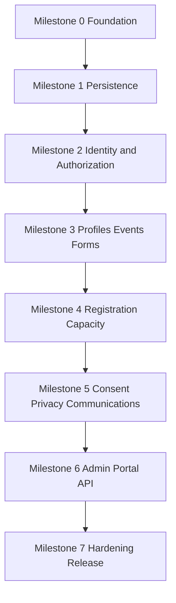

# Phase 3 Specification Freeze und Implementierungsplan

## Status und Zweck

**Stand:** 21. September 2026  
**Status:** Freigegebene Umsetzungsgrundlage für V1  
**Technischer Arbeitsname:** UOP Core  
**Zielgruppe:** Senior WordPress PHP Entwickler, technische Projektleitung, QA und Security Review

Dieses Dokument schließt die verbleibenden Verträge aus Phase 2, legt die verbindliche Entwicklungsreihenfolge fest und übersetzt die Spezifikation in ausführbare Milestones und Issues. Nach diesem Freeze darf die Implementierung beginnen.

Die normative Reihenfolge lautet:

1. Dieses Phase 3 Dokument
2. Phase 2 Implementierungsreife V1 Spezifikation
3. Phase 1 Produkt Technik und Entwicklungsstrategie

Bei Widersprüchen gilt die jeweils höhere Ebene. Marktanalyse und spätere Modulideen aus Phase 1 dürfen den engeren V1 Scope aus Phase 2 und 3 nicht wieder vergrößern.

## Ergebnis des Specification Freeze

Der V1 Scope ist realistisch, wenn er in Milestones umgesetzt und nicht als ein einzelner großer Coding Auftrag behandelt wird. Die Entwicklung darf mit Foundation und Persistence beginnen. Vor dem ersten Code müssen keine weiteren allgemeinen Recherchen stattfinden.

Folgende Architektur bleibt unverändert:

- WordPress User und Person sind getrennte Objekte.
- Jede V1 Person gehört genau einer Organization.
- Relationship und sicherheitswirksame Delegation sind getrennt.
- Öffentlicher Event Content liegt in einem CPT; operative Eventdaten liegen in eigenen Tabellen.
- Form Drafts sind bearbeitbar; veröffentlichte Form Versions sind unveränderlich.
- Registration Snapshots sind die historische Wahrheit; typisierte Values sind reproduzierbare Query Projektionen.
- Capabilities, Object Scope, Field Policy und Projection bilden eine gemeinsame Autorisierungsgrenze.
- Capacity Claims sind die Wahrheit über belegte Plätze.
- Der Capacity Bucket ist die Serialisierungszeile für konkurrierende Platzvergaben.
- Waitlist Offers reservieren einen Platz mit einem expiring held Claim.
- Audit, Business History und Transactional Outbox bleiben getrennte Konzepte.
- Action Scheduler ist Queue Engine, aber nicht fachliche Wahrheit.
- REST, Admin, Portal, Blocks, CSV und Background Jobs verwenden dieselben Application Services und Policies.
- Payments, Documents, Signatures, Tasks, Check in, Offline, Automation Builder, SMS, WhatsApp und allgemeiner CSV Import sind nicht Teil von Core V1.

## Technische Identität

Der öffentliche Produktname darf später geändert werden. Die technische Identität wird dagegen jetzt stabilisiert, damit Namespace, Tabellen, Hooks und API nicht während der Entwicklung umbenannt werden.

| Bereich | Verbindlicher Wert |
|---|---|
| Arbeitsname | UOP Core |
| Plugin Slug | `uop-core` |
| Text Domain | `uop-core` |
| PHP Root Namespace | `UOP\\` |
| Composer Package | `uop/core` |
| Tabellenpräfix | `$wpdb->prefix . 'uop_'` |
| Optionspräfix | `uop_` |
| Hookpräfix | `uop_` |
| Block Namespace | `uop/` |
| REST Namespace | `/uop/v1` |
| Action Scheduler Group | `uop` |

Eine spätere Markenänderung ändert nur sichtbaren Namen, Assets und Beschreibung. Sie ändert nicht Tabellenpräfix, Hooks, PHP Namespace, Blocknamen oder REST Namespace.

## Eingefrorener V1 Scope

### Release Blocker

- Installer, Environment Gate und Migration Registry
- Default Organization und obligatorischer OrgScope
- Person, Account Link, Relationship, Delegation und Actor Assignment
- zentrale Policy und Projection
- Profile Fields und typisierte Values
- Conditions AST und serverseitige Auswertung
- Event CPT, Settings und manuelle Occurrences
- Form Draft und immutable Form Version
- Registration Submission, Verification, Snapshots und State Machine
- Capacity, Waitlist und Offers
- Consent Definition, Version und Records
- E Mail Templates und Message Queue
- Portal und notwendige Admin Screens
- notwendige REST Endpoints und CSV Export
- WordPress Privacy Exporter und Eraser
- Retention, Audit, Outbox und System Health
- Cross Channel Permission Tests, Migration Tests, Concurrency Tests und Golden Path E2E
- WCAG 2.2 AA Baseline und mobile Reflow Prüfung

### Nach V1

- Person Merge UI
- allgemeiner CSV Import
- gespeicherte Filter und erweiterte Bulk Actions
- Self Service Claim alter Gastprofile
- Dashboards und Advanced Reporting
- Documents, Payments, Signatures, Tasks, Automation, Check in und Messaging Channels

## Ergänzende Architecture Decision Records

### ADR 301 Technische Identität bleibt unabhängig vom Produktnamen

**Context:** Ein endgültiger Markenname ist noch nicht notwendig, Namespace, Tabellen und APIs müssen aber stabil sein.

**Decision:** `uop` und `UOP\\` werden als dauerhafte technische Kennungen verwendet. Der sichtbare Produktname bleibt austauschbar.

**Consequences:** Kein späteres riskantes Rename von Tabellen, Hooks oder REST Routen. Der öffentliche Name kann ohne Datenmigration geändert werden.

### ADR 302 E Mail Templates liegen in einer eigenen Tabelle

**Context:** Phase 2 verlangt einen Communications Screen mit Templates und verwendet `template_revision` im Idempotency Key, spezifiziert aber keine Persistenz für bearbeitbare Templates.

**Decision:** V1 ergänzt `uop_email_templates`. Pro Organization, Template Key und Locale existiert höchstens ein aktiver Datensatz. Jede Änderung erhöht `revision` und erzeugt einen neuen `content_hash`. Bereits gerenderte Nachrichten bleiben in `uop_email_messages` unverändert.

**Alternatives:** Options wären schlecht filterbar und für Organization Scope ungeeignet. Ein CPT würde private operative Konfiguration mit öffentlichem Content Lifecycle vermischen. Eine zweite Versionstabelle ist für V1 unnötig, weil gesendete Inhalte bereits vollständig eingefroren werden.

**Consequences:** Der Administrator kann Templates bearbeiten. Retries verändern ihren Inhalt nicht. Rollback auf alte Templatefassungen ist kein V1 Feature; Änderungen sind im Audit nachvollziehbar.

### ADR 303 Asynchrone Exporte besitzen persistente Jobs

**Context:** `POST /exports`, `GET /exports/{job}` und `uop_generate_export` benötigen ein eigenes persistentes Objekt.

**Decision:** V1 ergänzt `uop_export_jobs`. Der Job speichert Request, Actor, Scope, Status, private Storage Referenz, Prüfsumme, Ablaufzeit und Fehlerzustand. Berechtigungen werden bei Erstellung, Ausführung und Download erneut geprüft.

**Consequences:** Ein Capability oder Assignment Revoke während der Queue Laufzeit stoppt den Export. Dateien sind niemals über eine öffentliche Media URL erreichbar und werden nach 24 Stunden gelöscht.

### ADR 304 Consent ist kein boolescher Registration Value

**Context:** Ein normales `true` oder `false` neben einem Consent Record würde zwei konkurrierende Wahrheiten erzeugen.

**Decision:** Ein Form Field vom Typ `consent` referenziert beim Publish genau eine immutable Consent Version. Beim Submit erzeugt der Consent Service einen Consent Record. Im Registration Snapshot steht nur eine referenzielle Evidence Struktur mit Consent Record Public ID, Definition Key, Version und Decision. In `registration_values` darf optional nur `value_reference = consent_record_id` materialisiert werden. Es wird kein paralleles boolesches Consent Value gespeichert.

**Consequences:** Withdrawal erzeugt einen neuen superseding Consent Record und überschreibt weder alte Records noch Registration Snapshots. Required Consent akzeptiert nur `granted`; optionaler Consent kann `granted` oder `denied` protokollieren.

### ADR 305 Öffentliche Hooks und durable Events haben verschiedene Garantien

**Context:** Phase 2 legt Post Commit Hooks bereits fest. Die Garantie gegenüber Transactional Outbox muss eindeutig bleiben.

**Decision:** Öffentliche `do_action()` Hooks laufen synchron direkt nach erfolgreichem Commit und erhalten immutable DTOs. Exceptions aus Drittcode dürfen den bereits erfolgten Commit nicht rückgängig machen; sie werden gefangen und diagnostiziert. Durable Domain Events werden innerhalb der Business Transaktion in der Outbox gespeichert und mindestens einmal verarbeitet. Outbox Consumers müssen idempotent sein.

**Consequences:** WordPress Hooks sind unmittelbare Best Effort Erweiterungspunkte. Die Outbox ist der zuverlässige Weg für Queueing und asynchrone Side Effects.

### ADR 306 PHP 8.3 bleibt V1 Minimum

**Context:** Ein späteres Absenken würde Syntax, Dependencies und CI rückwirkend verändern.

**Decision:** Development, Alpha, Beta, RC und Stable verwenden PHP 8.3 als Minimum. CI testet PHP 8.3, 8.4 und 8.5. Eine Absenkung ist nur durch ein neues ADR vor Beta zulässig.

**Consequences:** Weniger Legacy Code und kleinere Testmatrix. Installationen mit älteren PHP Versionen erhalten vor jeder Datenmutation eine klare Inkompatibilitätsmeldung.

### ADR 307 Action Scheduler wird kontrolliert gebündelt

**Context:** Das Plugin muss ohne WooCommerce funktionieren und darf nicht von einer zufällig installierten Queue Version abhängen.

**Decision:** Eine geprüfte Action Scheduler Version wird nach dem offiziellen Loader Muster im Release Artefakt gebündelt. Version Arbitration des Projekts wird respektiert. UOP registriert alle Jobs in der Gruppe `uop` und prüft die Initialisierung, bevor Jobs geplant werden.

**Consequences:** Standalone Betrieb ist möglich. Fachliche Idempotenz bleibt in UOP Tabellen; das `$unique` Flag der Queue ist nur zusätzliche Deduplizierung.

### ADR 308 Exporte verwenden privaten temporären Storage

**Context:** WordPress garantiert keinen allgemein privaten Upload Ordner. Große CSV Dateien dürfen weder in der Media Library noch ungeschützt unter einer URL liegen.

**Decision:** Der Core liefert ein `ExportStorageInterface`. Der V1 Local Driver verwendet ein installationsspezifisches Verzeichnis unter dem System Temp Pfad und lehnt Pfade innerhalb von ABSPATH, WP Content oder Uploads ab. System Health prüft Schreibbarkeit und Lage. `storage_key` ist relativ und niemals eine URL. Download erfolgt ausschließlich über einen autorisierten Controller. Cluster Storage ist ein späterer Adapter.

**Consequences:** Auf Hosts ohne sicheren persistenten Temp Pfad sind asynchrone Exporte deaktiviert und der Systemstatus zeigt die Ursache. Kleine Exporte bis 5.000 Zeilen können nach derselben Projection Policy direkt gestreamt werden.

### ADR 309 Public ID Format bleibt UUID v4 ähnlich

**Context:** Phase 2 entscheidet BINARY 16 intern und kanonischen UUID String extern.

**Decision:** Kryptografisch zufällige RFC 4122 Variant UUID v4 IDs werden verwendet. Keine ULIDs, keine zeitlich sortierbaren öffentlichen IDs und keine internen BIGINT Werte in REST, URLs oder Block Markup.

**Consequences:** Interne Sortierung nutzt BIGINT und Zeitspalten. Public IDs reduzieren Enumeration, ersetzen aber nie Object Policy.

### ADR 310 Änderungskontrolle nach Freeze

**Decision:** Änderungen an Datenmodell, Public IDs, State Machine, Organization Boundary, Permission Pipeline, REST Versionierung, Consent Wahrheit, Capacity Locking, Outbox Semantik oder Module Scope benötigen ein ADR und Migration beziehungsweise Compatibility Plan. UI Text, visuelle Gestaltung und nicht öffentliche interne Refactorings benötigen kein ADR, solange Verträge und Tests unverändert bleiben.

## Schema Ergänzungen

Phase 2 definiert 24 Core Tabellen. Mit den zwei notwendigen Ergänzungen umfasst das initiale V1 Schema 26 Tabellen.

### Email Templates

```sql
CREATE TABLE {p}email_templates (
    id                  BIGINT UNSIGNED NOT NULL AUTO_INCREMENT,
    public_id           BINARY(16) NOT NULL,
    organization_id     BIGINT UNSIGNED NOT NULL,
    template_key        VARCHAR(100) NOT NULL,
    locale              VARCHAR(20) NOT NULL,
    revision            INT UNSIGNED NOT NULL DEFAULT 1,
    subject             VARCHAR(255) NOT NULL,
    body_html           LONGTEXT NULL,
    body_text           LONGTEXT NOT NULL,
    content_hash        BINARY(32) NOT NULL,
    status              VARCHAR(32) NOT NULL,
    created_by_user_id  BIGINT UNSIGNED NOT NULL,
    updated_by_user_id  BIGINT UNSIGNED NOT NULL,
    created_at          DATETIME NOT NULL,
    updated_at          DATETIME NOT NULL,
    PRIMARY KEY (id),
    UNIQUE KEY uq_public_id (public_id),
    UNIQUE KEY uq_org_key_locale (organization_id, template_key, locale),
    KEY ix_org_status (organization_id, status, id)
);
```

Zusätzlich erhält `uop_email_messages`:

```sql
template_revision INT UNSIGNED NOT NULL,
template_hash BINARY(32) NOT NULL,
locale VARCHAR(20) NOT NULL
```

Template Regeln:

- Variablen folgen einer festen Allowlist pro Template Key.
- Unbekannte Variablen verhindern Save und Preview.
- Kein PHP, kein JavaScript, keine Shortcodes und keine frei ausführbaren Expressions.
- HTML wird über eine enge KSES Policy bereinigt.
- Variablen werden kontextgerecht escaped; bewusst freigegebenes HTML benötigt einen typisierten Safe HTML Wert.
- Der Renderer erzeugt Subject, Text und HTML vor dem Queueing.
- Der Idempotency Key enthält Template Hash oder Revision.

### Export Jobs

```sql
CREATE TABLE {p}export_jobs (
    id                  BIGINT UNSIGNED NOT NULL AUTO_INCREMENT,
    public_id           BINARY(16) NOT NULL,
    organization_id     BIGINT UNSIGNED NOT NULL,
    command_id          BINARY(16) NOT NULL,
    actor_user_id       BIGINT UNSIGNED NOT NULL,
    resource_type       VARCHAR(64) NOT NULL,
    format              VARCHAR(16) NOT NULL,
    status              VARCHAR(32) NOT NULL,
    filters_json        LONGTEXT NOT NULL,
    columns_json        LONGTEXT NOT NULL,
    row_count           BIGINT UNSIGNED NULL,
    storage_key         VARCHAR(255) NULL,
    content_sha256      BINARY(32) NULL,
    error_code          VARCHAR(64) NULL,
    error_message       VARCHAR(255) NULL,
    created_at          DATETIME NOT NULL,
    started_at          DATETIME NULL,
    completed_at        DATETIME NULL,
    expires_at          DATETIME NOT NULL,
    downloaded_at       DATETIME NULL,
    updated_at          DATETIME NOT NULL,
    PRIMARY KEY (id),
    UNIQUE KEY uq_public_id (public_id),
    UNIQUE KEY uq_command_id (command_id),
    KEY ix_org_status_created (organization_id, status, created_at, id),
    KEY ix_actor_created (actor_user_id, created_at, id),
    KEY ix_expiry (status, expires_at, id)
);
```

Statusmodell:

```text
queued
running
completed
failed
failed_authorization
expired
deleted
```

Worker Regeln:

- Der Worker lädt Actor und aktuelle Assignments neu.
- Der Worker verwendet Query Service und Projection Service; kein Raw SQL Export.
- Ein Revoke nach Job Erstellung führt zu `failed_authorization`.
- Download prüft aktuelle Policy erneut.
- Ablaufzeit ist standardmäßig 24 Stunden.
- Cleanup entfernt Datei und setzt Status atomar auf `deleted`.
- CSV Zellen mit `=`, `+`, `-` oder `@` werden spreadsheet safe escaped.
- UTF 8, RFC 4180 kompatibles Quoting und konsistente Newlines sind verbindlich.

## Consent Contract

Ein Form Draft darf beim Hinzufügen eines Consent Feldes nur eine aktive Consent Definition wählen. Beim Publish wird die aktuelle Version aufgelöst und als `consent_version_public_id` in der immutable Form Version festgeschrieben.

Submission Ablauf:

1. Server lädt die veröffentlichte Form Version.
2. Server validiert, dass die gepinnte Consent Version existiert und zur Organization gehört.
3. Actor und Subject werden autorisiert.
4. Required und optional Decision werden validiert.
5. Consent Record, Registration Snapshot, referenzieller Registration Value, Audit und Outbox Event entstehen in derselben Transaktion.
6. Snapshot enthält keine zweite unabhängige boolesche Wahrheit.

Minimale Evidence:

```json
{
  "schema_version": 1,
  "form_version_public_id": "uuid",
  "field_key": "photo_consent",
  "channel": "portal",
  "auth_context": "wordpress_account",
  "correlation_id": "uuid"
}
```

IP Adresse und vollständiger User Agent werden standardmäßig nicht gespeichert. Ein späterer regulierter Adapter kann zusätzliche Evidence nur mit eigener Privacy Dokumentation ergänzen.

## Hooks und Outbox Contract

Die Reihenfolge jeder relevanten Mutation lautet:

```text
authorize
validate
BEGIN
load and lock
apply domain rule
persist business state
persist history
persist audit
persist outbox event
COMMIT
dispatch synchronous post commit hooks
attempt queue enqueue
return response
```

Wenn das Queue Enqueue nach Commit scheitert, bleibt das Outbox Event unveröffentlicht und wird durch den Sweep erneut gefunden. Ein Fehler in einem öffentlichen WordPress Hook wird protokolliert, aber verändert weder Business State noch Outbox Status.

## Milestones



Ein Milestone beginnt erst, wenn die Exit Criteria des vorherigen Milestones grün sind. Parallelisierung innerhalb eines Milestones ist nur an den ausdrücklich genannten Stellen erlaubt.

## GitHub Issue Plan

### Milestone 0 Foundation

#### M0 01 Repository und Plugin Bootstrap

**Scope:** Plugin Entry File, Constants, PSR 4 Autoloading, Kernel und activation safe bootstrap.

**Acceptance Criteria:**

- GIVEN eine unterstützte leere WordPress Installation WHEN das Plugin aktiviert wird THEN startet der Kernel ohne Warning oder Notice.
- Kein Domain Service wird im globalen Scope konstruiert.
- Deaktivierung löscht keine Daten.
- Alle PHP Dateien blockieren direkten Aufruf, wo dies erforderlich ist.

#### M0 02 Composer NPM und reproduzierbarer Build

**Scope:** `composer.json`, `package.json`, Lockfiles, Produktionsbuild und Source Distribution.

**Acceptance Criteria:**

- `composer validate` ist grün.
- Produktionsartefakt enthält Runtime Dependencies und gebaute Assets, aber keine Secrets oder Test Fixtures.
- Source und Build bleiben gemäß WordPress org Regeln nachvollziehbar.

#### M0 03 Environment Compatibility Gate

**Scope:** WordPress 6.9, PHP 8.3, InnoDB, MySQL 8.0 oder MariaDB 10.11, utf8mb4.

**Acceptance Criteria:**

- Unsupported Environment erzeugt eine klare Admin Meldung.
- Vor erfolgreichem Gate wird keine operative Tabelle angelegt.
- WP CLI und Web Activation liefern dasselbe Ergebnis.

#### M0 04 Service Container und Modul Registry

**Scope:** kleiner expliziter Container, keine Reflection Autowiring Pflicht, Core Module Registrierung.

**Acceptance Criteria:**

- Abhängigkeiten sind in einer Composition Root sichtbar.
- Circular Dependencies schlagen im Test fehl.
- Future Module Interfaces enthalten keine Fachtabellen oder UI.

#### M0 05 Coding Security und Static Analysis Baseline

**Scope:** WordPress Coding Standards, PHPCS, PHPStan, ESLint und Dependency Scan.

**Acceptance Criteria:**

- CI schlägt bei neuen Fehlern fehl.
- Baseline Dateien dürfen keine neuen Fehler verstecken.
- Secrets und Credentials werden nicht committed.

#### M0 06 Test Harness und Referenzumgebungen

**Scope:** Unit, WordPress Integration, MySQL, MariaDB und Browser Test Grundgerüst.

**Acceptance Criteria:**

- Ein Smoke Test läuft für PHP 8.3 bis 8.5.
- DB Integration läuft mindestens gegen MySQL 8.0 und MariaDB 10.11.
- Test Fixtures können deterministisch neu aufgebaut werden.

**Milestone 0 Exit:** Plugin aktiviert und deaktiviert sicher, inkompatible Umgebungen werden vor Mutation gestoppt, CI und Test Harness sind grün.

### Milestone 1 Persistence

#### M1 01 Normatives Schema Manifest

**Scope:** Alle 26 V1 Tabellen, Spalten, Indizes und Invariants in maschinenlesbarer beziehungsweise testbarer Form.

**Acceptance Criteria:** Schema stimmt mit Phase 2 plus ADR 302 und 303 überein; Tasks, Documents, Payments und Signatures Tabellen existieren nicht.

#### M1 02 Migration Registry und Runner

**Scope:** Schema Version, geordnete Migrationen, Locking, Retry und Failure State.

**Acceptance Criteria:** Fresh Install und wiederholter Runner sind idempotent; parallele Runner führen Migrationen nicht doppelt aus; Fehler sind in System Health sichtbar.

#### M1 03 Initial Migration

**Scope:** dbDelta für kompatible Basis DDL und manuelle Schritte für Indizes oder Backfills, die dbDelta nicht sicher abbildet.

**Acceptance Criteria:** Tabellen und Indizes sind auf MySQL und MariaDB identisch; Charset und Collation stammen aus WordPress; alle operativen Tabellen sind InnoDB.

#### M1 04 Public ID Clock und Correlation Infrastructure

**Acceptance Criteria:** UUID v4 Roundtrip BINARY 16 zu kanonischem String; ungültige IDs werden vor Repository Zugriff abgelehnt; alle fachlichen Zeiten werden über injizierbare UTC Clock erzeugt.

#### M1 05 Transaction Manager

**Acceptance Criteria:** Commit, Rollback und maximal drei Deadlock Retries sind getestet; verschachtelte Business Transaktionen werden verboten oder eindeutig als Join der äußeren Transaktion implementiert; Hooks laufen nie vor Commit.

#### M1 06 Default Organization und OrgScope

**Acceptance Criteria:** Aktivierung erzeugt genau eine Default Organization; jeder tenant owned Repository Call verlangt einen OrgScope; Cross Org Fixtures liefern keine Daten.

#### M1 07 Repository Query Grundvertrag

**Acceptance Criteria:** Kein `SELECT *`; Sort und Filter sind allowlisted; Collections sind paginiert; interne IDs verlassen Repository beziehungsweise Mapping Layer nicht als öffentliche DTO IDs.

#### M1 08 Migration und Schema Tests

**Acceptance Criteria:** Fresh Install, erneuter Lauf, simulierte Unterbrechung, Resume und Rollback fähiger Einzelschritt sind automatisiert; Schema Drift schlägt CI fehl.

**Milestone 1 Exit:** Das vollständige leere V1 Schema ist reproduzierbar, Organization Scope ist technisch nicht umgehbar und Migration Recovery ist getestet.

### Milestone 2 Identity Authorization Audit und Outbox

#### M2 01 Person und Account Link

- Person kann ohne WordPress Account existieren.
- Pro Organization ist ein WordPress User höchstens mit einer Person verknüpft.
- User Löschung setzt Link auf NULL und löscht Person oder Registration nicht.
- Gleiche E Mail führt nie automatisch zu Merge oder Link.

#### M2 02 Relationships und Delegations

- Relationship allein gewährt keinen Zugriff.
- Delegation besitzt Scope, Status und Gültigkeit.
- Revoke wirkt auf dem nächsten Request und auf Background Jobs.

#### M2 03 Actor Assignments

- Organization und Event Scope sind darstellbar.
- Assignment ist zusätzlich zu Capabilities erforderlich.
- Abgelaufene oder widerrufene Assignments werden deny by default behandelt.

#### M2 04 Rollen und primitive Capabilities

- Standardrollen entsprechen Phase 2.
- Autorisierung prüft niemals Rollennamen.
- Deinstallation entfernt Rollen oder Caps nur nach sicherem, dokumentiertem Verfahren und nie Nutzerdaten automatisch.

#### M2 05 Policy Service

- Capability, Organization, Object und Delegation Regeln sind zentral.
- Admin, REST, Portal und Jobs erhalten dasselbe Allow oder Deny Ergebnis.
- Verbotene fremde Objekte können als 404 verborgen werden.

#### M2 06 Field Policy und Projection Service

- Sensitive Felder erreichen keinen Channel ohne Projection.
- Unbekannte Sensitivity wird deny by default behandelt.
- Cross Channel Contract Tests vergleichen sichtbare Feldmengen.

#### M2 07 Audit Infrastructure

- Mutationen erzeugen append only Audit Records.
- Audit enthält keine kompletten medizinischen oder geheimen Payloads.
- Audit Fehler innerhalb einer erforderlichen Business Transaktion verhindern den Commit.

#### M2 08 Transactional Outbox

- Business State und Event werden atomar gespeichert.
- Dispatcher, Sweep und Attempts funktionieren nach simuliertem Crash.
- Payload enthält Public IDs und minimale Metadaten, keine vollständigen Personendaten.

#### M2 09 Public Post Commit Hooks

- Hooks erhalten immutable DTOs.
- Hook Exception wird abgefangen und diagnostiziert.
- Hook Fehler verändert den erfolgreichen Command nicht.

#### M2 10 Authorization Regression Matrix

- Org A und Org B, Event A und B, Staff, Viewer, Participant und Guardian sind als Fixtures vorhanden.
- Admin, Portal, REST, CSV und Background Job werden gegen dieselbe Matrix getestet.

**Milestone 2 Exit:** Kein fachlicher Zugriffspfad darf Repositories ohne OrgScope und Policy verwenden. Audit und Outbox sind atomare Infrastruktur.

### Milestone 3 Profiles Events Forms

#### M3 01 Profile Field Definitions

Elf V1 Feldtypen, Sensitivity, Privacy Purpose, Retention Class und Field Policy werden validiert. Nach produktiver Nutzung sind inkompatible Typänderungen verboten.

#### M3 02 Typed Profile Values

Genau ein passender Value Slot ist gesetzt; Multiselect verwendet mehrere Rows mit Ordinal; NULL bedeutet kein Wert und nicht leerer String oder false.

#### M3 03 Conditions AST

Parser, Schema Validator und Evaluator unterstützen nur die eingefrorenen Nodes und Operators. Browserauswertung ist nur UX und Serverauswertung autoritativ.

#### M3 04 Event CPT und Settings

Öffentlicher Content bleibt im CPT. Organization, Timezone, Registration Window und operative Settings liegen in Tabellen. CPT Meta wird nicht zur konkurrierenden Wahrheit.

#### M3 05 Manual Occurrences

UTC Speicherung, IANA Timezone und DST Tests sind verbindlich. Keine Recurrence Rule Engine in V1.

#### M3 06 Form Draft Model

Draft Revision unterstützt optimistisches Locking. Protected Properties werden nicht per Mass Assignment akzeptiert.

#### M3 07 Immutable Form Publication

Publish validiert Felder, Conditions und Consent Bindings, erzeugt eine immutable Version und erlaubt kein Überschreiben referenzierter Versionen.

#### M3 08 Kleiner Form Builder

React wird nur für den Builder verwendet. Reorder ist per Drag and Drop und Tastaturbuttons möglich. Es gibt keine HTML, File, Image, Signature oder Hidden Fields.

#### M3 09 Profile Event und Form REST Read Models

DTOs enthalten Public IDs und projizierte Felder. Kein Controller greift direkt auf ein Repository zu.

#### M3 10 Domain und Accessibility Tests

Conditions, Type Validation, Version Immutability, Timezone Grenzen, Keyboard Reorder und Error Summary sind abgedeckt.

**Milestone 3 Exit:** Ein Manager kann ein Event mit Occurrence und validierter immutable Form Version konfigurieren, aber noch keine produktive Registration ausführen.

### Milestone 4 Registration Capacity und Waitlist

#### M4 01 Registration Submission und Snapshots

Submission Key ist idempotent. Snapshot und typed Rows werden atomar erzeugt. Spätere Profiländerungen verändern den Snapshot nicht.

#### M4 02 E Mail Verification

Tokens sind zufällig, nur gehasht gespeichert, zeitlich begrenzt und single use. Account oder Person Enumeration wird verhindert.

#### M4 03 Registration State Machine

Nur definierte Transitions sind möglich. Verification und Archive sind orthogonale Attribute. Jede Transition erzeugt History, Audit und Outbox Event.

#### M4 04 Capacity Buckets und Claims

Bucket PK Lock, Eligibility aus Snapshot und Claim Source of Truth sind implementiert. Kein COUNT then INSERT Pattern.

#### M4 05 Waitlist Entries und Offers

FIFO mit Priority, realer held Claim, sichere Token, Expiry und Accept Flow. Ein aktiver Waitlist Eintrag verhindert stilles Umgehen durch normale Acceptance.

#### M4 06 Cancellation und Release

Cancellation released Claim und nächstes Offer entstehen unter derselben Bucket Lock Grenze. Duplicate Command bleibt ohne zweiten Effekt.

#### M4 07 Concurrency Suite

50 parallele Commands auf einen letzten Platz erzeugen exakt einen confirmed Claim, keine doppelten Events und deterministische übrige Ergebnisse.

#### M4 08 Event Änderungen und Cancellation Policy

Occurrence Verschiebung verändert historische Snapshots nicht. Event Cancellation erzeugt definierte Registration Auswirkungen und Benachrichtigungs Events, aber keinen neuen frei konfigurierbaren Workflow.

#### M4 09 Golden Path Service Tests

Guest, Self Registration, Guardian Registration, Review, Waitlist Offer, Acceptance und Cancellation laufen ohne UI vollständig über Application Services.

**Milestone 4 Exit:** Der gesamte fachliche Registration und Capacity Golden Path ist als Service und Integration Test stabil.

### Milestone 5 Consent Privacy Communications und Export

#### M5 01 Consent Definitions und Versions

Publish erzeugt immutable Version mit Hash. Alte Versionen bleiben referenzierbar.

#### M5 02 Consent Form Binding und Records

ADR 304 ist vollständig umgesetzt. Withdrawal erzeugt einen superseding Record. Guardian Actor und Subject bleiben unterscheidbar.

#### M5 03 E Mail Template Registry und Persistence

Built in Templates besitzen Code Defaults. Organization Overrides liegen in `email_templates`. Preview und Save validieren Variablen und HTML Policy.

#### M5 04 E Mail Messages und Delivery

Rendering erfolgt vor Queueing. Retry Inhalt bleibt unverändert. `wp_mail()` ist der einzige V1 Sender. Duplicate Job sendet nicht doppelt.

#### M5 05 WordPress Privacy Exporter und Eraser

Account linked Personen sind eindeutig auflösbar. Shared Family Email führt zu Manual Resolution statt Datenvermischung.

#### M5 06 Retention Engine

Dry Run, Hold, Batch Cursor, Erase, Anonymize und Archive sind vorhanden. Audit kopiert gelöschte Inhalte nicht.

#### M5 07 Export Jobs

`POST /exports`, Worker, Status Query, Download und Cleanup verwenden ADR 303 und 308. Authorization Revoke vor Worker oder Download wird getestet.

#### M5 08 CSV Generator

Projection, Allowlisted Columns, Streaming, Formula Injection Schutz und Encoding Tests sind implementiert.

#### M5 09 Communications Privacy und Export Admin States

Queue Failures, Retry, Export Expiry, Retention Failure und Manual Subject Resolution sind bedienbar, ohne Secrets anzuzeigen.

#### M5 10 Failure und Recovery Tests

Queue Offline, Duplicate Execution, Mail Failure, Export Storage Failure, Retention Interrupt und Consent Retry sind abgedeckt.

**Milestone 5 Exit:** Consent hat nur eine Wahrheit, Kommunikation ist idempotent, Privacy Lifecycle funktioniert und Exportdateien sind geschützt.

### Milestone 6 Admin Portal Blocks und REST

#### M6 01 REST Base Controller und Error Contract

Jede Route besitzt Permission Callback, Request Schema, DTO Allowlist, Application Service und standardisierte Error Codes.

#### M6 02 People und Registration Endpoints

List, Detail, Create, Patch, Cancel und Transition entsprechen Phase 2 und exponieren ausschließlich Public IDs.

#### M6 03 Event Form Capacity Consent Audit und Export Endpoints

Nur für V1 benötigte Endpoints werden veröffentlicht. Keine breite generische CRUD API.

#### M6 04 Admin People und Registration Screens

Listen, Filter, Details und sichere Status Actions enthalten Loading, Empty, Denied, Not Found, Validation, Conflict und Failure States.

#### M6 05 Admin Forms Communications Privacy Audit und System Health

Screens verwenden Application Services. System Health zeigt Versionen, Migration, Queue, Cron, Mailtest und letzte sichere Fehler ohne Secrets.

#### M6 06 Dynamic Blocks

Event List, Event Details, Registration Form, Portal und My Registrations sind servergerendert und verwenden Block Supports.

#### M6 07 Portal Self und Delegated UX

Subject Switcher zeigt nur aktive Delegations. Revoke während offener Session wird beim nächsten Command wirksam.

#### M6 08 Interactivity Adapter

Progressive Enhancement unterstützt Conditions, Disclosures und Filter. Autorisierung, Validation und Capacity bleiben serverseitig.

#### M6 09 Responsive und Accessibility Screen Pass

Mobile Reflow, Tastatur, Fokus, Labels, Fieldsets, Error Summary, 32 Pixel Targets und statusunabhängige Farbcodierung werden geprüft.

#### M6 10 E2E Golden Paths

Adult Self Registration, Guardian Child Registration und Staff Managed Member Registration laufen im Browser durch Portal und Admin.

**Milestone 6 Exit:** Alle V1 Channels verwenden denselben Kern und bestehen Golden Path, Permission und Accessibility Tests.

### Milestone 7 Hardening und Release

#### M7 01 Large Fixtures und Performance Budgets

100, 10.000 und 100.000 Persons sowie Millionen Values werden erzeugt. P95 Budgets aus Phase 2 werden gemessen und dokumentiert.

#### M7 02 Security Suite

IDOR, Cross Org, CSRF, XSS, SQLi, Mass Assignment, CSV Formula Injection, Token Replay und Privilege Escalation sind grün.

#### M7 03 Migration Upgrade und Recovery Matrix

Jeder unterstützte Schema Stand migriert zum nächsten. Unterbrochene Backfills sind resumable. Kein Release bei unbekannter Drift.

#### M7 04 Compatibility Matrix

WordPress Minimum und Current, PHP 8.3 bis 8.5, MySQL 8.0 und MariaDB 10.11 sowie WordPress Browserslist Smoke Tests sind grün.

#### M7 05 Manual Accessibility Review

Keyboard und mindestens ein Screenreader Review für Registration, Error Flow, Portal, Builder und Admin Tables werden dokumentiert.

#### M7 06 Privacy Security und Developer Documentation

Data Inventory, Retention, Export Erase Verhalten, Hooks, REST, Schema, Upgrade Notes und Extension Contracts sind aktuell.

#### M7 07 WordPress org Release Package

GPL kompatible Lizenz, `readme.txt`, Third Party Notices, External Services Disclosure, Uninstall Verhalten und reproduzierbarer Build sind geprüft.

#### M7 08 Alpha Beta RC und Stable Gates

- Alpha: interner Golden Path, Breaking Changes erlaubt.
- Beta: vollständiger Scope, keine geplanten Schema Brüche.
- RC: nur Blocker Fixes, Upgrade von Beta getestet.
- Stable: alle Release Gates grün, keine Critical oder High Findings.

**Milestone 7 Exit:** Public V1 darf veröffentlicht werden.

## Parallelisierung

Nach Milestone 2 können folgende Arbeiten kontrolliert parallel laufen:

- Profile Fields und Event CPT
- Consent Definitions und E Mail Template Registry
- Admin Shell und Dynamic Block Shell, solange sie nur Application Interfaces konsumieren
- MySQL und MariaDB Integration Tests
- Accessibility Test Infrastruktur und Performance Fixture Generator

Nicht parallel ohne stabilen Vorgänger:

- Form Publication vor Profile Field und Condition Contracts
- Registration vor Form Versioning
- Capacity vor Registration State Machine
- Portal oder REST Fachlogik vor Policy und Projection
- E Mail Side Effects vor Outbox
- Export vor Projection
- UI Status Actions vor State Machine Commands

## Definition of Ready für ein Issue

Ein Issue darf erst implementiert werden, wenn folgende Angaben vorhanden sind:

- Ziel und Non Goal
- Abhängigkeiten
- betroffene Invariants
- Capability, Object Scope und Field Policy
- Input und Output Contract
- Transaktionsgrenze
- Idempotency Verhalten
- Audit und Domain Event Verhalten
- Privacy und Retention Auswirkung
- Fehlercodes
- konkrete automatisierbare Acceptance Criteria

## Definition of Done

Ein Issue ist erst fertig, wenn:

- Implementierung und Migration vollständig sind
- OrgScope und Permissions zentral geprüft werden
- REST Admin Portal Export und Job Auswirkungen bewertet sind
- Inputs allowlisted und Outputs kontextgerecht escaped sind
- Domain Event Audit und Idempotency festgelegt sind
- Unit und relevante Integration Tests vorhanden sind
- Failure Path Tests vorhanden sind
- Accessibility und Mobile Auswirkungen geprüft sind
- Dokumentation aktualisiert ist
- keine neuen Critical oder High Security Findings offen sind

## Release Stop Conditions

Die Entwicklung oder Veröffentlichung stoppt bei:

- konkurrierenden Wahrheiten für Status, Consent oder Capacity
- Channel spezifischer Berechtigungslogik
- fehlendem OrgScope in einem tenant owned Repository
- intern exponierten BIGINT IDs
- direktem Raw Export ohne Projection
- nicht privaten Exportdateien
- Side Effects vor Commit
- nicht idempotenten Queue Handlern
- automatisch gemergten Personen allein wegen gleicher E Mail
- physischer Löschung historischer Daten ohne Retention oder Erasure Policy
- verstecktem Code für Out of Scope Module

## Verbleibende Produktentscheidungen

Keine verbleibende Entscheidung blockiert Milestone 0 bis 6.

| Entscheidung | Spätester Zeitpunkt | Default |
|---|---|---|
| Öffentlicher Produktname und Branding | vor Beta | technischer Arbeitsname UOP Core |
| Betreiber Standardtexte für Consent und Privacy | vor produktivem Einsatz | keine angeblich rechtssicheren Universaltexte |
| Default Sender Name und Sender Adresse | Installations Setup | Site Name und WordPress Admin Mail nur nach Bestätigung |
| tatsächliche WordPress org Einreichung | vor RC | Package wird WordPress org ready gebaut |

## Erster Implementierungsauftrag

Der erste Coding Auftrag umfasst ausschließlich Milestone 0 und Milestone 1. Er implementiert noch keine Personen, Events, Forms, Registrations oder sichtbaren Produkt Screens.

### Copy Paste Masterprompt für Codex

```text
Du arbeitest an UOP Core, einem neuen WordPress Plugin. Implementiere ausschließlich Milestone 0 Foundation und Milestone 1 Persistence aus dem Dokument „Phase 3 Specification Freeze und Implementierungsplan“. Die Phase 2 Spezifikation ist die nachgeordnete fachliche Quelle. Bei Widersprüchen gilt Phase 3.

WICHTIGER SCOPE

Implementiere in diesem Auftrag nur:
- Repository und Plugin Bootstrap
- Composer und NPM Build Grundlage
- Environment Compatibility Gate
- expliziten Service Container und Module Registry
- Coding Standards, Static Analysis und CI
- Unit und WordPress Integration Test Harness
- vollständiges normatives V1 Schema mit 26 Tabellen
- Migration Registry, Runner und initiale Migration
- Public ID, UTC Clock und Correlation ID
- Transaction Manager mit Deadlock Retry
- Default Organization und obligatorischen OrgScope
- Repository Query Grundvertrag
- Schema und Migration Tests

Implementiere ausdrücklich noch nicht:
- People oder Account Linking
- Relationships oder Delegations
- Permissions jenseits der notwendigen Bootstrap Infrastruktur
- Events, Forms, Registrations, Capacity oder Waitlist
- Admin Produkt Screens, Portal oder Blocks
- E Mail Versand, Consent, Privacy Jobs oder Exporte
- Payments, Documents, Signatures, Tasks, Check in oder Automation

TECHNISCHE VERTRÄGE

- Requires at least WordPress 6.9
- Requires PHP 8.3
- PHP CI 8.3, 8.4 und 8.5
- MySQL 8.0 plus oder MariaDB 10.11 plus
- InnoDB und utf8mb4
- Plugin Slug uop-core
- PHP Namespace UOP\\
- Tabellenpräfix $wpdb->prefix . 'uop_'
- REST Namespace später /uop/v1
- interne IDs BIGINT UNSIGNED AUTO_INCREMENT
- öffentliche IDs kryptografisch zufällige UUID v4, BINARY(16) in der DB, kanonischer UUID String außerhalb der Persistence
- UTC für fachliche Zeitstempel
- keine physischen Foreign Keys, aber Repository und Migration Invariant Tests
- keine Domain Logik im Plugin Entry File
- keine Reflection Pflicht für Dependency Injection
- keine Datenlöschung bei Deaktivierung

SCHEMA

Verwende das vollständige Phase 2 Schema und ergänze exakt:
1. uop_email_templates nach ADR 302
2. uop_export_jobs nach ADR 303
3. template_revision, template_hash und locale in uop_email_messages

Es dürfen keine Tabellen für Tasks, Documents, Payments, Signatures, Check in oder Automation angelegt werden.

ARBEITSWEISE

1. Prüfe zuerst den vorhandenen Repository Zustand und bestehende Anweisungsdateien.
2. Wenn das Repository nicht leer ist, erhalte vorhandene funktionierende Konfiguration und ändere nur, was für Milestone 0 und 1 nötig ist.
3. Lege eine kleine, nachvollziehbare Schichtenstruktur an. Vermeide Enterprise Overengineering.
4. Nutze dbDelta nur für kompatible Basis DDL. Kapsle manuelle Migrationen und Backfills als testbare Migration Classes.
5. Der Environment Gate muss vor operativen Schema Mutationen laufen.
6. Der Migration Runner muss idempotent sein, parallele Ausführung verhindern und Fehler diagnostizierbar speichern.
7. Jeder tenant owned Repository Contract verlangt OrgScope. Baue einen Architecture Test, der unsichere Signaturen verhindert oder mindestens zuverlässig erkennt.
8. Collections müssen Pagination und allowlisted Sortierung erzwingen. Kein SELECT *.
9. TransactionManager führt BEGIN, COMMIT, ROLLBACK und maximal drei komplette Deadlock Retries mit kleinem Jitter aus. Business Code enthält später keine eigenen DB Retries.
10. Schreibe keine Platzhalter Implementierung, die fälschlich als funktionierendes Feature erscheint.

VERIFIKATION

Führe mindestens aus und berichte die exakten Ergebnisse:
- composer validate
- PHPCS mit WordPress Coding Standards
- PHPStan
- PHPUnit Unit Tests
- WordPress Integration Tests
- Fresh Install Migration auf MySQL 8.0
- Fresh Install Migration auf MariaDB 10.11
- wiederholter Migration Run ohne Änderung
- simulierte Migration Unterbrechung und Recovery
- Unsupported Environment Test ohne angelegte operative Tabellen
- Schema Manifest gegen tatsächliches Schema

ABNAHME

Milestone 0 und 1 sind nur abgeschlossen, wenn:
- das Plugin auf unterstützter Umgebung sauber aktiviert und deaktiviert
- eine nicht unterstützte Umgebung vor Datenmutation stoppt
- alle 26 Tabellen und erwarteten Indizes reproduzierbar angelegt werden
- keine Out of Scope Tabellen existieren
- Default Organization genau einmal angelegt wird
- Public ID Roundtrip und Invalid Input Tests grün sind
- Transaction Rollback und Deadlock Retry Tests grün sind
- Migrationen idempotent und resumable sind
- CI grün ist

Stoppe nach Milestone 1. Beginne nicht eigenständig mit Identity oder UI. Gib am Ende eine kompakte Liste geänderter Dateien, Architekturentscheidungen, ausgeführter Tests, Resultate und verbleibender Blocker aus.
```

## Startfreigabe

Mit diesem Freeze ist die Spezifikation ausreichend geschlossen, um die Implementierung zu beginnen. Der nächste operative Schritt ist die Bereitstellung oder Erstellung des Git Repositories und die Ausführung des ersten Implementierungsauftrags für Milestone 0 und 1.
